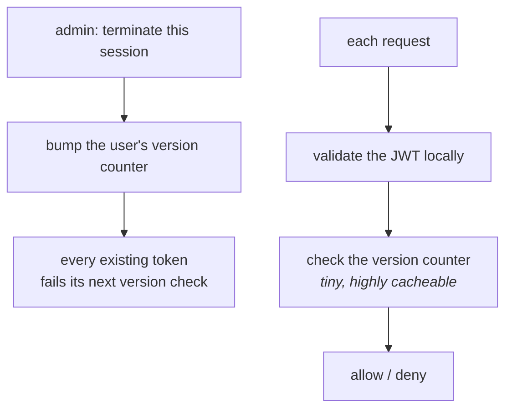

# Design: RBAC, SSO/SCIM and session revocation

Three related prompts that all come from your resume. Shorter than the auth
service chapter because they share its foundations — read that one first.

---

## Prompt A — Multi-tenant RBAC with policy evaluation

> Design role-based access control for a platform where users belong to
> multiple organisations, customers can define their own roles, and permission
> checks happen on every request.

### The model

One chain: a **user account** is a member of one or more **orgs (tenants)**.
Each org **binds** that user to a **role**, scoped to that org (editor in Acme,
viewer in Globex). A role **bundles permissions** (`entry:read`,
`entry:publish`), and permissions **act on resources** (an entry belonging to
Acme). A viewer binding in Globex grants nothing on an Acme entry.

**The whole point is the binding step.** The role binding is scoped to an
organisation, so "the user is an editor" is never true on its own — they are an
editor *in Acme*. Drop the org from any link in that chain and you have a
cross-tenant hole.

Four things and one rule: **the role binding belongs to a (user, org) pair, not
to a user.**

### Decisions to make out loud

**Permissions are the atoms.** Code asks "does this person have
`entry:publish`?", never "are they an admin?". That's what lets customers
define their own roles — you can't ship custom roles if your code branches on
role names.

**Where does the tenant come from?**

| | In the token | In the request |
| --- | --- | --- |
| How | `org_id` claim; token works for one org | Token = user; org from URL or header |
| Switching orgs | Need a new token | Same token |
| Risk | Low — can't address another org | **Every endpoint must check membership** |

If you pick the second, that membership check goes in shared middleware. Per
endpoint means someone eventually forgets, and that's a cross-tenant leak.

**Inheritance.** An org admin shouldn't need a grant on every project. Two ways
to do it:

- **Compute at check time** — walk up from resource to org gathering bindings.
  Always right, costs a traversal, gets slow when nesting is deep. *(This is a
  very plausible cause of a multi-second p99.)*
- **Materialise on write** — expand and store effective permissions when a
  binding changes. Reads become one flat lookup, but writes fan out and a
  missed update is a security bug.

Start with compute-plus-cache. Correctness is easier to reason about, and the
cache handles the cost.

**Avoiding role explosion.** If role names start containing conditions —
`editor-eu-readonly` — that condition belongs in policy, not in a role. Keep a
few good defaults, let customers compose custom roles, and push varying
dimensions into attributes.

---

## Prompt B — SSO and SCIM provisioning

> Design enterprise SSO and automated user provisioning across many customers,
> each bringing their own identity provider.

### Two separate systems

**SSO** answers "can this person log in right now?" — synchronous, one user, at
login. **SCIM** answers "who exists and what are they entitled to?" —
continuous, all users, in the background.

You need both. SSO alone means a terminated employee can't log in *again*, but
their account, sessions and API tokens all still exist.

### What you store per tenant

- IdP entity ID and SSO URL
- Signing certificate (**and its expiry date — see below**)
- Attribute mappings: their `groups` claim → your roles
- Protocol: SAML or OIDC

### The operational reality that shows experience

**Certificate expiry is the number one SSO support ticket.** A cert expires,
SSO breaks for an entire company at once, and nobody read the renewal email.

Three things that fix it:

1. Monitor expiry across every tenant, alert weeks ahead.
2. Support two valid certs during rotation so it isn't a hard cutover.
3. Give every tenant a **break-glass local admin** — exempt from SSO — so a
   broken configuration doesn't lock a customer out of their own account.

Mentioning break-glass without being asked signals you've actually operated this.

### SCIM: the detail that breaks real integrations

**Okta and Entra deprovision with `PATCH active:false`, not `DELETE`.**

Implement only `DELETE` and your integration passes testing, then silently
fails to offboard anyone in production. The IdP reports success — it sent what
the spec says. You ignored it.

And deactivating isn't enough on its own. You must **revoke sessions and API
tokens at the same time**, or the person is still logged in.

---

## Prompt C — Session management with instant revocation

> Design session handling that lets an admin terminate a session immediately,
> with configurable idle and absolute timeouts.

### The core tension

*The version counter is what buys instant revocation without a session-store lookup per request — a very different cost from hitting a full session store.*

Stateless tokens are fast (no lookup) but can't be un-issued. Server-side
sessions revoke instantly but need a lookup on every request.

At 30k RPS you can't do a database lookup per request. But "terminate this
session now" is a product promise. So:

**Short-lived access tokens + a tracked refresh token + a version counter.**

- Access tokens live 5–15 minutes, validated locally, no lookup.
- Refresh tokens are stored server-side and revocable.
- Each user has a version counter included in their tokens. Terminating a
  session bumps it, and every existing token becomes invalid immediately.

The version check is a tiny, highly cacheable lookup — very different from a
full session store hit.

### The two timeouts

**Idle timeout** resets on every request. It protects against someone walking
away from a logged-in machine.

**Absolute timeout** never resets. It protects against a stolen long-lived
session that's being kept alive deliberately.

You need both, and they defend different things.

### Be honest about "immediate"

With stateless tokens, "immediate" really means "within one token lifetime"
unless you add a version check or a revocation list. If the UI says "session
terminated" and the reality is fifteen minutes, that's a product problem as
much as a technical one. Either the wording changes or you pay for the lookup.

## Reference stack

| Prompt | See |
| --- | --- |
| A — RBAC with policy evaluation | [rbac-abac](../01-auth-identity/08-rbac-abac.md), [opa-rego](../01-auth-identity/09-opa-rego.md) |
| B — SSO and SCIM | [saml-sso](../01-auth-identity/04-saml-sso.md), [scim](../01-auth-identity/05-scim.md) |
| C — Session revocation | [foundations](../01-auth-identity/01-foundations.md) — the version-counter pattern |

---

## Interview Q&A

### Design: Multi-tenant RBAC where customers define their own roles
**Level:** senior · **Time:** 45 min

**What a strong answer covers:**
- Permissions as atoms; code never checks role names
- Role bindings scoped per (user, org), not global
- Tenant resolved before roles are gathered
- Cross-tenant membership check in shared middleware
- A position on inheritance, with its cost
- Role explosion and how the design avoids it
- Caching with versioned keys for invalidation

Worked solution

See the model and decisions above. Lead with the per-org binding — it's the
thing that makes this a real design question rather than a CRUD schema.

The most common miss is tenancy. Candidates design a clean RBAC model that
quietly assumes one organisation, and it falls apart the moment the interviewer
says "this user is in three orgs".

### Q: How do you terminate a session immediately with stateless tokens?
**Level:** senior · **Tags:** sessions, jwt, revocation

Model answer

Strictly, you can't — a signed token validates offline, so anything you do is a
workaround. The honest answer names the workaround and its cost.

The approach I'd use is short access tokens plus a version counter. Access
tokens live 5–15 minutes and are validated locally with no lookup, which is
what makes 30k RPS affordable. Each user record holds a version number that's
also embedded in their tokens. Terminating a session bumps the counter, and any
token carrying an older version is rejected on its next use.

The version lookup is small and very cacheable, so it's much cheaper than a
full session store hit on every request.

Alternatives: a denylist of revoked token IDs, which is genuinely immediate but
adds a lookup — though a small one, since it only holds tokens revoked before
they'd naturally expire. Or server-side sessions, giving up statelessness
entirely, which is a reasonable choice if immediate revocation is a hard
product requirement.

The thing I'd flag: if the product says "terminate now" and the system means
"within fifteen minutes", that gap needs closing deliberately — either in the
wording or in the design.

**Follow-ups:**

1. Q: Why do you need both idle and absolute timeouts?
   

Answer

   They protect against different things.

   The idle timeout resets on activity. It handles someone walking away from a
   logged-in machine — after 30 minutes of nothing, the session ends.

   The absolute timeout never resets. It handles a session that's being kept
   alive deliberately, which is what a stolen session looks like: the attacker
   makes a request every few minutes and an idle timeout never fires. An
   absolute timeout forces re-authentication regardless.

   With only idle, a stolen session lives forever. With only absolute, an
   abandoned machine stays logged in for the whole window. Enterprises ask for
   both, and being able to say why is an easy win.

   

2. Q: A SCIM deprovision arrives for someone who owns content. What happens?
   

Answer

   Deactivate, never hard delete. Two reasons: their content would lose its
   owner or get cascade-deleted, and audit history has to outlive the user —
   you need to answer "who published this?" a year from now.

   The sequence: mark them inactive so they can't authenticate. **Then
   immediately revoke their sessions and API tokens** — this is the step most
   implementations skip, and it's the one that actually ends access. Keep the
   record and all attribution. Surface their content to an admin so ownership
   can be transferred deliberately rather than auto-reassigned to someone who
   didn't ask for it.

   And handle the right signal: Okta and Entra send `PATCH active:false` rather
   than `DELETE`, so treat that as the deprovisioning event. An app that only
   handles `DELETE` will look like it works and quietly never offboard anyone.

   

---

## What a weak answer sounds like

- **Global role bindings** in a multi-tenant design.
- **Checking role names in code**, which makes custom roles impossible.
- **No answer for cert expiry** — the most common real SSO failure.
- **Deactivating without revoking sessions.** They're still logged in.
- **Claiming instant revocation** with stateless tokens and no mechanism.
