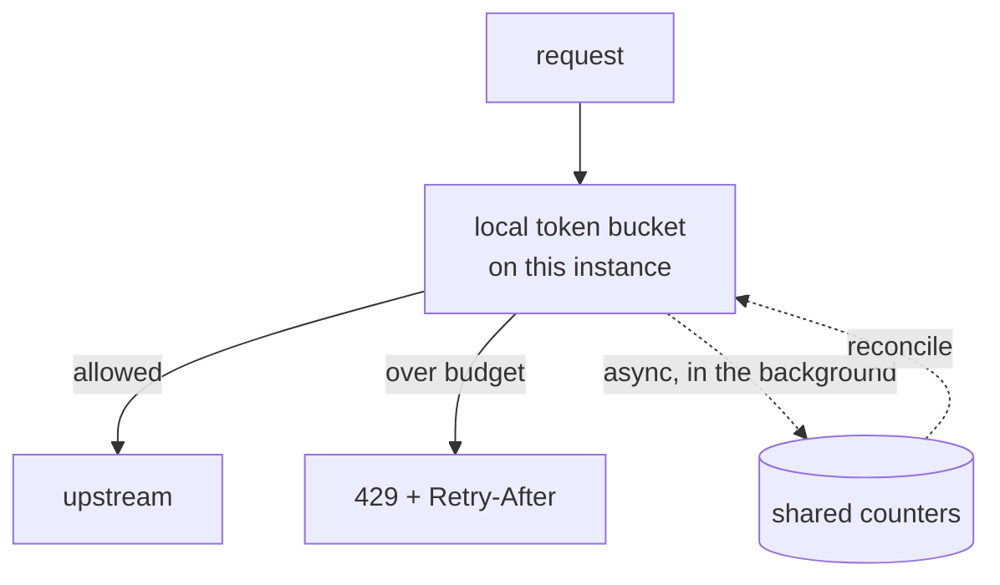
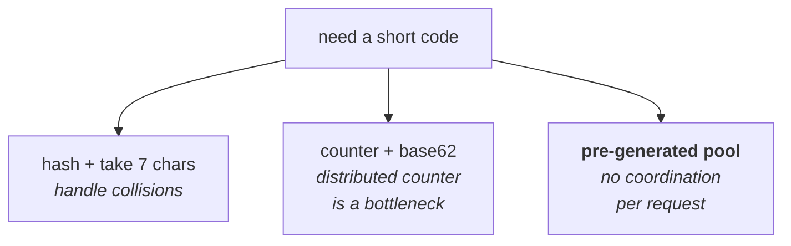
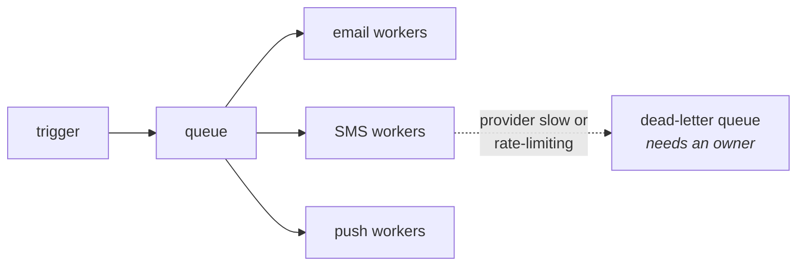
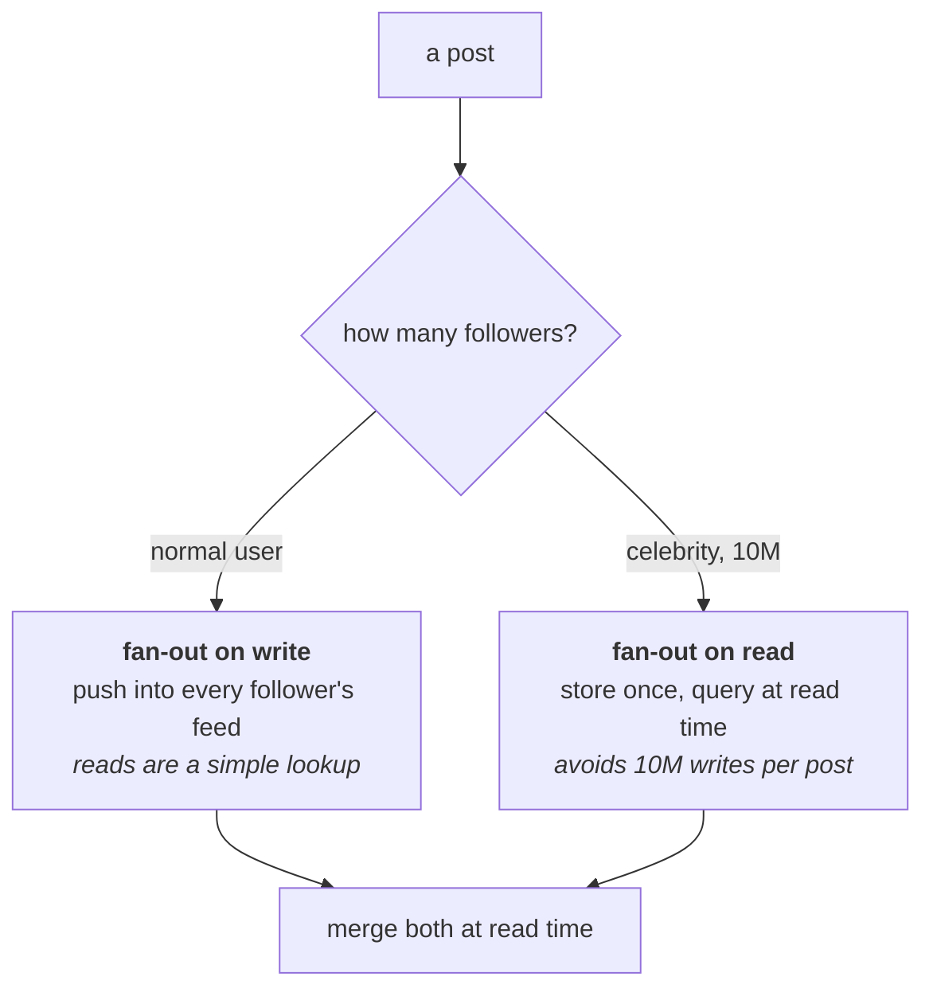
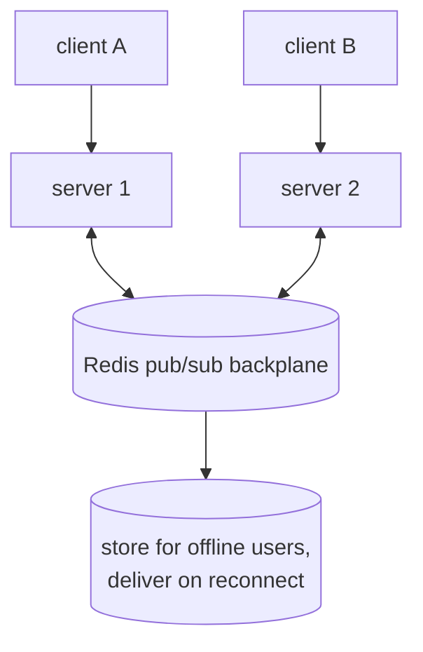

# The classics

Interviewers pick from a standard pool. These aren't your domain, but they come
up, and each one teaches a pattern you can reuse.

---

## Rate limiter / API gateway

Closest to your world, so expect this one.

*Enforce locally, reconcile in the background, accept slightly over-admitting. Reserve an exact central counter for limits that are contractual.*

**Core question:** how do you count requests across many servers without adding
a network hop to every request?

**Algorithm:** token bucket. Tokens refill at a fixed rate, each request takes
one. Bucket size = how big a burst you allow; refill rate = sustained
throughput. Real traffic is bursty and users expect a short burst to work.

**Distribution — the real problem:**

| Approach | Accuracy | Latency |
| --- | --- | --- |
| Central Redis counter | Exact | A round trip per request |
| Local, each instance gets 1/N | Loose | None |
| Local + async reconciliation | Close enough | None |

Most large systems use the third: enforce locally, sync counters in the
background, accept slightly over-admitting. Reserve the exact version for
limits that are contractual.

**Layers:** per tenant (the commercial quota), per user or API key within a
tenant, per endpoint (an expensive report shouldn't share a budget with a cheap
read), and a global one to protect the platform.

**Always return `429` with `Retry-After`.** A limiter that doesn't say when to
come back guarantees an immediate retry.

---

## URL shortener

The classic warm-up. It looks trivial and is really about ID generation and
read scale.

**Numbers:** 100M new URLs/day is only ~1,200 writes/sec. But reads are
100:1 — ~120,000 reads/sec. Read-heavy, like most systems.

*The third is usually the best answer, and saying why — no coordination on the request path — is what the question is actually testing.*

**Generating the short code** — the actual design question:

- **Hash the URL, take 7 chars** — deterministic, but you must handle
  collisions.
- **Counter + base62 encode** — no collisions, but a distributed counter is a
  bottleneck, and sequential IDs are guessable.
- **Pre-generated key pool** — a service hands out unused keys in blocks.
  No collisions, no per-request coordination. Usually the best answer.

7 base62 characters = 62⁷ ≈ 3.5 trillion. Plenty.

**Storage:** key-value, since the only access pattern is "look up by short
code". ~500 bytes per record × 100M/day × 5 years ≈ 90TB.

**Reads:** cache aggressively. URL popularity follows a power law, so a small
cache covers most traffic. Then a CDN in front for the very hottest.

---

## Notification system

Teaches fan-out, queues and delivery guarantees.

**Points worth making:**

*Per-channel workers are a bulkhead: a slow SMS provider must not stop email. And a DLQ nobody watches is data loss with extra steps.*

- **Queue between trigger and delivery.** Sending shouldn't block the action
  that caused it.
- **Per-channel workers**, because providers fail and rate-limit independently.
  A bulkhead — a slow SMS provider shouldn't stop emails.
- **At-least-once delivery**, so use an idempotency key per (user,
  notification) to avoid sending twice.
- **Dead-letter queue** with an owner. A DLQ nobody watches is data loss with
  extra steps.
- **User preferences and quiet hours**, checked at send time not trigger time.
- **Batching/digests** so twenty events don't become twenty emails.

---

## News feed

Teaches the fan-out trade, which generalises widely.

*Naming the celebrity problem and then the hybrid fix is the whole test — either half alone reads as a memorised answer.*

**Fan-out on write (push):** when someone posts, write it into all their
followers' feeds. Reads are then a simple lookup — fast. But a celebrity with
10M followers means 10M writes for one post.

**Fan-out on read (pull):** store posts once; build the feed by querying
everyone you follow at read time. Writes are cheap, reads are expensive.

**The real answer is hybrid:** push for normal users, pull for celebrities.
Merge the two at read time. Being able to name the celebrity problem *and* the
hybrid fix is what's being tested.

---

## Chat / messaging

Relevant because Socket.io is on your resume.

- **WebSockets** for delivery; fall back to long polling.

*A socket lives on exactly one server, so without the backplane server 1 simply cannot reach client B. That is the part candidates skip.*

- **Connection state is the hard part** — a socket lives on one server, so you
  need a pub/sub backplane (Redis) so any instance can reach any connection.
- **Ordering** per conversation: sequence numbers, not timestamps, since
  clocks differ between clients.
- **Delivery receipts** — sent, delivered, read — are three separate states and
  each needs its own acknowledgement.
- **Offline users** need messages stored and delivered on reconnect.

## Reference stack

| Design | Libraries you'd name |
| --- | --- |
| Rate limiter / gateway | `rate-limiter-flexible` or the hand-rolled Lua token bucket in [resilience-rate-limiting](../02-distributed-systems/08-resilience-rate-limiting.md) |
| URL shortener | `nanoid` or `hashids` for the code; `ioredis` cache in front of the key-value store |
| Notification system | `bullmq` for per-channel queues; a provider SDK per channel (SES, Twilio, FCM) |
| News feed | `ioredis` sorted sets for the per-user feed cache; a fan-out worker on `bullmq` |
| Chat / messaging | `socket.io` + `@socket.io/redis-adapter` for the pub/sub backplane — see [messaging-streams](../02-distributed-systems/06-messaging-streams.md) |

---

## Interview Q&A

### Design: A rate limiter for a multi-tenant API
**Level:** senior · **Time:** 45 min

**What a strong answer covers:**
- Token bucket, and why bursts are usually desirable
- Per-tenant limits, not just global — otherwise one tenant eats everything
- The distributed counting problem, and the latency trade
- `429` with `Retry-After` and rate-limit headers
- What happens when the limiter itself fails

Worked solution

See the rate limiter section above, plus
[resilience rate limiting](../02-distributed-systems/08-resilience-rate-limiting.md)
for the algorithms in detail.

One extra thing to raise if it doesn't come up: **what does the limiter do when
Redis is down?** Failing closed means your rate limiter takes down the API.
Failing open means no limits during an outage — usually the right call, since
losing rate limiting briefly is better than losing the API, but say it's a
deliberate choice.

### Q: Design a URL shortener.
**Level:** intermediate · **Tags:** design, classics

Model answer

I'd check scope first: do we need custom aliases, expiry, analytics? Assume
basic shortening plus click counts.

Numbers: say 100M new URLs a day, which is only about 1,200 writes/second.
Reads at 100:1 gives ~120,000 reads/second. So it's read-heavy, and the read
path is the design.

The interesting decision is generating the short code. Hashing the URL and
taking seven characters is deterministic but needs collision handling. A global
counter with base62 encoding avoids collisions but the counter becomes a
bottleneck and the IDs are guessable. What I'd do is pre-generate keys: a
service hands out blocks of unused keys to each app server, so there's no
per-request coordination and no collisions.

Seven base62 characters gives about 3.5 trillion combinations, which is plenty.

Storage is key-value — the only access pattern is lookup by code — so DynamoDB
or similar. About 90TB over five years at that rate.

For reads, cache hard. URL popularity follows a power law, so a relatively
small cache covers most traffic, and a CDN handles the hottest links. Redirects
are `301` if you don't need analytics, `302` if you do, since a permanent
redirect gets cached by the browser and you stop seeing the clicks.

**Follow-ups:**

1. Q: Two users shorten the same URL. One code or two?
   

Answer

   Depends on whether you offer per-user analytics, which is a product question
   worth surfacing.

   One code is storage-efficient and needs a lookup by original URL — so an
   index on it, or a hash-based scheme. But then both users share click counts,
   and neither can delete or expire the link without affecting the other.

   Two codes means duplicate storage but clean ownership: separate analytics,
   separate expiry, separate deletion.

   I'd default to two, because ownership is usually worth more than the storage
   saving, and the coupling in the shared version causes support problems that
   are hard to explain to a customer.

   

---

## What a weak answer sounds like

- **Jumping to an architecture** without asking what's in scope.
- **Ignoring the read/write ratio.** It's the first thing to establish and it's
  usually lopsided.
- **Fan-out on write with no celebrity answer.**
- **A distributed counter** as the ID scheme with no note that it's a
  bottleneck.
- **No failure story.** "What if this component dies?" always comes.
