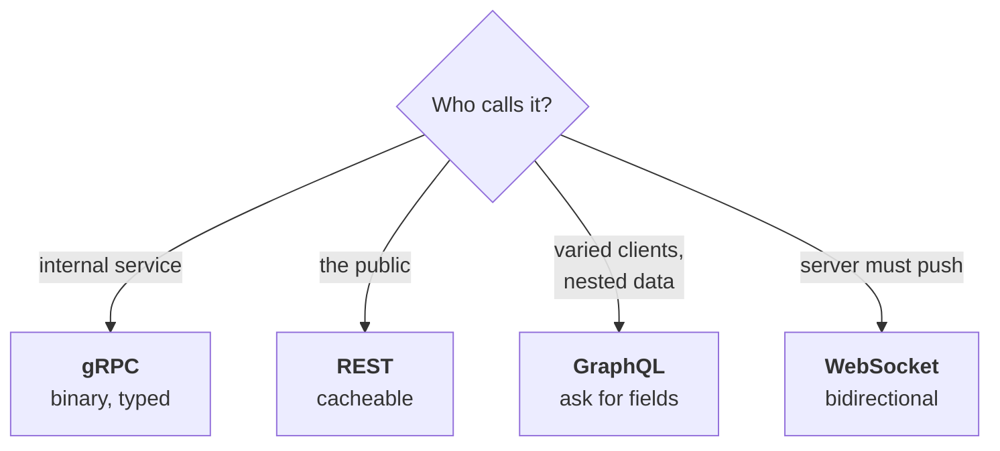

# REST, GraphQL, gRPC and WebSockets

Four ways for systems to talk. The interview question is never "what is REST" —
it's "why did you pick this one", which you answered in real life when you
chose gRPC for the auth package.

---

## The comparison


*Start from who calls it and the choice usually makes itself — arguing the merits in the abstract is how this question gets failed.*

| | **REST** | **GraphQL** | **gRPC** | **WebSocket** |
| --- | --- | --- | --- | --- |
| Format | JSON over HTTP | JSON over HTTP | Protobuf over HTTP/2 | Any, over TCP |
| Shape | Resources + verbs | One endpoint, you ask for fields | Typed method calls | Bidirectional stream |
| Contract | OpenAPI (optional) | Schema (required) | `.proto` (required) | Yours |
| Browser | Native | Native | Needs grpc-web | Native |
| Best at | Public APIs | Varied clients, nested data | Internal service calls | Real-time push |
| Weak at | Over/under-fetching | Caching, query cost | Browsers, debuggability | Scaling stateful conns |

### Choosing between them

Start from **who calls it**. Service-to-service and internal → **gRPC** (binary,
typed contract, HTTP/2 connection reuse). Server pushing to a live client →
**WebSocket**, or **SSE** if it's one-way. Browser or public API → then ask
whether clients need wildly different shapes of data: no → **REST** (cacheable,
debuggable, universally understood); yes, deeply nested → **GraphQL**, at the
cost of caching and per-field authz.

That first split is the one that matters: **the edge and the interior have
different needs**, which is why a platform commonly runs REST outside and gRPC
inside rather than picking one.

---

## REST

Resources as nouns, HTTP verbs as actions. `GET /entries/123`.

The parts people get wrong:

- **Verbs have meanings.** `GET` is safe (no side effects) and `GET`, `PUT`,
  `DELETE` are idempotent. `POST` isn't. Those aren't style rules — caches,
  proxies and retry logic depend on them.
- **Status codes matter.** 400 (your request is malformed), 401 (not
  authenticated), 403 (authenticated but not allowed), 404, 409 (conflict), 422
  (understood but invalid), 429 (rate limited).
- **401 vs 403 is the one to get right in an auth interview.** 401 means "I
  don't know who you are"; 403 means "I know, and no".

**Over-fetching and under-fetching** are its main weaknesses: an endpoint
returns more than a mobile client needs, or a screen needs three calls to
assemble one view.

---

## GraphQL

One endpoint. The client sends a query naming exactly the fields it wants.

Great when you have many different clients with different needs, or deeply
nested data. The costs are real and worth naming:

- **Caching is harder.** REST caches on URL; every GraphQL request is a POST to
  the same URL with a different body, so HTTP caching doesn't apply.
- **N+1 queries.** A query for 100 users each with their posts naively becomes
  101 database queries. **DataLoader** batches and dedupes within a request —
  if you mention GraphQL, know this.
- **Unbounded query cost.** A client can request something enormous. You need
  query depth limits, complexity scoring, or persisted queries.
- **Authorization is per-field**, not per-endpoint, which is more surface area
  to get right.

That last point is worth raising given your background: with REST you check
permission at the endpoint. With GraphQL a single query can traverse into data
the user shouldn't see, so checks have to live at the resolver level.

---

## gRPC

Typed remote calls. You define the contract in a `.proto` file and generate
client and server code from it.

```protobuf
service AuthService {
  rpc CheckPermission(CheckRequest) returns (CheckResponse);
}
message CheckRequest {
  string user_id = 1;      // field NUMBERS are the wire contract
  string tenant_id = 2;
  string permission = 3;
}
```

**Why it fits internal service calls:**

- **Protobuf is compact and fast** — binary, much cheaper to serialise than
  JSON. On a hot path multiplied by every request, that matters.
- **HTTP/2 multiplexes** many calls over one connection, so there's no
  per-call handshake.
- **Generated clients** mean a breaking change is a compile error in the
  consuming service, not a 3am runtime surprise.
- **Streaming** in either or both directions.

**Where it's bad:** browsers can't speak it natively (grpc-web needs a proxy);
you can't `curl` it easily; load balancers need HTTP/2 awareness, and because
connections are long-lived, naive L4 balancing sends all of one client's calls
to one server.

### Protobuf compatibility — the rule that matters

**Field numbers are the contract.** Never reuse or renumber them.

- Adding a field: fine, old clients ignore it.
- Removing a field: mark it `reserved` so nobody reuses the number.
- Changing a type: breaks everything.

This is what lets nine teams run different versions against the same server —
which was exactly your situation. You can't deploy nine services at once, so
the wire format has to tolerate mixed versions indefinitely.

---

## WebSockets

A persistent bidirectional connection. For genuine push — chat, collaboration,
live dashboards.

The hard part is that they're **stateful**: a connection lives on one server,
so you need a pub/sub backplane (Redis) for any instance to reach any
connection. See
[messaging streams](../02-distributed-systems/06-messaging-streams.md).

**Auth note:** authenticate at the handshake, then re-check periodically. A
long-lived socket outlives token expiry and session revocation, so a terminated
user can keep receiving data over an already-open connection.


## Building it

**Libraries**

| Style | Library | Why |
| --- | --- | --- |
| REST | Express or Fastify — see [frameworks](02-frameworks.md) | Already covered there; nothing style-specific to add |
| GraphQL | `apollo-server` or `graphql-yoga` | Schema-first, resolver wiring, and query-cost limiting out of the box |
| gRPC | `@grpc/grpc-js` + `ts-proto` | `ts-proto` generates typed clients/servers from `.proto` — avoids hand-writing the generated code |
| WebSocket | `ws` (bare) or `socket.io` | `socket.io` adds rooms, reconnection and fallback transport; `ws` when you want nothing extra |

**Pseudocode — a gRPC service, since it's the one you actually shipped**

```proto
service AuthzService {
  rpc Check (CheckRequest) returns (CheckResponse);
}
```

```ts
// server
server.addService(AuthzService, {
  check: async (call, callback) => {
    const allowed = await enforcer.enforce(call.request.userId, call.request.action);
    callback(null, { allowed });
  },
});

// client, from any service consuming the auth package
const res = await authzClient.check({ userId, action: 'entry:publish' });
```

---

## Interview Q&A

### Q: Why did you choose gRPC over REST for an internal service?
**Level:** intermediate · **Tags:** grpc, api-design

<details><summary>Model answer</summary>

Three reasons, in order of importance.

**It was on the hot path.** Every request in every service made an
authorization call, so per-call cost multiplied by total platform traffic.
Protobuf is binary and much cheaper to serialise than JSON, and HTTP/2 reuses
connections so there's no per-call handshake.

**Typed contracts.** The `.proto` file *is* the contract, and clients are
generated from it. Across nine consuming teams that's worth a lot — a breaking
change surfaces as a compile error rather than a runtime failure in someone
else's service.

**Streaming**, if we needed to push policy or revocation updates rather than
having every service poll.

The honest counterpoint is that gRPC is worse at the edge — browsers need
grpc-web and a proxy, it's harder to debug with curl, and load balancers need
HTTP/2 awareness. None of that applies to internal service-to-service calls,
which is exactly where it fits.

For a public API I'd still choose REST, because ubiquity and debuggability
matter more there than serialisation cost.

</details>

**Follow-ups:**

1. Q: How do you make a breaking change across nine teams?
   <details><summary>Answer</summary>

   You don't, is the short answer — you avoid needing to, because you can't
   deploy nine services simultaneously and any design requiring that will fail.

   On the wire, be additive only: never reuse or renumber a field, mark removed
   fields `reserved`, never change a type. Old clients then keep working against
   a newer server indefinitely, which is the property you need when you don't
   control anyone's deploy schedule.

   If a genuine breaking change is unavoidable, run both versions in parallel —
   a new method name, or a versioned service — migrate teams individually with
   help, and only then remove the old one, with a deadline that's communicated
   early and actually enforced. Without a deadline nobody moves.

   And instrument it: log which version each caller uses, so you know when
   usage of the old path has actually hit zero rather than assuming.

   </details>

2. Q: What's the N+1 problem in GraphQL and how do you fix it?
   <details><summary>Answer</summary>

   A query asks for 100 users and each user's posts. The resolver for users
   runs one query, then the posts resolver runs once **per user** — 101 queries
   for one request. It's invisible in the query itself, which is what makes it
   dangerous: the client wrote something innocuous.

   The standard fix is **DataLoader**. Instead of querying immediately, each
   resolver registers the key it needs; DataLoader collects them within a tick,
   issues one batched query for all of them, and hands each resolver its result.
   It also dedupes repeated keys within the request.

   So 101 queries become 2. It's per-request, so there's no stale-cache risk.

   Alternatives: look ahead at the query AST and join up front, or precompute.
   But DataLoader is the standard answer and knowing the name matters.

   The broader point is that GraphQL moves query planning from the server to the
   client, so the server needs its own defences — batching, depth limits,
   complexity scoring — or a client can accidentally write something very
   expensive.

   </details>

### Q: When is REST the better choice?
**Level:** intermediate · **Tags:** rest, api-design

<details><summary>Model answer</summary>

For public APIs, almost always. Everyone knows it, every language has a client,
you can debug it with curl, and it works through every proxy and browser.

It also gets HTTP caching for free — cache on URL, use ETags and
`Cache-Control` — which GraphQL largely gives up, since every request is a POST
to the same endpoint.

And it's simple to reason about: one URL, one resource, one obvious permission
check at the endpoint. With GraphQL, authorization moves to the field level,
because a single query can traverse into data the caller shouldn't reach.
That's more surface area to get right, and it's a genuine security
consideration rather than a style preference.

I'd reach for GraphQL when there are many different clients with genuinely
different data needs, or when the data is deeply nested and REST would mean
lots of round trips. And gRPC for internal service calls where performance and
typed contracts matter.

The pattern I'd actually build is often all three: REST at the public edge,
gRPC internally, GraphQL only if client diversity justifies it.

</details>

---

## What a weak answer sounds like

- **"GraphQL is better than REST."** Different trades; GraphQL gives up HTTP
  caching and adds query-cost and per-field authorization problems.
- **Not knowing 401 vs 403** — bad in any interview, worse in an auth one.
- **"gRPC is faster"** with no mention of Protobuf, HTTP/2, or the edge
  drawbacks.
- **Not knowing DataLoader** while claiming GraphQL.
- **Reusing Protobuf field numbers.** Silently corrupts data for old clients.

---

## Glossary

- **Idempotent verb** — `GET`, `PUT`, `DELETE`; safe to retry.
- **Over/under-fetching** — getting more than you need, or needing more calls.
- **Resolver** — the function producing one GraphQL field.
- **DataLoader** — batches and dedupes resolver loads within a request.
- **Persisted query** — a pre-registered GraphQL query, referenced by id.
- **Protobuf field number** — the wire contract; never reuse or renumber.
- **HTTP/2 multiplexing** — many concurrent calls on one connection.
- **grpc-web** — a proxy layer letting browsers speak gRPC.
