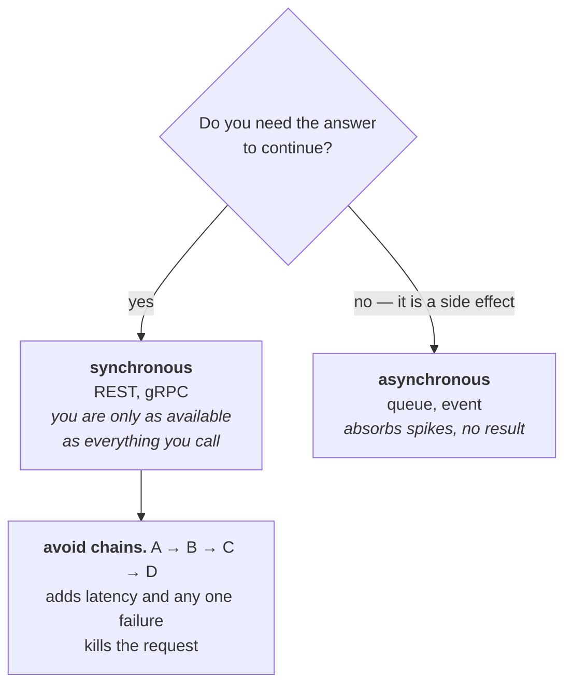
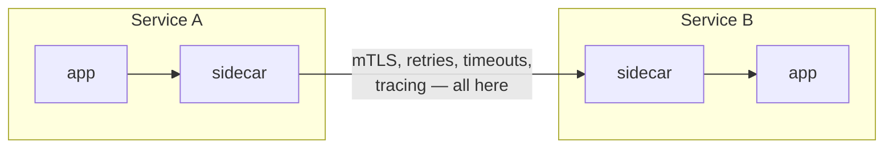

# Microservices

You split a monolith into 3 services, so this comes up as a real question
rather than a theoretical one. The interviewer mostly wants to know whether you
can articulate the **cost**.

---

## What they actually buy you

Microservices solve an **organisational** problem more than a technical one:
letting teams deploy independently without coordinating.

Genuine reasons to split:
- Teams are blocked waiting on each other's deploys
- One component needs to scale very differently from the rest
- Fault isolation genuinely matters
- Different parts want different languages or runtimes

Not reasons:
- The codebase is messy (that's a structure problem — fix the structure)
- Microservices are modern
- It might scale someday

**A modular monolith** — clear internal boundaries, one deployable — gets you
most of the structural benefit with none of the operational cost, and it stays
splittable later once the boundaries have proven themselves.

---

## Getting boundaries right

This is the decision the whole thing lives or dies on.

**Split by technical layer** (API service → logic service → data service) and
every feature crosses all three: adding one field means three repos, three
deploys, one release train — a distributed monolith with none of the benefits.
**Split by domain** (Orders, Billing, Shipping, each owning its own table and
communicating via events) and adding a field to Shipping touches Shipping.

Criteria, in order:

1. **Domain boundaries.** A service should map to an area with its own
   vocabulary and rules.
2. **Data ownership.** Each service owns its data exclusively. If two services
   write the same table, they're one service. *Shared database is the classic
   anti-pattern — you get distributed deployment with none of the
   independence.*
3. **Rate of change.** Code that changes together should live together.
4. **Team ownership.** A service nobody owns rots.

**The test:** can you deploy this service without coordinating with another
team? If not, the boundary is wrong.

---

## What it costs

Be able to list these — it's what separates experience from enthusiasm:

- Every in-process call becomes a network call that can fail, or worse, be slow
- Debugging needs distributed tracing instead of a stack trace
- Data consistency becomes your problem (sagas, outbox — see
  [idempotency transactions](../02-distributed-systems/05-idempotency-transactions.md))
- Per-service CI/CD, monitoring, on-call
- Local development gets meaningfully harder
- Versioning and compatibility across services

---

## Communication patterns

*Sending a welcome email must not be able to fail user registration — that single example decides most of these calls for you.*

**Synchronous (REST, gRPC)** — simple, immediate result, but it couples
availability: your service is only as available as everything it calls, and
latency adds up down the chain.

**Asynchronous (queue, event)** — decoupled in time, absorbs spikes, but the
caller doesn't get a result, and debugging spans systems.

The rule: **synchronous when you need the answer to continue, asynchronous for
side effects.** Sending a welcome email shouldn't be able to fail user
registration.

**Avoid chains.** A → B → C → D means latency adds up and any one failure kills
the request. Prefer a shallow fan-out, or events.

---

## The service mesh question

*Worth it for many services in several languages. For a handful in one language a library does the same job without the operational weight.*

A mesh (Istio, Linkerd) puts a sidecar proxy next to each service and handles
retries, timeouts, mTLS, load balancing and tracing at the infrastructure layer
instead of in your code.

Worth it when you have many services in several languages and want consistent
behaviour without every team implementing it. Not worth it for a handful of
services — it's a lot of operational complexity, and a library does the same
job when everything is one language.

## Building it

No new library beyond what the specific communication choice already needs:

| Pattern | See |
| --- | --- |
| Synchronous (REST/gRPC) | [api-styles](04-api-styles.md) |
| Asynchronous (queue/event) | [messaging-streams](../02-distributed-systems/06-messaging-streams.md) |
| Service mesh sidecar | Infrastructure (Istio, Linkerd) — not application code; see [zero-trust-idps](../01-auth-identity/10-zero-trust-idps.md) |

The design decision this chapter is actually testing — where the boundary
goes — isn't a library choice at all.

---

## Interview Q&A

### Q: How do you decide where to draw service boundaries?
**Level:** senior · **Tags:** microservices, ddd, architecture

Model answer

I'd talk about criteria rather than an answer, because the criteria are what
transfer.

**Domain boundaries first** — services should map to bounded contexts, areas
with their own vocabulary and rules. If two parts of the system use the same
word to mean different things, that's usually a boundary.

**Data ownership** — each service owns its data exclusively. If two services
need to write the same table, they belong together. A shared database across
"microservices" is the classic anti-pattern: you get distributed deployment
with none of the independence, because neither service can change its schema
alone.

**Rate and reason of change** — code that changes together should live
together. If every feature touches all three services, the split is wrong.

**Team ownership**, because a service with no owner rots.

The anti-pattern is splitting by technical layer — an API service, a logic
service, a data service. Every feature then crosses all three, so you deploy
them together and you've built a distributed monolith: all the network
complexity, none of the benefit.

The practical test I'd apply: can I deploy this without coordinating with
another team? If no, the boundary is wrong.

**Follow-ups:**

1. Q: Was splitting the monolith worth it?
   

Answer

   That depends on what was actually blocking us, and I'd want to answer
   honestly rather than defend the decision.

   The costs are real: every in-process call became a network call that can
   fail or hang, debugging needed distributed tracing rather than a stack
   trace, data consistency became our problem, and local development got
   harder.

   It's worth it when teams are genuinely blocked deploying independently, when
   one component needs to scale differently, or when fault isolation matters.

   It isn't worth it when the real problem is a badly-structured codebase. A
   **modular monolith** — clear internal boundaries, one deployable — gets most
   of the structural benefit with none of the operational cost, and you can
   still split later once the boundaries have proven themselves.

   With three services and one team, I think a modular monolith might have
   carried us for another year. What made the split worthwhile was scaling one
   component separately from the others.

   > **FILL IN:** what actually drove your split — scaling, team boundaries, or
   > deploy contention? The honest reason makes this a much better answer.

   

2. Q: Two services need the same data. What do you do?
   

Answer

   Some sharing is unavoidable; the question is the mechanism.

   The option I'd usually pick is **duplicating the data** each service needs,
   kept eventually consistent through events. Each service owns its own copy,
   shaped for its own use. It feels wrong if you're trained on normalisation,
   but it's the right trade here — you're buying independence with storage and
   a consistency window.

   Alternatively, **call the owning service** synchronously. Simple and always
   current, but now the caller is only as available as the callee, and latency
   compounds.

   What you avoid is **two services writing the same table**, because then
   neither can change its schema independently. That's the coupling that
   removes the entire point of splitting.

   If a lot of data needs sharing, that's usually a signal the boundary is
   wrong and the two services want to be one.

   

### Q: How do you debug a request that spans five services?
**Level:** senior · **Tags:** observability, tracing

Model answer

Distributed tracing, and it needs to be in place before you need it — you can't
add it during an incident.

A **correlation ID** is generated at the edge and propagated through every call,
usually via headers, so logs from all five services can be pulled together for
one request. That alone solves most of it.

Proper tracing goes further: each service emits **spans** with timing and
parent/child relationships, so a tool like Jaeger shows the whole request as a
waterfall — where the time went and which call failed. OpenTelemetry is the
standard for instrumenting it.

The three pillars together: **logs** for what happened, **metrics** for
aggregate health, **traces** for one request's path through the system.

The practical points I'd add: propagation must survive async boundaries — a
message going through a queue has to carry the trace context, or the trace
breaks exactly where it's most useful. And you sample, because tracing
everything is expensive — but sample intelligently, keeping all the errors and
slow requests rather than a flat percentage.

For a multi-tenant system I'd also tag spans with tenant, because "it's slow
for one customer" is undiagnosable otherwise.

---

## What a weak answer sounds like

- **"Microservices scale better."** They scale *teams*. Technically they add
  latency and failure modes.
- **Splitting by technical layer.** Distributed monolith.
- **Shared database across services.** The anti-pattern.
- **Listing only benefits.** Every architecture question wants the cost.
- **No tracing story.** Debugging is the biggest day-to-day cost.

---

## Glossary

- **Bounded context** — a domain area with its own vocabulary and rules.
- **Distributed monolith** — services that must deploy together. Worst of both.
- **Modular monolith** — internal boundaries, one deployable.
- **Service mesh** — sidecar proxies handling retries, mTLS, tracing.
- **Correlation ID** — an id following one request across services.
- **Span / trace** — one operation's timing / the whole request's path.
- **OpenTelemetry** — the standard for emitting traces and metrics.
