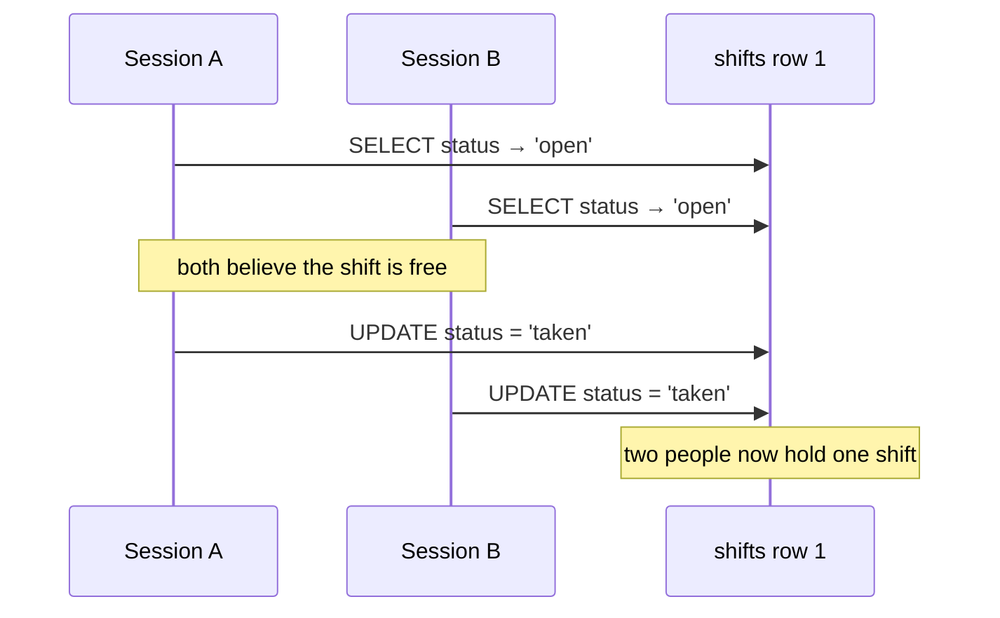

# MongoDB, PostgreSQL and SQL

Both are on your resume. The question is never "which is better" — it's "why
did you use each", and knowing when Mongo is the wrong choice is worth more
than knowing its features.

---

## Picking one

**Ask how the data is read**, not what it looks like.

| Use PostgreSQL when | Use MongoDB when |
| --- | --- |
| Data has relationships you'll join across | Documents are read as a whole unit |
| You need transactions across tables | Schema genuinely varies per record |
| Queries aren't fully known in advance | Access patterns are known and simple |
| Constraints matter (unique, foreign keys) | You need horizontal write scaling |

**Default to Postgres** unless there's a specific reason not to. It handles
JSON (JSONB), full text search and geospatial adequately, and "one boring
system we understand" is worth a lot operationally.

The honest reason people regret Mongo: they picked it for "flexibility", then
discovered their data had relationships after all, and now they're doing joins
in application code.

---

## PostgreSQL essentials

### Indexes

An index is a sorted structure that turns a full scan into a lookup. Without
one, finding a row means reading every row.

```sql
CREATE INDEX idx_bindings_user_tenant ON role_bindings (user_id, tenant_id);
```

**Composite index column order matters.** An index on `(user_id, tenant_id)`
helps queries filtering on `user_id`, or on both. It does **not** help a query
filtering only on `tenant_id` — think of a phone book sorted by surname then
first name: useless for finding everyone called "James".

Costs: every write must update every index, and indexes take space. Unused
indexes are pure overhead.

**`EXPLAIN ANALYZE` is the tool.** It shows the actual plan and timing. `Seq
Scan` on a large table usually means a missing index.

### Transactions and isolation

ACID: Atomicity (all or nothing), Consistency (constraints hold), Isolation
(concurrent transactions don't interfere), Durability (committed means saved).

Isolation levels, weakest to strongest:

| Level | Allows |
| --- | --- |
| Read Committed *(Postgres default)* | Non-repeatable reads, phantoms |
| Repeatable Read | Phantoms (in theory; Postgres prevents most) |
| Serializable | Nothing — as if transactions ran one at a time |

Higher isolation means more locking or more retries. Serializable in Postgres
uses optimistic checking, so transactions can fail and need retrying — your
code must handle that.

### Locking and the classic race


*The gap between the two statements is the whole bug. An atomic conditional update closes it without holding a lock; FOR UPDATE closes it by serialising on a row that is hot by definition.*

```sql
-- The bug: check-then-act has a gap between the two steps
SELECT status FROM shifts WHERE id = 1;      -- 'open'
UPDATE shifts SET status = 'taken' WHERE id = 1;   -- two people both get here

-- Fix 1: atomic conditional update
UPDATE shifts SET status = 'taken' WHERE id = 1 AND status = 'open';
-- then check rows affected: 1 = you won, 0 = someone else did

-- Fix 2: pessimistic lock
SELECT * FROM shifts WHERE id = 1 FOR UPDATE;
```

The atomic update is usually right — it's one statement and doesn't hold a
lock. `FOR UPDATE` serialises on a hot row, and popular rows *are* hot rows.

### Connection pooling

Postgres uses a process per connection, so connections are expensive. An
application opening one per request will exhaust the server.

Use a pool, and if you have many application instances each with a pool, put
**PgBouncer** in front — otherwise 20 instances × 20 connections = 400
connections and the database falls over.

---

## MongoDB essentials

**Documents** in **collections**. Schema-less by default, though you should use
schema validation in production — "flexible" quickly becomes "nobody knows what
shape this is".

### Embed or reference?

The core modelling decision:

- **Embed** when data is always read together and the child doesn't grow
  unboundedly. One read gets everything.
- **Reference** when data is large, grows without limit, or is accessed
  independently.

The trap is embedding something unbounded — comments inside a post document —
and hitting the **16MB document limit**, or rewriting a huge document for a
small change.

### Transactions

Mongo has had multi-document ACID transactions since 4.0, so "Mongo doesn't do
transactions" is out of date. But they're more expensive than in Postgres, and
needing them often signals the documents are modelled wrong — related data that
must change together usually wants to be in one document.

### Write concern and read preference

- **Write concern** — how many nodes must acknowledge. `w:1` is fast and can
  lose data on failover; `w:majority` is durable and slower.
- **Read preference** — primary (consistent) or secondary (scalable, stale).

**Reading from secondaries gives you eventual consistency**, with all the
read-your-writes problems that brings.


## Building it

**Libraries**

| Need | Library | Why |
| --- | --- | --- |
| Postgres driver | `pg` (node-postgres) | The primitive everything else builds on; use it directly when you don't need an ORM's abstraction |
| Query builder / light ORM | `Drizzle` or `Prisma` | Drizzle stays close to SQL (good when you need to reason about the exact query, as in the locking section); Prisma trades that for more generated ergonomics |
| Migrations | `node-pg-migrate` or `Prisma Migrate` | Versioned, reversible schema changes — see the expand/contract steps in [cicd-and-observability](../07-cloud-devops/02-cicd-and-observability.md) |
| MongoDB driver | `mongodb` (official) or `Mongoose` | Mongoose adds schema validation and middleware; the official driver when you want nothing between you and the query |

---

## Interview Q&A

### Q: When would you choose MongoDB over PostgreSQL?
**Level:** intermediate · **Tags:** databases, tradeoffs

<details><summary>Model answer</summary>

When the data is naturally document-shaped and read as a whole unit, when the
schema genuinely varies between records, or when I need horizontal write
scaling and the data partitions cleanly.

A CMS is a reasonable fit — content items with varying structure, usually
fetched whole.

When I'd stay with Postgres: relationships I'll need to join across,
transactions spanning entities, constraints like uniqueness and foreign keys,
and queries I can't fully predict — ad-hoc SQL against a relational schema is
hard to beat.

Two things I'd add. Postgres handles semi-structured data well with JSONB, so
"we might need flexibility" isn't a reason to leave relational. And the common
regret is choosing Mongo for flexibility, then finding the data had
relationships after all — at which point you're doing joins in application
code, which is slower and buggier than doing them in the database.

So my default is Postgres unless there's a specific reason, and "we might need
flexibility later" isn't one.

</details>

**Follow-ups:**

1. Q: You have a `users` collection and an `orders` collection. Embed or reference?
   <details><summary>Answer</summary>

   Reference, in almost any real system.

   Orders grow without limit — an active customer might have thousands — and
   embedding them means the user document grows forever, eventually hitting the
   16MB limit. Worse, every read of a user drags in all their orders, and every
   small update rewrites a huge document.

   Orders are also accessed independently: "orders from last week across all
   users" is a normal query, and it's awkward if they're buried inside user
   documents.

   I'd embed something bounded and always-read-together — a user's address, or
   their notification preferences. The rule I'd state: embed one-to-few where
   the child never grows unboundedly; reference one-to-many.

   And if I find myself referencing a lot and joining with `$lookup` everywhere,
   that's a signal the data is relational and Postgres was the better choice.

   </details>

2. Q: A query is slow. How do you diagnose it?
   <details><summary>Answer</summary>

   Look at the plan before changing anything — `EXPLAIN ANALYZE` in Postgres,
   `.explain("executionStats")` in Mongo.

   What I'm looking for: a sequential scan on a large table, which usually means
   a missing index; a large gap between rows *estimated* and rows *returned*,
   which means stale statistics and a bad plan; or a huge intermediate result
   being filtered late, which means the filter should have been applied earlier
   or via a better index.

   Then the usual causes in order of frequency: no index on the filter column; a
   composite index whose column order doesn't match the query; a function on
   the indexed column in the `WHERE` clause, which stops the index being used;
   or an N+1 pattern where the real fix is one query instead of many.

   Before adding an index I'd check the write cost, since every index slows
   every write, and check whether an existing index could be reordered to serve
   both queries rather than adding another.

   And I'd confirm it's actually the query — sometimes the slowness is
   connection pool exhaustion or lock contention, and no index will fix that.

   </details>

### Q: Two requests try to claim the same row at once. How do you handle it?
**Level:** senior · **Tags:** concurrency, transactions

<details><summary>Model answer</summary>

The naive version is check-then-act — read the status, then update if it's
available — and it has a race between the two steps, so both requests can pass
the check before either writes.

The simplest correct fix is an **atomic conditional update**: put the condition
in the `WHERE` clause and check the rows affected.

```sql
UPDATE shifts SET status = 'taken', taken_by = $1
WHERE id = $2 AND status = 'open';
```

One request affects one row and wins; the other affects zero rows and gets a
clean "already taken". One statement, no lock held, no race.

Alternatives: **optimistic locking** with a version column, which generalises
better when more state is involved — the update fails if the version moved.
Or **pessimistic locking** with `SELECT ... FOR UPDATE`, which is correct but
serialises everything on that row, and popular rows are exactly the ones with
contention.

I'd usually reach for the atomic update, and optimistic locking when the
operation is more complex than a single status flip.

The product question worth raising too: is instant claiming even the right
model? Many marketplaces deliberately use apply-then-select, which removes the
race entirely by making applying non-exclusive.

</details>

---

## What a weak answer sounds like

- **"Mongo is faster."** For some access patterns. It's a modelling choice, not
  a speed one.
- **"Mongo doesn't support transactions."** Out of date since 4.0.
- **Adding an index without considering write cost.**
- **Check-then-act** as the answer to a concurrency question.
- **No connection pooling.** Postgres uses a process per connection.

---

## Glossary

- **Composite index** — multi-column; order determines which queries it serves.
- **`EXPLAIN ANALYZE`** — shows the real query plan and timing.
- **Seq scan** — reading every row; usually a missing index.
- **Isolation level** — how much concurrent transactions can see of each other.
- **Optimistic / pessimistic locking** — detect conflict at write / prevent it
  by holding a lock.
- **Connection pooling** — reusing connections; PgBouncer for many instances.
- **Embed vs reference** — nest a document, or point at another.
- **Write concern** — how many nodes must acknowledge a write.
