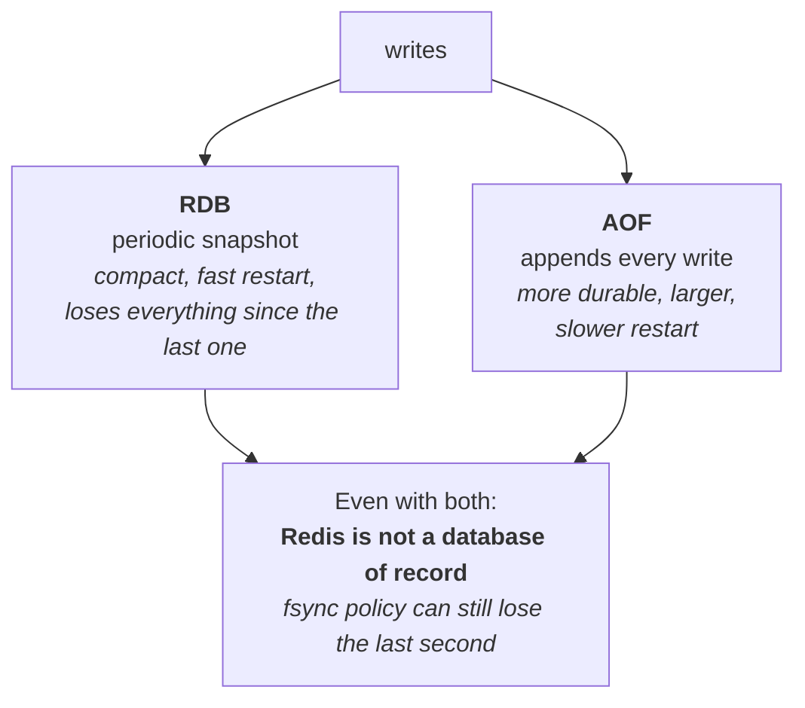
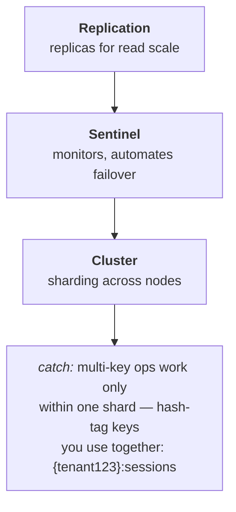

# Redis, ODMs and Firebase

Redis is the important one — it's central to your latency story. Mongoose,
Sequelize and Firebase get lighter treatment; know enough to discuss them
credibly.

---

## Redis

An in-memory data store. Fast because it's in memory and single-threaded for
commands — **no locking, no race conditions between commands**, which is the
property that makes several patterns below work.

### The data types, and what each is for

| Type | Use |
| --- | --- |
| **String** | Cached values, counters (`INCR` is atomic) |
| **Hash** | An object — update one field without rewriting the whole thing |
| **List** | Queues (`LPUSH`/`BRPOP`), recent-items feeds |
| **Set** | Membership, deduplication, unique visitors |
| **Sorted set** | Leaderboards, rate limiting, delayed jobs — score = time |
| **Stream** | An append-only log with consumer groups |

**Sorted sets are the underrated one.** Score by timestamp and you have a
sliding-window rate limiter, a priority queue, or a scheduled job store.

**Use hashes for cached objects**, not JSON strings — you can update or read
one field rather than serialising the whole object every time.

### Persistence


*The bottom box is the sentence to say out loud. Treat Redis as cache and derived state you can rebuild, not as the place the truth lives.*

- **RDB** — periodic snapshots. Compact, fast restart, **loses everything
  since the last snapshot**.
- **AOF** — appends every write. More durable, larger, slower restart.
- **Both** is the usual production choice.

The thing to say out loud: **Redis is not a database of record.** Even with
AOF, `fsync` policy means you can lose the last second of writes. Treat it as a
cache and derived state you can rebuild.

### Eviction

When memory fills, `maxmemory-policy` decides:

- `allkeys-lru` — evict least recently used. **The right default for a cache.**
- `volatile-lru` — only keys with a TTL.
- `noeviction` — reject writes. Right for a queue, where silently dropping jobs
  would be worse than failing.

**Monitor evictions.** Rising evictions mean your working set doesn't fit, and
your hit rate is quietly collapsing.

### Atomic operations and Lua

Single-threaded execution means individual commands are atomic. For
multi-command atomicity, use a **Lua script** — it runs as one unit.

This is how you release a lock safely:

```lua
-- delete the key ONLY if it still holds my token
if redis.call("get", KEYS[1]) == ARGV[1] then
  return redis.call("del", KEYS[1])
else
  return 0
end
```

Without this, you can delete someone else's lock after yours expired. See
[consensus coordination](../02-distributed-systems/04-consensus-coordination.md).

### Scaling


*The hash tag is the detail that bites in production: without it, keys you always use together land on different shards and multi-key operations simply fail.*

- **Replication** — replicas for read scale and failover.
- **Sentinel** — monitors and automates failover.
- **Cluster** — sharding across nodes. The catch: **multi-key operations only
  work within one shard**, so keys you use together need a hash tag
  (`{tenant123}:sessions`) to force them onto the same shard.

---

### ioredis — the client

**ioredis** is the Node client most production code uses (over `node_redis`).
Worth knowing why:

- **Cluster and Sentinel support built in**, including automatic failover
  handling and `MOVED`/`ASK` redirection — you don't hand-roll that.
- **Automatic pipelining** — commands issued in the same tick are batched into
  one round trip. On a chatty path that's a large saving for free.
- **Lua scripting via `defineCommand`**, which registers a script and caches it
  by SHA so you aren't shipping the source every call. This is how you'd
  implement an atomic lock release or a token-bucket refill.
- **Offline queue** — commands issued while disconnected are buffered and
  replayed. Convenient, but a trap: during a long outage the queue grows and
  you can OOM. Bound it, or disable it and fail fast.

The gotchas: connections are not free, so share one client rather than creating
per request; and set `maxRetriesPerRequest` so a dead Redis fails fast instead
of hanging every request that touches it.

## Mongoose and Sequelize

ODM/ORM layers. They give you schemas, validation, relationships and
migrations — and they hide SQL, which is both the point and the problem.

**The N+1 problem is the thing to know.** Render 100 users with their posts:
one query fetches the users, then — if the association is lazy — touching
`user.posts` inside the loop fires one `SELECT … WHERE user_id = ?` per user,
101 queries total (~200ms). Load eagerly instead (a join, or
`WHERE user_id IN (…)`) and it's 2 queries (~4ms).

The killer is that the lazy path is *invisible in the code* — `user.posts`
looks like a property access. It only shows up in query logs or an APM trace.

The danger is that the loop looks completely innocent in code — nothing warns
you, because the ORM issues each query silently on property access.

```js
const users = await User.findAll();              // 1 query
for (const u of users) await u.getPosts();       // N more queries
```

Fix with eager loading — `include` in Sequelize, `populate` in Mongoose — which
turns it into one or two queries.

**Where ORMs hurt:** they generate inefficient SQL for complex queries, they
make it easy to write something quadratic without noticing, and they abstract
away exactly the details you need when performance matters.

The practical position: use the ORM for CRUD and relationships, drop to raw SQL
for reporting and hot paths. That isn't a failure of the ORM — it's using it
for what it's good at.

**Migrations** matter more than the query API. Schema changes need to be
versioned, reviewable and reversible, and backward-compatible if you deploy
without downtime — add a column, deploy code writing both, backfill, then
remove the old one.

---

## Firebase

A managed backend — Auth, Firestore, Storage, Hosting. On your resume from
earlier work, so know roughly what it's for.

**The pieces**: **Auth** (managed identity with social and email providers),
**Firestore** (document database with real-time listeners), **Storage** (files),
and **Hosting** (static site and SPA serving with a CDN, atomic deploys and
one-command rollback, plus automatic TLS). Firebase Hosting is essentially a
managed CDN for a frontend — its selling point is that a deploy is atomic and
instantly reversible, which removes a whole class of partial-deploy problems.

**Good at:** getting to production fast, real-time sync out of the box, no
servers to run, generous free tier. Genuinely the right choice for prototypes,
mobile apps and small teams.

**Costs:** vendor lock-in, querying is limited compared to SQL (no joins,
restricted compound queries), pricing scales with reads and can surprise you,
and **security rules become your authorization layer** — which is a real
constraint, since complex permission logic is awkward to express in them.

That last point is a natural bridge if it comes up: Firestore security rules
are a declarative authorization language, so they're conceptually similar to
Rego — but far less expressive, which is exactly why a platform with real RBAC
needs a policy engine instead.


## Building it

**Setting it up — connecting to Sentinel or Cluster**

The client code elsewhere in this chapter assumes a single Redis; scaling to
Sentinel or Cluster is a connection-config change, not a new library:

```ts
// Sentinel — client discovers the current master through the sentinels
const redis = new Redis({
  sentinels: [{ host: 'sentinel-1', port: 26379 }, { host: 'sentinel-2', port: 26379 }],
  name: 'mymaster',
});

// Cluster — remember: multi-key ops need a hash tag to land on one shard
const cluster = new Redis.Cluster([{ host: 'node-1', port: 6379 }]);
await cluster.mget('{tenant123}:sessions:a', '{tenant123}:sessions:b'); // same shard
```

---

## Interview Q&A

### Q: What would you use Redis for, and what wouldn't you?
**Level:** intermediate · **Tags:** redis, caching

<details><summary>Model answer</summary>

Would: caching computed results, session storage, rate limiting with sorted
sets or counters, distributed locks with the caveats, pub/sub for
cross-instance messaging, queues for simple job processing, and leaderboards or
anything ranked.

Wouldn't: use it as a system of record. Even with AOF persistence and
aggressive fsync you can lose the last second of writes, so anything you can't
rebuild shouldn't live only in Redis.

I'd also avoid it for data much larger than memory — it's in-memory, so cost
scales with dataset size — and for complex queries, since it's key-based, not
a query engine.

The other thing I'd mention is the modelling choice: use hashes for cached
objects rather than JSON strings, so you can read and update individual fields
without serialising the whole object each time.

</details>

**Follow-ups:**

1. Q: Redis is single-threaded. Isn't that a bottleneck?
   <details><summary>Answer</summary>

   Rarely, because it's in-memory and most commands are microseconds — a single
   thread handles well over 100,000 operations per second. The bottleneck is
   usually network or client-side, not Redis itself.

   Single-threaded is also a *feature*: commands execute one at a time, so
   there's no locking and no race between commands. That's why `INCR` is atomic
   for free, and why a Lua script gives you a multi-command atomic block.

   Where it does bite: one slow command blocks everything. `KEYS *` on a large
   database, a big `SORT`, or deleting a huge key with `DEL` will stall every
   other client. That's why you use `SCAN` instead of `KEYS`, and `UNLINK`
   instead of `DEL` for large keys, since it frees memory in the background.

   Modern Redis does use threads for I/O and background tasks; it's command
   *execution* that's single-threaded.

   </details>

2. Q: How would you implement rate limiting in Redis?
   <details><summary>Answer</summary>

   Simplest version is a counter with an expiry — `INCR` the key, and set a TTL
   when it's first created. If the value exceeds the limit, reject. That's a
   fixed window, so it has the boundary problem: a client can send the full
   limit at the end of one window and again at the start of the next, getting
   double the intended burst.

   Better is a **sorted set as a sliding window log**. Add each request with the
   timestamp as the score, remove entries older than the window with
   `ZREMRANGEBYSCORE`, then count what's left. Exact, no boundary problem, at
   the cost of storing a member per request.

   For a token bucket, store tokens and the last refill time in a hash, and do
   the refill arithmetic in a Lua script so the read-modify-write is atomic.

   Whichever I pick, the operations need to be atomic — either a `MULTI` block
   or Lua — otherwise concurrent requests interleave between the read and the
   write and the limit leaks.

   </details>

### Q: What's the N+1 problem and how does it show up with an ORM?
**Level:** intermediate · **Tags:** orm, performance

<details><summary>Model answer</summary>

You fetch a list — say 100 users — then loop and fetch each one's related
records. That's 1 query plus 100 more, and it's slow in a way that's invisible
in the code, because the loop looks perfectly innocent.

ORMs make it especially easy through **lazy loading**: accessing
`user.posts` silently issues a query. You don't see the queries, so nothing
warns you.

The fix is eager loading — `include` in Sequelize, `populate` in Mongoose —
which fetches the related data in one or two queries instead of N.

How I'd catch it: log queries in development with counts per request, and alert
on requests issuing an unusual number. Many ORMs can warn on lazy loads in
development specifically for this.

The wider point is that ORMs are excellent for CRUD and hide exactly the
details that matter for performance. I'd use the ORM for normal work and drop
to raw SQL for hot paths and reporting — that's using it for what it's good at
rather than a failure of the tool.

</details>

---

## What a weak answer sounds like

- **Using Redis as the source of truth** without acknowledging it can lose
  writes.
- **`KEYS *` in production.** Blocks the whole server.
- **Unconditional `DEL` to release a lock.** Can delete someone else's.
- **No eviction policy set**, then surprise when writes start failing.
- **Not knowing eager loading**, while claiming ORM experience.

---

## Glossary

- **Sorted set** — scored members; rate limiters, leaderboards, scheduling.
- **RDB / AOF** — snapshot / append-only persistence.
- **`maxmemory-policy`** — what to evict when full; `allkeys-lru` for caches.
- **Lua script** — multiple Redis commands executed atomically.
- **Hash tag** — `{tenant}:key`, forces keys onto the same cluster shard.
- **N+1** — one query for a list, then one per item.
- **Eager loading** — fetching relations up front in one query.
- **Migration** — a versioned, reversible schema change.
