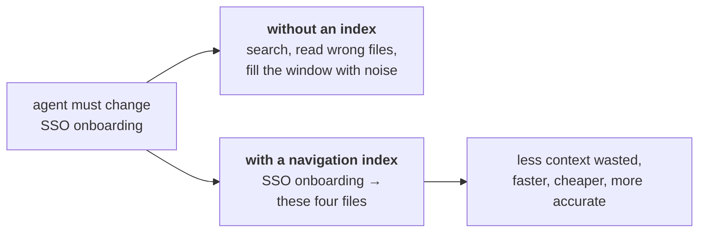
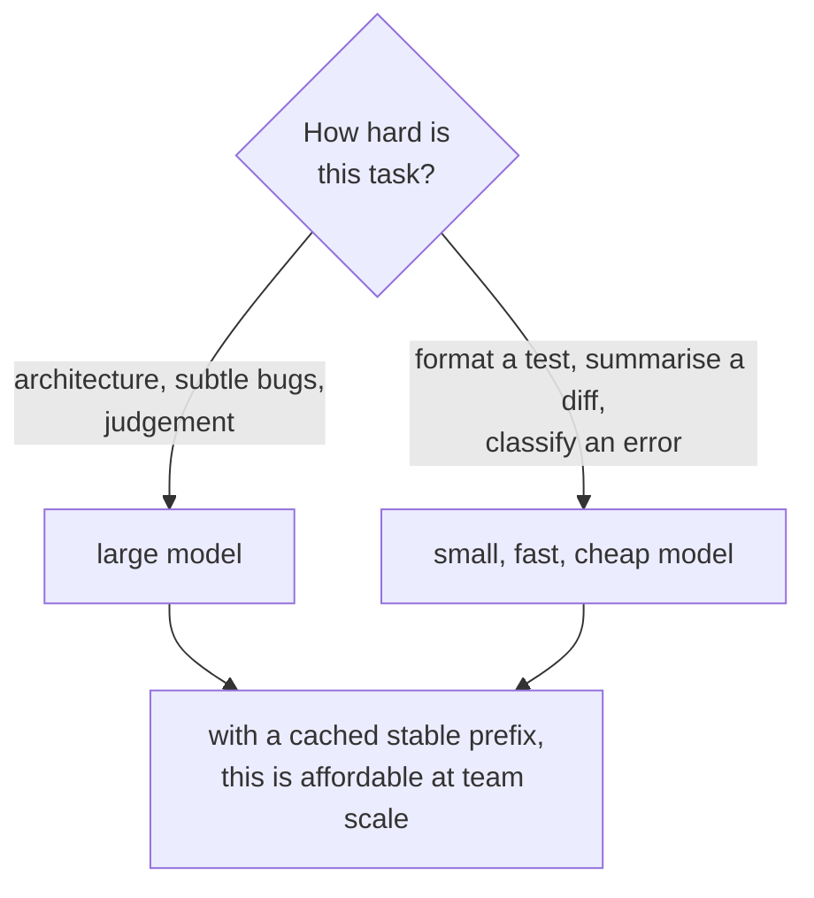

# AI tooling and agent enablement

Your differentiator. Most candidates say "I use Copilot"; you built the docs
and libraries that made a team of agents effective. That's a different
conversation, and it's worth being ready to have it well.

Expect two kinds of question: genuine curiosity about how it works, and
skepticism about whether the output is any good.

---

## What you actually built

Three things, and it's worth naming them as an architecture rather than a list.
**AGENT.md / SKILLS.md** carry the conventions and gotchas, so the agent isn't
guessing at how the team works. A **navigation index** maps a feature or flow
to the exact files, across repos — this turns search into lookup and is the
highest-value piece. A **playbook library** holds the repeatable procedures:
RCA, test generation, conflict resolution. An agent session pulls those in,
then prompt caching and model routing keep it cheap.

**This repo is built the same way** — navigation index, thin skill layer,
knowledge in markdown. Offering to show it is a strong close to that
conversation.

---

## The tools themselves

**GitHub Copilot** (and Copilot Chat, and Copilot's PR summaries) is inline
completion — it suggests the next few lines as you
type, from the surrounding file and open tabs. Excellent for boilerplate, test
scaffolding, and the code you'd otherwise copy from the file above. Its limit is
context: it sees your editor, not your architecture, so it confidently completes
patterns that are locally plausible and globally wrong.

**Claude Code** is an agent in the terminal. It reads and writes files, runs
commands, and works across a whole repository — so it operates at the level of
tasks rather than lines: "add SCIM deprovisioning and the tests for it" rather
than finishing a function.

The distinction is worth being able to draw, because it explains why the
enablement work mattered:

| | Copilot | Agent (Claude Code) |
| --- | --- | --- |
| Unit of work | Next lines | A whole task |
| Sees | Open files | Whole repo, runs commands |
| Needs from you | Nothing | **Context: conventions, where things live** |

Completion needs no setup. An **agent's output quality is bounded by the
context it can reach**, which is exactly why AGENT.md files, a navigation index
and a playbook library are the use — they're the difference between an
agent guessing at your codebase and knowing it.

That's also why the two tools coexist rather than compete: GitHub Copilot for
typing speed inside a file, agents for delegated tasks across a repo. In
practice a team uses both, and the enablement work only pays off for the
second.

## Context engineering — the concept to name

The constraint on an agent isn't intelligence, it's **whether the right context
reaches it**. An agent in a large unfamiliar codebase spends most of its effort
*locating* relevant code — searching, reading the wrong files, filling its
context window with noise.


*Naming this "context engineering" signals you understand where the bottleneck actually is — getting the right context in, not model intelligence.*

The navigation index converts **search into lookup**. Instead of "find where
SSO onboarding is handled", it's "SSO onboarding → these four files in these
two repos". Less context wasted, faster and more accurate results, lower cost.

Use the term "context engineering" — it signals you understand the actual
bottleneck rather than just using the tools.

---

## Prompt caching

A long, stable prefix — conventions, navigation index, repo context — is
identical across requests. Cache it and it's reused rather than reprocessed and
re-billed each time.

**The design constraint this imposes:** the stable part must come *first* in
the prompt, and the varying part last. If you interleave them, nothing caches.
So it changes how you assemble prompts, not just a flag you turn on.

The saving grows with how much fixed context you carry — which is exactly the
situation once you've invested in good agent docs. The two decisions reinforce
each other.

## Model routing


*Routing everything to the largest model is the default and the biggest source of waste — caching and routing together are what keep the tooling from being switched off.*

Match model capability to task difficulty:

- **Large model** — architectural reasoning, subtle bugs, anything needing
  judgement.
- **Small, fast, cheap model** — formatting a test, summarising a diff,
  classifying an error, mechanical transformations.

Routing everything to the largest model is the default and the most common
source of waste. Together, caching and routing are what make agent tooling
cost-justified at team scale rather than something finance turns off.

---

## Where you draw the line

The best question you'll get is **"what do you *not* let AI do?"** A candidate
with no boundaries hasn't used it seriously.

- **Security-sensitive logic** — authorization checks, token handling, crypto.
  Not because a model can't write it, but because reviewing subtly-wrong
  security code is harder than writing it, and a plausible-looking authz bug
  survives review.
- **Final approval.** AI pre-reviews; a human approves. Automate that and
  you've removed the only real check.
- **Anything needing context it can't have** — why a strange workaround exists,
  which customer depends on an undocumented behaviour, what the team agreed
  verbally. Agent docs help but are never complete.
- **Unsupervised production actions.** Diagnosis yes, executing a mitigation
  no.

---

## Defending the numbers

Your resume says 2–3x more PRs per sprint, coverage 75% → 85%+, bug turnaround
2–3 days → one day.

**Lead with the quality number.** Throughput alone reads as churn, and the
unspoken question is always whether defect rate went up. Coverage rising over
the same period is the answer, and volunteering it before being asked defuses
the whole line of questioning.

Also be honest that **PR count is a weak proxy** — you can inflate it by
splitting work. The metrics worth defending are coverage and bug turnaround,
because they're outcomes rather than activity. Saying that yourself is more
persuasive than being pushed to it.


## Building it

**Libraries**

| Need | Library | Why |
| --- | --- | --- |
| Model calls with caching | `@anthropic-ai/sdk` | `cache_control` blocks on stable prefix content are what make prompt caching from "Prompt caching" above concrete rather than conceptual |

**Pseudocode — the stable-prefix cache in code**

```ts
const response = await anthropic.messages.create({
  model: 'claude-sonnet-5',
  system: [
    { type: 'text', text: navigationIndexAndConventions, cache_control: { type: 'ephemeral' } },
  ],
  messages: [{ role: 'user', content: currentTask }],
});
```

The navigation index and repo conventions are identical across requests, so
they're the part marked `cache_control` — only the task text changes turn to
turn, which is the whole saving "Prompt caching" describes.

---

## Interview Q&A

### Q: You drove AI adoption. Did code quality suffer?
**Level:** senior · **Tags:** ai, metrics, quality

<details><summary>Model answer</summary>

Coverage went from 75% to 85%+ over the same period that PR throughput rose, so
output increased while the test safety net got stronger. I'd lead with that,
because throughput on its own reads as churn.

The fuller answer is that we applied AI where it *reduces* defect risk rather
than where it increases it: pre-review catching issues before human review,
test generation covering the edge cases people skip when they're bored, and RCA
assistance during incidents. Nothing merged without human review, and AI output
was treated as a draft to be judged, never a result to be trusted.

If I'm being rigorous, PR count is a weak metric — you can inflate it by
splitting work smaller. The numbers I'd actually defend are the coverage
increase and bug turnaround dropping from two or three days to one, because
both are outcomes rather than activity.

</details>

**Follow-ups:**

1. Q: What do you not let AI do?
   <details><summary>Answer</summary>

   Security-sensitive logic — authorization checks, token handling, crypto.
   Not because a model can't produce it, but because reviewing subtly-wrong
   security code is harder than writing it. A plausible-looking authorization
   bug passes review in a way that a plausible-looking syntax error doesn't.

   Final approval. AI pre-reviews, a human approves. The moment approval is
   automated you've removed the only real check in the process.

   Anything that depends on context it can't have — why a strange workaround
   exists, which customer relies on an undocumented behaviour, what the team
   agreed in a meeting. Writing agent docs addresses part of that, but they're
   never complete and pretending otherwise is how you get confidently wrong
   changes.

   And unsupervised production actions. Diagnosis during an incident, yes;
   executing a mitigation on its own, no.

   </details>

2. Q: How did you get a whole team to change how they work?
   <details><summary>Answer</summary>

   Adoption was harder than the tooling.

   What worked was starting with a **painful, unglamorous task** rather than an
   exciting one. Merge-conflict resolution and test generation are ideal —
   nobody enjoys them, so there's no territorial resistance, and the benefit is
   felt immediately.

   Then making it **reusable rather than heroic**. A demo impresses once; a
   playbook library other people can run is what actually spreads. That's why
   the prompt library mattered more than any individual result.

   Then **showing rather than mandating** — internal demos on the team's own
   code, with real before-and-after.

   And taking the skeptics seriously. The engineer worried about AI-generated
   code quality is usually right about the risk, and converting them by
   addressing it — with explicit review boundaries — produced a stronger
   advocate than any demo did.

   > **FILL IN:** who was hardest to convince and what changed their mind? A
   > concrete story here is much more memorable than the general version.

   </details>

### Q: What's in an agent-navigation index and why does it help?
**Level:** senior · **Tags:** ai, context-engineering

<details><summary>Model answer</summary>

It maps features and flows to the exact files that implement them, across
repositories.

The problem it solves is that an agent working in a large unfamiliar codebase
spends most of its effort *locating* relevant code — searching, opening the
wrong files, filling its context window with things that turn out to be
irrelevant. In a multi-repo platform where one feature spans several services,
that's the majority of the work and the majority of the cost.

The index converts search into lookup. Rather than "find where SSO onboarding
is handled", it's "SSO onboarding → these four files in these two repos". Less
wasted context, faster and more accurate results.

The framing I'd use is **context engineering**: the constraint isn't the
model's intelligence, it's whether the right context reaches it. Curating that
deliberately, instead of hoping retrieval finds it, is the highest-use
thing you can do.

It's also a durable artefact — it helps every future session, and it turns out
to help new human engineers onboarding too, which wasn't the original intent.

</details>

**Follow-ups:**

1. Q: How do you keep documentation like that from going stale?
   <details><summary>Answer</summary>

   The honest answer is that stale agent docs are worse than none, because
   they confidently point at the wrong place.

   What helps: keep the docs **in the repository** next to the code, so they're
   part of the same change and the same review — documentation in a wiki
   diverges immediately. Keep them **specific enough to be checkable** — a path
   that no longer exists is detectable, where vague prose isn't. And **validate
   them in CI**: if the index names files, a script can assert those files
   exist and fail the build when they don't.

   That last one is the real answer. Making the documentation executable —
   checked by a script rather than by good intentions — is the only thing that
   reliably keeps it true.

   It's the same approach as this prep repo, where `check_coverage.py` fails if
   the resume claims a skill nothing here teaches. Documentation that can be
   wrong silently will eventually be wrong.

   </details>

---

## What a weak answer sounds like

- **"I use Copilot and ChatGPT."** So does everyone. The interesting part is
  what you built around them.
- **No boundaries.** Says you haven't used it seriously.
- **Quoting throughput without quality.** Invites exactly the skepticism you
  want to avoid.
- **Treating AI output as trusted** rather than as a draft.
- **Not knowing why prompt caching needs the stable content first.**

---

## Glossary

- **Context engineering** — deliberately curating what reaches the model.
- **Navigation index** — feature/flow → exact files; turns search into lookup.
- **AGENT.md / SKILLS.md** — repo conventions and procedures for agents.
- **Prompt caching** — reusing a stable prefix instead of reprocessing it.
- **Model routing** — matching model capability to task difficulty.
- **Pre-review** — AI reviewing a PR before a human does.
- **Playbook** — a reusable prompt for a recurring task.
