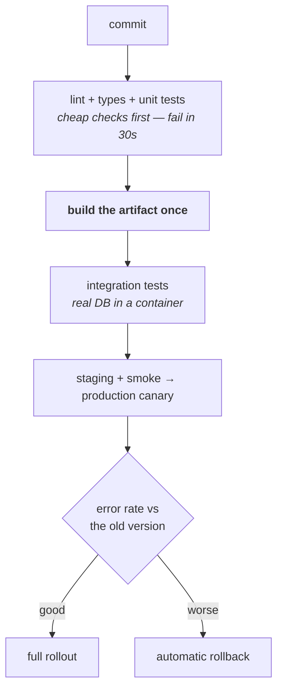
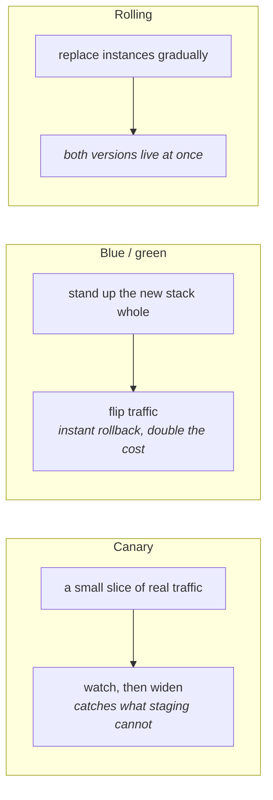
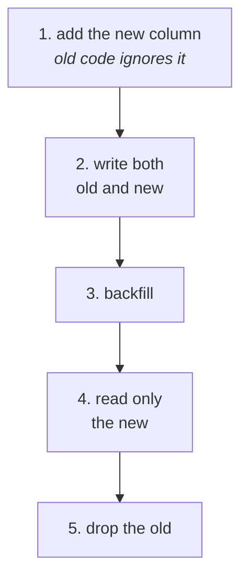

# CI/CD and observability

You built CI/CD pipelines at Gyrix and used Datadog for incident response, so
both connect to real stories.

---

## CI/CD

**CI** — every push builds and tests automatically, so broken code is caught in
minutes rather than at release.
**CD** — those builds deploy automatically (delivery = to staging, deployment =
to production).


*Cheap checks first, and the same artifact promoted the whole way: rebuild per environment and what you tested is not what you shipped.*

A reasonable pipeline, in order: **commit → lint + types → unit tests → build
the artifact once → integration tests (real DB in a container) → deploy to
staging → smoke tests → production canary → watch error rate vs the old
version → full rollout, or automatic rollback if it degrades.**

**Fail fast** — cheap checks first. A lint error should fail in 30 seconds, not
after a 10-minute test suite.

**Build the artifact once** and promote the same one through environments. If
you rebuild per environment, what you tested isn't what you shipped.

### Deployment strategies


*Canary is the one that finds problems staging never will, because the thing you cannot reproduce off production is production traffic.*

| Strategy | How | Trade |
| --- | --- | --- |
| **Rolling** | Replace instances gradually | Simple; both versions live at once |
| **Blue-green** | Two environments, switch traffic | Instant rollback; double the capacity |
| **Canary** | Small % first, watch, expand | Safest; needs good metrics |

**Canary with automatic rollback on error rate is the mature answer**, and for
a tier-0 service like auth it's what I'd argue for — a bad auth deploy is a
total platform outage, not a degraded feature.

### Deploy and release are different

Feature flags separate "the code is live" from "the behaviour is on". That
means you can deploy frequently and safely, turn a feature on for 1% of users,
and turn it off without a rollback. It's the single biggest improvement to
deployment safety most teams can make.

### Database migrations

The part that can't be rolled back cleanly. The discipline is
backward-compatible steps:


*Slower on purpose: at every one of these five points you can roll the code back and the schema is still correct.*

1. Add the new column (old code ignores it)
2. Deploy code writing both old and new
3. Backfill existing rows
4. Deploy code reading only the new
5. Drop the old column

Slower, but at every point you can roll the *code* back without the schema
being wrong.

---

## Observability

**Monitoring** tells you something is wrong. **Observability** lets you work out
*why*, including for failures you didn't anticipate.

### The three pillars

- **Metrics** — numbers over time. Cheap, aggregate, good for alerts and
  dashboards. Can't tell you about one specific request.
- **Logs** — discrete events with detail. Expensive at volume; use structured
  (JSON) logs so they're queryable, and always include a correlation ID.
- **Traces** — one request's path across services, as a waterfall. The only way
  to answer "where did the time go" in a distributed system.

### What to alert on

**Symptoms, not causes.** Alert on "error rate above 1%" or "p99 latency above
500ms" — things users feel. Don't alert on "CPU above 80%", which may be
perfectly fine.

The **four golden signals**: latency, traffic, errors, saturation.

**Use percentiles, not averages.** An average hides everything: a service where
90% of requests take 50ms and 10% take 5 seconds has a fine average and a
terrible experience. **p99 is what your unhappiest users get**, and it's the
number that matters for a service every request passes through.

**Alert fatigue is a real failure mode.** Too many alerts and people ignore all
of them, including the one that mattered. Every alert should be actionable — if
there's nothing to do about it, it's a dashboard, not an alert.

### SLI, SLO, error budget

- **SLI** — the measurement. "Percentage of requests served under 300ms."
- **SLO** — the target. "99.9% of requests under 300ms."
- **Error budget** — what's left. 99.9% allows ~43 minutes of failure per month.

The useful part is what the budget *does*: budget remaining means you can ship
riskily; budget exhausted means you stop shipping features and fix reliability.
It turns an argument about whether to prioritise reliability into a number.

### Multi-tenant observability

Tag everything with tenant. In a multi-tenant platform, "the system is slow" is
undiagnosable unless you can slice by customer — and "it's slow for one
customer" is a common incident shape. Being able to filter rather than grep is
the difference between minutes and hours.

---

## The day-to-day tooling

Three names on your resume that are easy to say and easy to be caught out on.
Each has one question an interviewer actually asks.

### PM2

A Node process manager: it keeps processes alive, restarts them on crash, runs
one worker per core in **cluster mode**, and handles log rotation and zero-
downtime reloads.

**The question you get is "why PM2 if you're on containers?"** — and the honest
answer is that mostly you shouldn't. In a container, the orchestrator already
does supervision and restart; running PM2 inside means two supervisors, and the
common bug is PM2 restarting a broken process forever so the container never
exits and the orchestrator never notices it is unhealthy. PM2 belongs on a
long-lived VM — an EC2 box running the app directly, which is where it earns
its place, and where a lot of production Node still lives.

The one container case that survives scrutiny is `pm2-runtime`, which runs in
the foreground and forwards signals properly. Even then, prefer one process per
container and let the orchestrator scale.

The detail worth knowing: **cluster mode gives you multiple processes, not
threads** — see [Node internals](../04-backend/01-nodejs-internals.md). It
scales across cores, and it means anything in process memory (a session cache,
a rate-limit counter) is now per-worker and wrong. That state has to move to
Redis, which is the same lesson as horizontal scaling generally.

### Postman

API client and collection runner. Fine to say you used it; the useful part is
what you did beyond clicking send.

- **Collections** are the shared, versioned definition of an API's requests —
  environments carry the base URL and tokens so the same collection runs
  against local, staging and prod.
- **Newman** is the CLI runner, which is what makes a collection a **CI
  artefact** rather than a personal scratchpad. Contract-level checks on every
  deploy, in the pipeline.
- **Auth flows** are where it earns its place in your world: OAuth 2.0 grants
  and token refresh are painful to exercise by hand, and a saved collection
  makes an SSO or SCIM flow reproducible for the whole team and for support.

The boundary to state before it's asked: a Postman collection **is not a test
suite**. It's an integration smoke check against a deployed environment — it
doesn't replace Jest, and treating it as coverage is how you end up with a
green pipeline and untested logic.

### Jira

Issue tracking, and the substrate for the Agile ceremonies you ran at
Bestpeers.

- **Vocabulary:** epic → story → sub-task; bug; sprint; backlog; board.
- **Estimation** in story points is about relative size and uncertainty, not
  hours — the point people get wrong.
- **Velocity is a planning input, not a performance metric.** The moment it's
  used to compare people or teams it gets gamed, and both the estimates and the
  plan stop being useful. Saying that unprompted is a leadership signal.
- **The link that matters technically** is commit/PR → issue key, so a release
  has a changelog and an incident has a trail back to why a change was made.
  A Jira key in the branch name is the cheapest way to get that for free.


## Building it

**Libraries**

| Need | Library | Why |
| --- | --- | --- |
| CI/CD | GitHub Actions or Jenkins — see "Jenkins and GoCD" | Already covered; the pipeline shape matters more than the specific runner |
| Tracing/metrics | `@opentelemetry/sdk-node` | Vendor-neutral instrumentation — export to Datadog, Honeycomb, or anything else without re-instrumenting |

**Pseudocode — the three pillars, minimally instrumented**

```ts
import { trace } from '@opentelemetry/api';
const tracer = trace.getTracer('auth-service');

app.post('/authorize', async (req, res) => {
  const span = tracer.startSpan('authorize');
  try {
    const result = await checkPermission(req.body);
    span.setAttribute('decision', result.allow);
    res.json(result);
  } finally {
    span.end();   // duration is the metric; the span itself is the trace
  }
});
```

---

## Interview Q&A

### Q: What would your deployment pipeline look like for a tier-0 service?
**Level:** senior · **Tags:** cicd, deployment

<details><summary>Model answer</summary>

Given that a bad auth deploy takes the whole platform down rather than
degrading one feature, I'd bias heavily toward safety.

Build the artifact **once** and promote that same artifact through
environments, so what was tested is literally what ships.

Deploy with a **canary**: a small percentage of traffic on the new version,
with automatic comparison of error rate and latency against the old one, and
automatic rollback if it degrades. Expanding only if the metrics hold.

**Backward-compatible changes only**, because you can't deploy every consuming
service at once — the token format and the gRPC contract have to keep working
for older clients.

**Feature flags** so a behaviour change can be switched off without a rollback,
which is much faster and less risky than redeploying.

And **shadow mode for anything that changes authorization decisions**: run the
new logic alongside the old without enforcing it, and compare the answers on
real traffic. That's the one I'd insist on, because a change that makes the
system *more* permissive doesn't show up as an error — it shows up as a breach
later. Comparing decisions catches it before it ships.

</details>

**Follow-ups:**

1. Q: How do you handle a database migration that can't be rolled back?
   <details><summary>Answer</summary>

   You make it not need rolling back, by splitting it into backward-compatible
   steps — the expand/contract pattern.

   Instead of renaming a column in one migration, you: add the new column; deploy
   code that writes to both and reads the old; backfill existing rows; deploy
   code that reads the new; and only then, once you're confident, drop the old.

   At every point the currently-deployed code works against the current schema,
   so a code rollback is always safe.

   Backfills need care of their own — batch them so you don't lock a large
   table, and make them resumable, because they'll be interrupted.

   For genuinely destructive changes, the practical protection is a tested
   restore path and a maintenance window if it comes to that. But most
   migrations don't need to be destructive; they're made destructive by doing
   them in one step.

   </details>

2. Q: What would you alert on for an auth service?
   <details><summary>Answer</summary>

   Symptoms users feel, not resource numbers.

   The core ones: **error rate** on token validation and authorization checks,
   since a rise there means requests are failing across the platform; **p99
   latency**, because auth sits in front of everything and its tail becomes
   everyone's tail; and **availability** against the SLO.

   Auth-specific ones I'd add: **login success rate**, since a drop can mean a
   broken IdP integration rather than a broken service — and it's often the
   first sign a customer's SSO certificate expired. **Authorization denial
   rate**, because a sudden spike might be a misconfigured policy locking people
   out, and a sudden *drop* might mean something is wrongly permitting.
   **Certificate expiry** across tenants, well ahead of time. And **cache hit
   rate**, since a collapse there precedes a latency problem.

   All of it sliced by tenant, because "auth is slow" and "auth is slow for one
   customer" need different responses and you can't tell them apart from
   aggregates.

   What I wouldn't alert on: CPU or memory in isolation. They're diagnostic
   context, not symptoms.

   </details>

### Q: What's the difference between monitoring and observability?
**Level:** intermediate · **Tags:** observability

<details><summary>Model answer</summary>

Monitoring is checking known things — you decide in advance what to measure and
alert when it crosses a threshold. It answers "is the thing I predicted
happening?"

Observability is being able to ask *new* questions of a running system without
shipping new code. It's for the failures you didn't anticipate, which are most
of the interesting ones.

Practically the difference shows up in cardinality and detail. A monitoring
metric is "error rate is 2%". Observability lets you ask "which tenant, which
endpoint, which version, which region" and find the answer — which needs
high-cardinality data, meaning structured logs and traces rather than
pre-aggregated counters.

The three pillars together: metrics for aggregate health and alerting, logs for
detail about what happened, traces for where the time went across services. The
piece that ties them is a **correlation ID** flowing through all three, so you
can move from a metric spike to the specific traces to the specific logs.

The honest framing is that most teams have monitoring and call it
observability. The test is whether you can answer an unanticipated question
during an incident without deploying a change.

</details>

---

## What a weak answer sounds like

- **Alerting on CPU and memory.** They're diagnostic context, not symptoms.
- **Averages instead of percentiles.** An average hides the broken tail.
- **Rebuilding per environment.** Then you didn't ship what you tested.
- **No feature flags.** Every behaviour change becomes a deploy and a rollback.
- **Unstructured logs.** Grep doesn't scale; JSON logs are queryable.

---

## Glossary

- **CI / CD** — automated build and test / automated deploy.
- **Canary** — a small share of traffic on the new version first.
- **Blue-green** — two environments, switch traffic; instant rollback.
- **Feature flag** — separates deploying code from enabling behaviour.
- **Expand/contract** — backward-compatible migration in steps.
- **Golden signals** — latency, traffic, errors, saturation.
- **SLI / SLO / error budget** — the measure / the target / the room left.
- **Correlation ID** — one id linking logs, metrics and traces for a request.
- **p99** — what your unhappiest 1% of requests experience.
- **Alert fatigue** — too many alerts, so all get ignored.
- **PM2 cluster mode** — one Node process per core; processes, not threads,
  so in-process state becomes per-worker.
- **Newman** — Postman's CLI runner; what makes a collection a CI artefact.
- **Story point** — relative size and uncertainty, not hours.
- **Velocity** — points completed per sprint; a planning input, and a
  worthless performance metric.
