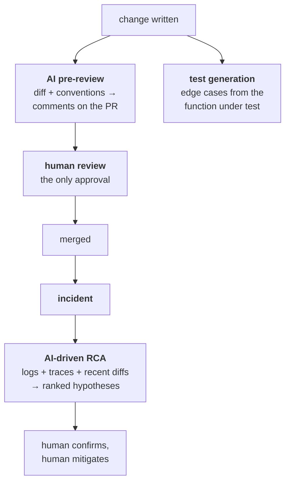

# AI across the SDLC

[Chapter 1](01-ai-engineering.md) covers the *enablement* work — the docs,
navigation index and playbook library that make an agent effective, plus prompt
caching and model routing. This chapter covers the five places your resume says
you actually applied it: **code review, test generation, debugging, incident
RCA, and security analysis**.

The distinction matters in an interview. Chapter 1 is "what I built"; this is
"what it does day to day". Interviewers push on the second, because that's
where the claim either has substance or falls apart.

---

## The tools, and which one for what

You name three on your resume. Be able to say why more than one exists.

| Tool | Shape | Where it earns its place |
| --- | --- | --- |
| **GitHub Copilot** | Inline completion in the editor | Typing speed inside a file — boilerplate, test scaffolding |
| **Claude Code** | Agent in the terminal, reads/writes files, runs commands | Whole-task work across a repo: "add SCIM deprovisioning and its tests" |
| **GPT** (ChatGPT / the OpenAI API) | Chat, and an API for building on | Thinking a problem through outside the repo; the API when you're *building* a feature on a model rather than using one |

The honest framing for GPT specifically: it's the general-purpose one. It has
no repo context, so it's for reasoning about a problem, drafting a design, or
explaining an unfamiliar error — not for changing code in place. A candidate
who claims an agent workflow but only ever pastes into a chat window is
describing something much smaller, so keep the distinction sharp.

> **FILL IN:** which model/provider your team actually standardised on, and
> whether GPT was used through ChatGPT, the API, or Copilot's backend. "We used
> GPT" invites "for what, and through what?" and a vague answer reads as
> résumé padding.

---

## How it actually works


*Every AI step produces a draft that a human judges; nothing in the chain has approval or production authority. That boundary is the answer to "did quality suffer?".*

### Who's who

| Actor | Role |
| --- | --- |
| **Author** | Writes the change; runs generation and pre-review before asking for human review |
| **Pre-review bot** | Reads the diff plus the repo's conventions, leaves comments — has no approve permission |
| **Human reviewer** | The only approver. Judges the AI's comments as much as the code |
| **Playbook** | The stored prompt that makes each of these repeatable rather than ad hoc |

### 1. AI-assisted code review

The AI reviews the diff *before* a human does, so the human starts from a
cleaner change. What it is reliably good at is the mechanical layer reviewers
are worst at sustaining: missing error handling, an unawaited promise, a
missing index on a new query, an inconsistency with a convention documented in
`AGENT.md`, a test that asserts nothing.

What it is bad at is exactly what human review is *for* — whether this is the
right change, whether it fits the architecture, whether the product behaviour
is correct.

The rule that makes this safe: **the bot comments, it never approves.** If AI
approval could merge code, you have removed the only real check and added a
plausible-sounding rubber stamp.

A second, subtler rule: pre-review output must be **cheap to dismiss**. A
reviewer who has to argue with twelve low-confidence nits per PR turns the tool
off within a fortnight. Tuning toward fewer, higher-confidence comments is the
difference between adoption and abandonment.

### 2. AI test generation

Generation is strongest where writing tests is boring and coverage is
predictably thin: the branches nobody enumerates by hand — null, empty array,
boundary values, the error path, the second tenant.

Two failure modes to name, because they're what a good interviewer probes:

- **Tests that assert the implementation rather than the behaviour.** A
  generated test that mirrors the code line by line passes forever and catches
  nothing — it locks in the current implementation and breaks on every
  refactor. See [testing](../06-testing/01-testing-and-coverage.md) on tests
  that survive refactoring.
- **Coverage theatre.** A model asked to raise a coverage number will produce
  assertion-free tests that execute lines. That is how you get 85% coverage
  that means nothing, which is precisely the trap your own coverage claim has
  to survive.

The framing that holds up: generation is for **breadth over cases**, humans
are for **deciding what correct means**. You review a generated test the same
way you'd review a handwritten one, and you delete more of them than you keep.

### 3. AI debugging

Useful for the *search* part of debugging, not the *deciding* part: reading an
unfamiliar stack trace, explaining a library's error, spotting the difference
between two similar code paths, suggesting where an instrument might go.

The trap is that a model will produce a confident, fluent, wrong explanation of
a bug just as readily as a right one — and a plausible wrong theory is worse
than no theory, because it sends you down a path and you stop looking. So the
discipline is: **treat every explanation as a hypothesis and confirm it against
the system** — a log line, a test that reproduces it, a metric — before acting
on it.

### 4. AI-driven RCA

This is the highest-value one on your resume, because it maps directly to a
number you claim: incidents resolved 3x more, ~30% faster.

The mechanism worth describing is **assembling the context a responder would
otherwise assemble by hand**: the error signature, the surrounding logs, the
trace, what deployed in the last hour, which tenants are affected — and
producing a ranked set of hypotheses with the evidence for each.

That is a search-and-summarise problem, which is what models are actually good
at. It is also why the speed-up is real and defensible: the saving is in
*orientation*, the first fifteen minutes of an incident spent working out where
to look. It is not the model fixing anything.

Say the boundary out loud before you're asked: **diagnosis yes, executing a
mitigation no.** An agent with production write access during an incident is
how a small outage becomes a large one.

> **FILL IN:** whether RCA assistance ran on live incidents or after the fact
> on the write-up, and whether the playbook read from Datadog/Observe directly
> or from pasted context. The 3x/30% claim gets much stronger with one concrete
> incident where it changed the outcome — and much weaker if you can't say how
> the tool got its data.

### 5. AI security analysis

Worth being carefully modest here, because this is your specialty and
overclaiming is expensive.

What it genuinely catches: the known, pattern-shaped classes — a query built
by string concatenation, a secret committed in a diff, a dependency with a
known CVE, a missing authorization check on a new route where every sibling
route has one, unsafe deserialisation.

What it does not do is reason about **your** threat model. Whether a given role
should be able to read a given field in a given tenant is a business question,
and a model has no way to know the answer. That is the distinction between
*pattern matching* and *threat modelling*, and naming it is what separates a
credible answer from a sales pitch.

This is also the strongest place to apply the boundary from Chapter 1: **AI
does not write security-sensitive logic** — authorization checks, token
handling, crypto. Reviewing subtly-wrong security code is harder than writing
it, and a plausible authz bug survives review. Using AI to *scan* for known bad
patterns while refusing to let it *author* the control is a coherent position,
and it's the one to hold.

---

## Where the value actually comes from

A senior answer connects these to a cycle-time argument rather than listing
tools. Each application removes waiting or searching, not thinking:

| Application | What it actually removes |
| --- | --- |
| Pre-review | The round-trip where a human catches a missing `await` |
| Test generation | The hour of enumerating boundary cases by hand |
| AI debugging | Reading unfamiliar stack traces and library errors |
| RCA | The first fifteen minutes of an incident, spent orienting |
| Security analysis | The known-pattern sweep, so review time goes to logic |

None of them removes judgement, and saying so unprompted is what makes the
throughput numbers believable.

---

## Building it

**Libraries**

| Need | Library / tool | Why |
| --- | --- | --- |
| Agent in the repo | Claude Code | Reads and writes files and runs commands — the only shape that does whole-task work |
| PR pre-review | Claude Code GitHub Action, or Copilot code review | Runs on the diff in CI; comment-only permissions are the point |
| Model calls from your own tooling | `@anthropic-ai/sdk` / `openai` | For playbooks you run yourself rather than through a product |
| Structured output you can act on | The SDK's tool/JSON-schema mode | A ranked hypothesis list you can render is worth more than prose; don't parse free text with regex |
| Nothing | — | For "is this a known CVE", `npm audit` and Dependabot already answer it. Don't route a solved problem through a model |

**Pseudocode — an RCA playbook**

```ts
// The stable half: how to do RCA here, and where things live. Identical every
// incident, so it is the part worth caching (see chapter 1).
const system = [
  { type: 'text', text: rcaPlaybook + navigationIndex, cache_control: { type: 'ephemeral' } },
];

// The varying half: this incident's evidence, gathered the way a responder
// would - and deliberately bounded, because an unbounded log dump both costs
// more and buries the signal.
const evidence = {
  errorSignature,
  logs: await logs.query({ service, window: '15m', level: 'error', limit: 200 }),
  deploys: await ci.deploysSince(incidentStart.minus({ hours: 1 })),
  affectedTenants,
};

const result = await anthropic.messages.create({
  model: 'claude-sonnet-5',        // routed: summarising evidence, not architecting
  system,
  messages: [{ role: 'user', content: JSON.stringify(evidence) }],
  tools: [rankedHypothesesSchema], // structured out, so the on-call UI can render it
});
```

Two lines carry the whole design. `cache_control` sits on the playbook and
index because they never change between incidents — that is the saving from
Chapter 1 made concrete. And `limit: 200` is not tidiness: an unbounded log
dump costs more *and* answers worse, because the signal is diluted by noise.
The output is a ranked list for a human to confirm — nothing here mitigates
anything.

---

## Interview Q&A

### Q: You say you used AI for code review. What stops it from rubber-stamping bad code?
**Level:** senior · **Tags:** ai, code-review, quality

<details><summary>Model answer</summary>

Permissions, first: the bot comments, it never approves. A human is still the
only approver, so the AI can't merge anything — it just means the human starts
from a cleaner diff.

Then it's about what you point it at. It's reliably good at the mechanical
layer reviewers are worst at sustaining: a missing `await`, an unhandled error
path, a new query without an index, a test that asserts nothing, an
inconsistency with a convention we'd written down in AGENT.md. It's bad at
whether this is the right change architecturally, which is exactly what human
review is for.

The practical thing I'd add is that pre-review has to be tuned toward fewer,
higher-confidence comments. If reviewers have to argue with a dozen nits per
PR, they turn it off inside a fortnight — so the failure mode in practice is
noise, not rubber-stamping.

</details>

**Follow-ups:**
1. Q: What if the AI's comment is wrong and the reviewer trusts it?
   <details><summary>Answer</summary>That's the real risk, and it's why the comments have to read as suggestions with reasoning rather than verdicts. A reviewer judging a claim with its rationale attached will catch a wrong one; a reviewer reading "❌ fails check 12" won't. It's also why I wouldn't let it block a merge — a wrong blocking comment trains people to bypass the whole thing.</details>
2. Q: Would you let it review authorization code?
   <details><summary>Answer</summary>Review, yes — scanning for a missing check on a new route where every sibling has one is exactly the pattern-shaped thing it's good at. Author it, no. Reviewing subtly-wrong security code is harder than writing it, and a plausible authz bug survives review.</details>

### Q: How do you keep AI-generated tests from being coverage theatre?
**Level:** senior · **Tags:** ai, testing, coverage

<details><summary>Model answer</summary>

By never pointing it at the coverage number. If you ask a model to raise
coverage, you get tests that execute lines and assert nothing — which is
exactly how you end up with a percentage that means nothing.

What I ask it for is cases, not coverage: the branches nobody enumerates by
hand — null, empty, boundary, the error path, the second tenant. Then I review
each one the way I'd review a handwritten test, and I delete more than I keep.

The specific thing I watch for is a test that mirrors the implementation line
by line. It passes forever, catches nothing, and breaks on every refactor —
it's worse than no test, because it makes the suite look healthy. The division
that works is: generation gives you breadth over cases, humans decide what
correct means.

</details>

**Follow-ups:**
1. Q: Your coverage went 75% to 85%. How much of that was generated?
   <details><summary>Answer</summary>> **FILL IN:** roughly what share was generated versus handwritten, and whether the generated tests concentrated in a particular layer. Be ready for "so is the extra 10% meaningful?" — the honest answer is that coverage is a floor, not a target, and the number I'd actually defend is bug turnaround, which is an outcome rather than an activity.</details>

### Q: You claim incidents resolved 3x faster with AI RCA. Where does the speed-up actually come from?
**Level:** senior · **Tags:** ai, incidents, rca

<details><summary>Model answer</summary>

From orientation, not from fixing. The slow part of an incident is the first
fifteen minutes — working out where to look. You're pulling the error
signature, the surrounding logs, the trace, what deployed in the last hour, and
which tenants are affected, and that's assembly work.

That's a search-and-summarise problem, which is what models are genuinely good
at. So the playbook gathers that context the way a responder would and returns
ranked hypotheses with the evidence for each. A human confirms one against the
system and fixes it.

The boundary I'd state before being asked: diagnosis yes, executing a
mitigation no. An agent with production write access during an incident is how
a small outage becomes a large one.

</details>

**Follow-ups:**
1. Q: What if it ranks the wrong hypothesis first?
   <details><summary>Answer</summary>Then you've lost a minute, provided each hypothesis carries its evidence — the responder checks the evidence, not the ranking. The dangerous version is a confident explanation with no evidence attached, because that's the one people act on without confirming. That's why the output is a ranked list with citations rather than a single answer.</details>
2. Q: How did the playbook get the logs?
   <details><summary>Answer</summary>> **FILL IN:** whether it queried Datadog/Observe directly or worked from pasted context, and whether it ran during live incidents or on the write-up afterwards. This is the follow-up most likely to expose a thin claim — be specific.</details>

### Q: Where would you not use AI in the SDLC?
**Level:** senior · **Tags:** ai, boundaries, security

<details><summary>Model answer</summary>

Four places. Authoring security-sensitive logic — authorization checks, token
handling, crypto — because reviewing subtly-wrong security code is harder than
writing it. Final approval, because automating that removes the only real
check. Anything needing context it can't have: why a strange workaround exists,
which customer depends on an undocumented behaviour. And unsupervised
production actions during an incident.

On security specifically I'd draw a line between pattern matching and threat
modelling. It genuinely catches the known shapes — string-concatenated queries,
a committed secret, a dependency CVE, a missing check on a new route. It cannot
tell you whether a given role should read a given field in a given tenant.
That's a business question about our threat model, and it has no way to know
the answer.

</details>

---

## What a weak answer sounds like

- **Listing tools** — "Copilot, Claude Code, GPT" — with no account of what
  each is for or which problem it removed.
- **"AI reviews our PRs"** with no answer on what stops a rubber stamp.
- **Claiming AI found security bugs** without separating known-pattern
  detection from threat modelling. In your specialty, this is the most
  expensive overclaim available.
- **Quoting the RCA speed-up as if the model fixed the incident**, rather than
  as an orientation saving.
- **No boundaries.** Says you haven't used it seriously — the same tell as in
  Chapter 1.
- **Generated tests measured by coverage.** Invites the coverage-theatre
  follow-up you can't win.

---

## Glossary

- **Pre-review** — AI reviewing a diff before a human does; comment-only.
- **AI debugging** — using a model to read stack traces and unfamiliar
  errors; a hypothesis generator, never a verdict.
- **Coverage theatre** — tests that execute lines and assert nothing.
- **Hypothesis ranking** — RCA output as ordered candidates plus evidence,
  rather than a single confident answer.
- **Pattern matching vs threat modelling** — detecting known-bad shapes vs
  reasoning about what an attacker would do to *your* system.
- **Orientation time** — the opening minutes of an incident spent finding where
  to look; what RCA assistance actually compresses.
- **Structured output** — model responses constrained to a schema so calling
  code can act on them without parsing prose.
