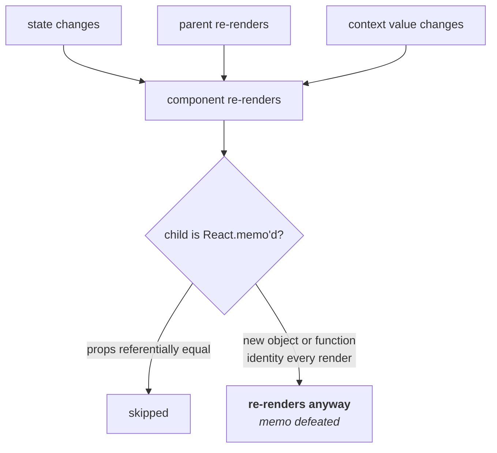
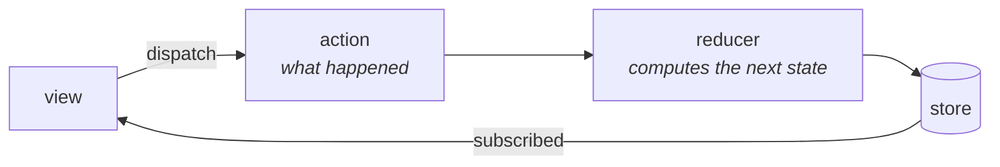

# React, Redux, TypeScript and styling

Lightest chapter in the book, because you're targeting backend/IAM roles.
You'll get a few questions to confirm the resume is honest, not a deep frontend
round.

---

## React

### Hooks, and the ones that get asked about

**`useState`** — local state. Updates are batched and asynchronous, so reading
state right after setting it gives you the old value. Use the functional form
when the new value depends on the old:

```jsx
setCount(c => c + 1);      // safe
setCount(count + 1);       // stale if called twice in one tick
```

**`useEffect`** — side effects after render. The dependency array is where bugs
live:

```jsx
useEffect(() => { ... });           // every render — usually a bug
useEffect(() => { ... }, []);       // once on mount
useEffect(() => { ... }, [userId]); // when userId changes
```

**Always clean up.** Return a function that cancels subscriptions, timers and
in-flight requests. Without it you leak, and you get "setState on an unmounted
component" warnings:

```jsx
useEffect(() => {
  const controller = new AbortController();
  fetch(url, { signal: controller.signal }).then(...);
  return () => controller.abort();
}, [url]);
```

**`useMemo` / `useCallback`** — memoise a value / a function identity. They
exist to keep referential equality so memoised children don't re-render.
**They're not free** — over-using them adds complexity and can be slower than
the re-render they prevent. Reach for them when you've measured a problem.

**`useRef`** — a mutable box that doesn't trigger re-renders. For DOM nodes and
for values you want to persist without rendering on change.

### Why components re-render


*The right-hand branch is the classic bug, and the one behind the Xtensio work: a canvas re-rendering everything because one prop was a fresh arrow function.*

A component re-renders when its state changes, its parent re-renders, or its
context value changes.

The classic performance bug: passing a **new object or function identity every
render** into a memoised child, which defeats `React.memo` entirely because the
props are never referentially equal.

```jsx
<Child onClick={() => save()} />        // new function every render
<Child onClick={handleSave} />          // stable via useCallback
```

That's the mechanism behind your Xtensio 30% improvement — a canvas re-rendering
everything when one shape changed.

### Keys in lists

Use a **stable id**, not the array index. With an index, inserting at the front
makes React think every item changed, so it re-renders everything and component
state attaches to the wrong row.

---

## Redux


*One direction only. Every change is an action a reducer turned into new state, which is what makes the flow replayable and debuggable.*

Central store, actions describe what happened, reducers compute the new state.

**Redux Toolkit is the modern way** — plain Redux had enormous boilerplate, and
RTK removes most of it with `createSlice` and includes Immer so you can write
what looks like mutation.

**Thunk vs Saga:** thunks are simple async functions and cover almost
everything. Sagas use generators and are better for complex orchestration —
cancellation, debouncing, coordinating several flows. Sagas are more powerful
and much heavier; most apps don't need them.

**When you don't need Redux:** if the state is server data, a data-fetching
library (React Query, SWR) handles caching, refetching and invalidation better
than hand-written reducers. If it's local UI state, `useState` is fine. Redux
is worth it for genuinely global client state shared across distant parts
of the tree.

---

## TypeScript

The parts that come up:

**`interface` vs `type`** — interfaces can be merged and are conventional for
object shapes; types can express unions and intersections. Either is fine;
consistency matters more.

**Generics** — write something once for many types:

```ts
function first<T>(arr: T[]): T | undefined { return arr[0]; }
```

**Union types and narrowing** — the genuinely useful pattern, because it makes
invalid states unrepresentable:

```ts
type Result<T> =
  | { ok: true; value: T }
  | { ok: false; error: string };

if (result.ok) result.value       // narrowed — value exists
else result.error                 // narrowed — error exists
```

**`unknown` over `any`.** `any` disables checking entirely, which quietly
spreads. `unknown` forces you to narrow before use, which is the whole point.

**Types disappear at runtime.** They don't validate API responses. If data
comes from outside your program, validate it (Zod, or a JSON schema) — a type
assertion on untrusted input is a lie the compiler believes.

---

## Styling

### SCSS

A CSS preprocessor: variables, nesting, mixins, functions, and `@use` for
splitting stylesheets into modules.

```scss
$brand: #7a5cff;

@mixin focus-ring {
  outline: 2px solid $brand;
  outline-offset: 2px;
}

.card {
  padding: 1rem;
  &__title { font-weight: 600; }      // compiles to .card__title
  &:focus-visible { @include focus-ring; }
}
```

Two pitfalls worth naming. **Nesting more than two or three levels** produces
selectors like `.a .b .c .d` that are specific, fragile and hard to override —
the most common SCSS mistake. And SCSS gives you **no scoping**: class names are
still global, so you need a convention like BEM (`.card__title--active`) to
avoid collisions.

Note that CSS itself now has native variables (`--brand`), nesting and `@layer`,
so the gap SCSS filled is narrower than it was. Custom properties are also
strictly better than SCSS variables for theming, because they're live at runtime
— which is how the dark mode in this book's own stylesheet works.

### Styled-components

CSS-in-JS: styles live with the component, scoped automatically by generated
class names, and can vary from props.

```jsx
const Button = styled.button`
  background: ${p => p.primary ? '#7a5cff' : 'transparent'};
  padding: 8px 14px;
`;
```

**Benefits:** real scoping with no naming convention needed, dead styles removed
with the component, and dynamic styling from props without class juggling.

**Costs:** a runtime that parses and injects styles, which adds bundle size and
per-render work; harder debugging, since generated class names are opaque; and
server-side rendering needs extra setup to avoid a flash of unstyled content.

Modern alternatives — CSS modules, or zero-runtime CSS-in-JS like vanilla-extract
— give you the scoping while doing the work at build time. That's usually the
better trade now.

If you're asked why a codebase used Styled-Components: it was the dominant
answer to CSS scoping before CSS modules and build-time CSS-in-JS matured, and
prop-driven styling genuinely is more natural in it than in class-based CSS.
Knowing why a choice made sense *at the time* is a better answer than saying
it's outdated.

**Specificity** is worth knowing regardless: inline > id > class > element.
`!important` beats everything and is almost always a sign the cascade has gone
wrong somewhere upstream.


## Building it

**Libraries**

| Need | Library | Why |
| --- | --- | --- |
| Server-state data fetching | `@tanstack/react-query` | Caching, refetch-on-focus and request dedup for API data — don't reach for Redux for state that isn't really client state |
| Client state | Redux Toolkit — see below | For state that genuinely lives in the client (UI state, form state, selections) |

**Pseudocode — the re-render fix from "Why components re-render", as a hook**

```tsx
const handleSave = useCallback(() => save(id), [id]);  // stable identity
return <Child onClick={handleSave} />;                  // React.memo now works
```

---

## Interview Q&A

### Q: Why might a React component re-render more than expected?
**Level:** intermediate · **Tags:** react, performance

<details><summary>Model answer</summary>

Three causes. Its own state changed, its parent re-rendered, or a context value
it consumes changed.

The subtle one is prop identity. If a parent passes an inline object or arrow
function, that's a **new reference every render**, so a child wrapped in
`React.memo` re-renders anyway — the props aren't equal, even though they're
equivalent. `useMemo` and `useCallback` exist to stabilise those references.

Context is the other one people miss: every consumer re-renders when the
context value changes, even if it only uses a part that didn't. Splitting one
large context into several smaller ones limits the blast radius.

To diagnose, I'd use the React Profiler — it shows which components re-rendered
and why, including which prop changed. That's better than guessing, because the
intuitive answer is often wrong.

The caveat is that re-rendering isn't automatically bad. React is fast, and
memoising everything adds complexity and can be slower than the render it
prevents. I'd measure before optimising.

</details>

**Follow-ups:**

1. Q: How did you cut editor render time by 30%?
   <details><summary>Answer — structure to fill</summary>

   The general shape for a canvas editor: state was too high in the tree, so
   changing one element re-rendered everything. Fixes are pushing state down so
   a component owns what changes, stabilising prop identity so memoisation
   actually engages, splitting components so the re-rendering subtree is small,
   and avoiding layout thrash — reading a DOM measurement then writing a style
   in a loop forces synchronous reflow each time.

   For very large canvases, virtualisation is next: only render what's in the
   viewport.

   > **FILL IN:** which of these it actually was, and how you measured it —
   > React Profiler, browser performance timeline, or a scripted interaction
   > benchmark? Naming the tool is what makes it sound lived rather than
   > reconstructed.

   </details>

2. Q: When would you not use Redux?
   <details><summary>Answer</summary>

   Most of the time, honestly.

   If the state is **server data**, a data-fetching library like React Query is
   a better fit — it handles caching, background refetching, invalidation and
   loading states, all of which you'd otherwise hand-write in reducers. A large
   share of what people historically put in Redux was really a cache of server
   state.

   If the state is **local to a component or its children**, `useState` or
   `useReducer` is enough, and context covers moderate sharing.

   Redux is worth it for genuinely global client state that many distant
   parts of the tree read and write, where you want a single source of truth
   and time-travel debugging.

   And if I did use it, Redux Toolkit rather than plain Redux — the boilerplate
   in classic Redux is the main reason it got a bad reputation.

   </details>

### Q: What's the difference between `any` and `unknown`?
**Level:** intermediate · **Tags:** typescript

<details><summary>Model answer</summary>

`any` switches off type checking for that value — you can call anything on it,
assign it anywhere, and the compiler won't complain. It also spreads: assign an
`any` to something else and checking is lost there too.

`unknown` is the type-safe counterpart. You can hold anything in it, but you
can't *do* anything with it until you narrow it — a type guard, a check, or a
schema parse. The compiler forces you to prove what it is first.

So `unknown` is the right type for anything arriving from outside: an API
response, `JSON.parse`, user input. It makes validation a requirement instead of
an option.

The related point I'd make: **types don't exist at runtime.** Casting an API
response with `as User` doesn't check anything — it just tells the compiler to
stop asking. If the API returns something different, you get a runtime error at
some distant point, with a stack trace that doesn't mention the real cause.
Validating with something like Zod at the boundary gives you a real check and a
type derived from it.

</details>

---

## What a weak answer sounds like

- **`useEffect` with no cleanup.** Leaks subscriptions and timers.
- **Array index as a list key.** Breaks reconciliation on insert.
- **`useMemo` everywhere.** Adds complexity; often slower than the re-render.
- **Casting API responses with `as`.** Types don't validate anything at runtime.
- **Redux for everything.** Server state belongs in a data-fetching library.

---

## Glossary

- **Reconciliation** — React diffing the tree to decide what to update.
- **Referential equality** — same reference, not just same shape; what `memo`
  compares.
- **`useCallback` / `useMemo`** — stabilise a function / value identity.
- **Virtualisation** — render only what's in the viewport.
- **Layout thrash** — interleaved DOM reads and writes forcing reflow.
- **Thunk / saga** — simple async action / generator-based orchestration.
- **Narrowing** — proving what a union type is in this branch.
- **Specificity** — which CSS rule wins.
