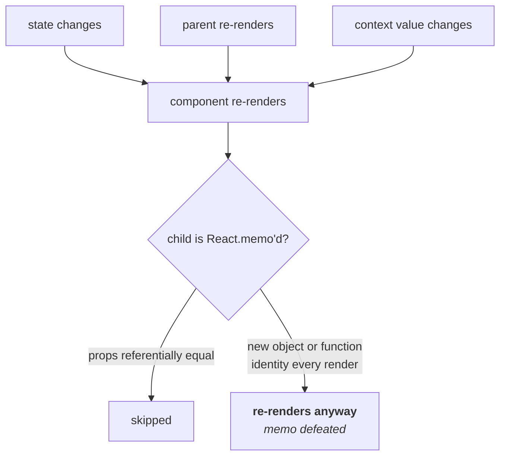
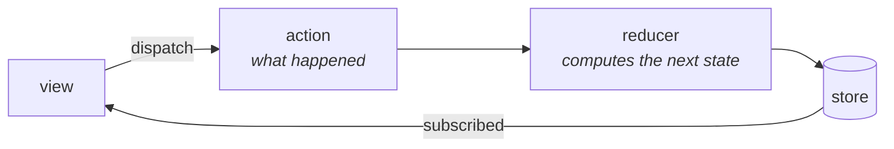

# React, Redux, TypeScript and styling

Lightest chapter in the book, because you're targeting backend/IAM roles.
You'll get a few questions to confirm the resume is honest, not a deep frontend
round.

---

## In brief

- **`setState` reads stale after the call in the same tick** because
  updates are batched and async — use the functional form
  (`setCount(c => c + 1)`) when the new value depends on the old, not
  `setCount(count + 1)`.
- **The classic memoization bug is a new object or function identity every
  render** — passing an inline arrow function to a `React.memo`'d child
  defeats the memoization entirely, since the props are never
  referentially equal even though they're equivalent. `useCallback`/
  `useMemo` exist specifically to stabilize that identity, but they're not
  free — reach for them when you've measured a problem, not by default.
- **List keys need a stable id, not the array index** — with an index,
  inserting at the front makes React think every item changed, re-
  rendering everything and attaching component state to the wrong row.
- **Redux Saga's effects are plain objects a middleware executes**, which
  is why sagas can be tested by stepping the generator and comparing
  yielded objects, without mocking `fetch`. `takeLatest` buys cancellation
  and debouncing in one word instead of hand-rolled `AbortController`
  plumbing — the trade is generators and effect vocabulary to learn.
- **Most historical Redux usage was really a cache of server state** — a
  data-fetching library (React Query, SWR) handles caching, refetching,
  and invalidation better than hand-written reducers. Redux earns its
  place for genuinely global client state shared across distant parts of
  the tree, not as a default store for everything.
- **Types disappear at runtime — they never validate anything.** Casting
  an API response with `as User` just tells the compiler to stop checking;
  if the API returns something different, the error surfaces at some
  distant point with a stack trace that doesn't mention the real cause.
  `unknown` forces narrowing before use; validating untrusted input with
  something like Zod is what actually checks it.

---

## React

### Hooks, and the ones that get asked about

**`useState`** — local state. Updates are batched and asynchronous, so reading
state right after setting it gives you the old value. Use the functional form
when the new value depends on the old:

```jsx
setCount(c => c + 1);      // safe
setCount(count + 1);       // stale if called twice in one tick
```

**`useEffect`** — side effects after render. The dependency array is where bugs
live:

```jsx
useEffect(() => { ... });           // every render — usually a bug
useEffect(() => { ... }, []);       // once on mount
useEffect(() => { ... }, [userId]); // when userId changes
```

**Always clean up.** Return a function that cancels subscriptions, timers and
in-flight requests. Without it you leak, and you get "setState on an unmounted
component" warnings:

```jsx
useEffect(() => {
  const controller = new AbortController();
  fetch(url, { signal: controller.signal }).then(...);
  return () => controller.abort();
}, [url]);
```

**`useMemo` / `useCallback`** — memoise a value / a function identity. They
exist to keep referential equality so memoised children don't re-render.
**They're not free** — over-using them adds complexity and can be slower than
the re-render they prevent. Reach for them when you've measured a problem.

**`useRef`** — a mutable box that doesn't trigger re-renders. For DOM nodes and
for values you want to persist without rendering on change.

### Why components re-render


```mermaid
flowchart TD
  S["state changes"] --> R["component re-renders"]
  P["parent re-renders"] --> R
  C["context value changes"] --> R
  R --> M{"child is React.memo'd?"}
  M -->|"props referentially equal"| SK["skipped"]
  M -->|"new object or function<br/>identity every render"| RR["<b>re-renders anyway</b><br/><i>memo defeated</i>"]
```
*The right-hand branch is the classic bug, and the one behind the Xtensio work: a canvas re-rendering everything because one prop was a fresh arrow function.*

A component re-renders when its state changes, its parent re-renders, or its
context value changes.

The classic performance bug: passing a **new object or function identity every
render** into a memoised child, which defeats `React.memo` entirely because the
props are never referentially equal.

```jsx
<Child onClick={() => save()} />        // new function every render
<Child onClick={handleSave} />          // stable via useCallback
```

That's the mechanism behind your Xtensio 30% improvement — a canvas re-rendering
everything when one shape changed.

### Keys in lists

Use a **stable id**, not the array index. With an index, inserting at the front
makes React think every item changed, so it re-renders everything and component
state attaches to the wrong row.

---

## Redux


```mermaid
flowchart LR
  V["view"] -->|dispatch| A["action<br/><i>what happened</i>"]
  A --> RD["reducer<br/><i>computes the next state</i>"]
  RD --> ST[("store")]
  ST -->|subscribed| V
```
*One direction only. Every change is an action a reducer turned into new state, which is what makes the flow replayable and debuggable.*

Central store, actions describe what happened, reducers compute the new state.

**Redux Toolkit is the modern way** — plain Redux had enormous boilerplate, and
RTK removes most of it with `createSlice` and includes Immer so you can write
what looks like mutation.

**Thunk vs Saga:** thunks are simple async functions and cover almost
everything. Sagas use generators and are better for complex orchestration —
cancellation, debouncing, coordinating several flows. Sagas are more powerful
and much heavier; most apps don't need them.

### Redux Saga, concretely

A **saga** is a generator function that `redux-saga` middleware runs. It
listens for actions and `yield`s **effects** — plain objects describing work
(`call` an API, `put` an action, `take` the next action) — which the
middleware executes. Because effects are descriptions, a saga can be tested by
stepping the generator and comparing the yielded objects, without mocking
`fetch`.

```ts
import { call, put, takeLatest, delay } from 'redux-saga/effects';

function* fetchUser(action: { type: 'user/fetch'; id: string }) {
  try {
    const user = yield call(api.getUser, action.id);   // effect: call a function
    yield put({ type: 'user/loaded', user });          // effect: dispatch an action
  } catch (e) {
    yield put({ type: 'user/failed', error: String(e) });
  }
}

function* searchAsYouType(action: { type: 'search/changed'; q: string }) {
  yield delay(300);                                    // debounce…
  yield put({ type: 'search/run', q: action.q });
}

export function* rootSaga() {
  yield takeLatest('user/fetch', fetchUser);           // cancels the previous fetch
  yield takeLatest('search/changed', searchAsYouType); // …because takeLatest cancels the older delay
}
```

| Helper | Behaviour | Use for |
| --- | --- | --- |
| `takeEvery` | Run a saga for every matching action, concurrently | Independent events (analytics) |
| `takeLatest` | Cancel the running saga when a new action arrives | Fetch-on-select, search-as-you-type |
| `takeLeading` | Ignore new actions while one is running | Submit buttons (no double-submit) |
| `race` / `cancel` | First of several effects wins; cancel a forked task | Timeouts, "stop polling on logout" |

**What sagas buy over thunks:** cancellation and debouncing are one word
(`takeLatest`) instead of hand-rolled `AbortController` plumbing; long-running
flows (polling, websockets via `eventChannel`, multi-step wizards) read as
straight-line code; and tests assert on effects, not on mocks. **What they
cost:** generators and effect vocabulary to learn, indirection when debugging,
and a dependency most new apps replace with RTK Query or React Query for data
fetching. The honest answer in an interview: you used sagas where
orchestration was genuinely complex, and you'd reach for RTK Query or React
Query first today.

## Micro-frontends

A **micro-frontend** architecture splits one web app into independently built
and deployed pieces, each owned by a team — the frontend version of
microservices. The resume's AngularJS → React migration used this shape
([Gyrix](../00-experience/gyrix.md)).

**How the pieces get composed:**

| Approach | How it works | Trade-off |
| --- | --- | --- |
| **Module Federation** (webpack 5 / Rspack) | A host app loads remote bundles at runtime and **shares** dependencies like React as singletons | Runtime composition, shared deps; version skew between remotes is the risk |
| **single-spa** | A root config mounts/unmounts framework apps by route; each app exposes `bootstrap/mount/unmount` | Mixes frameworks (AngularJS + React side by side) — ideal for a gradual migration |
| **Build-time packages** | Each part is an npm package the shell compiles in | Simple, but a change needs a shell redeploy — not really independent |
| **iframes / server-side includes** | Hard isolation | Isolation is the benefit and the cost (routing, styling, shared state) |

**The migration pattern (strangler fig):** mount the new React app for one
route at a time inside the existing AngularJS shell (single-spa or a route
switch), move shared concerns (auth token, user context) into a small shared
module, and retire AngularJS routes as they're replaced. Users see one app
throughout.

**What goes wrong:** duplicated React copies (two React instances break hooks
— share it as a singleton), CSS leaking between apps (scope with CSS
Modules/styled-components or a prefix), inconsistent design (a shared
component library), and too many round-trips at load (preload remotes).
Micro-frontends solve an **organisational** problem — independent team
deploys — and are overhead for a single small team.

**When you don't need Redux:** if the state is server data, a data-fetching
library (React Query, SWR) handles caching, refetching and invalidation better
than hand-written reducers. If it's local UI state, `useState` is fine. Redux
is worth it for genuinely global client state shared across distant parts
of the tree.

---

## TypeScript

The parts that come up:

**`interface` vs `type`** — interfaces can be merged and are conventional for
object shapes; types can express unions and intersections. Either is fine;
consistency matters more.

**Generics** — write something once for many types:

```ts
function first<T>(arr: T[]): T | undefined { return arr[0]; }
```

**Union types and narrowing** — the genuinely useful pattern, because it makes
invalid states unrepresentable:

```ts
type Result<T> =
  | { ok: true; value: T }
  | { ok: false; error: string };

if (result.ok) result.value       // narrowed — value exists
else result.error                 // narrowed — error exists
```

**`unknown` over `any`.** `any` disables checking entirely, which quietly
spreads. `unknown` forces you to narrow before use, which is the whole point.

**Types disappear at runtime.** They don't validate API responses. If data
comes from outside your program, validate it (Zod, or a JSON schema) — a type
assertion on untrusted input is a lie the compiler believes.

---

## Styling

### SCSS

A CSS preprocessor: variables, nesting, mixins, functions, and `@use` for
splitting stylesheets into modules.

```scss
$brand: #7a5cff;

@mixin focus-ring {
  outline: 2px solid $brand;
  outline-offset: 2px;
}

.card {
  padding: 1rem;
  &__title { font-weight: 600; }      // compiles to .card__title
  &:focus-visible { @include focus-ring; }
}
```

Two pitfalls worth naming. **Nesting more than two or three levels** produces
selectors like `.a .b .c .d` that are specific, fragile and hard to override —
the most common SCSS mistake. And SCSS gives you **no scoping**: class names are
still global, so you need a convention like BEM (`.card__title--active`) to
avoid collisions.

Note that CSS itself now has native variables (`--brand`), nesting and `@layer`,
so the gap SCSS filled is narrower than it was. Custom properties are also
strictly better than SCSS variables for theming, because they're live at runtime
— which is how the dark mode in this book's own stylesheet works.

### Styled-components

CSS-in-JS: styles live with the component, scoped automatically by generated
class names, and can vary from props.

```jsx
const Button = styled.button`
  background: ${p => p.primary ? '#7a5cff' : 'transparent'};
  padding: 8px 14px;
`;
```

**Benefits:** real scoping with no naming convention needed, dead styles removed
with the component, and dynamic styling from props without class juggling.

**Costs:** a runtime that parses and injects styles, which adds bundle size and
per-render work; harder debugging, since generated class names are opaque; and
server-side rendering needs extra setup to avoid a flash of unstyled content.

Modern alternatives — CSS modules, or zero-runtime CSS-in-JS like vanilla-extract
— give you the scoping while doing the work at build time. That's usually the
better trade now.

If you're asked why a codebase used Styled-Components: it was the dominant
answer to CSS scoping before CSS modules and build-time CSS-in-JS matured, and
prop-driven styling genuinely is more natural in it than in class-based CSS.
Knowing why a choice made sense *at the time* is a better answer than saying
it's outdated.

**Specificity** is worth knowing regardless: inline > id > class > element.
`!important` beats everything and is almost always a sign the cascade has gone
wrong somewhere upstream.


## Building it

**Libraries**

| Need | Library | Why |
| --- | --- | --- |
| Server-state data fetching | `@tanstack/react-query` | Caching, refetch-on-focus and request dedup for API data — don't reach for Redux for state that isn't really client state |
| Client state | Redux Toolkit — see below | For state that genuinely lives in the client (UI state, form state, selections) |

**Pseudocode — the re-render fix from "Why components re-render", as a hook**

```tsx
const handleSave = useCallback(() => save(id), [id]);  // stable identity
return <Child onClick={handleSave} />;                  // React.memo now works
```

---

## Interview Q&A

### Q: Why might a React component re-render more than expected?
**Level:** intermediate · **Tags:** react, performance

<details><summary>Model answer</summary>

Three causes. Its own state changed, its parent re-rendered, or a context value
it consumes changed.

The subtle one is prop identity. If a parent passes an inline object or arrow
function, that's a **new reference every render**, so a child wrapped in
`React.memo` re-renders anyway — the props aren't equal, even though they're
equivalent. `useMemo` and `useCallback` exist to stabilise those references.

Context is the other one people miss: every consumer re-renders when the
context value changes, even if it only uses a part that didn't. Splitting one
large context into several smaller ones limits the blast radius.

To diagnose, I'd use the React Profiler — it shows which components re-rendered
and why, including which prop changed. That's better than guessing, because the
intuitive answer is often wrong.

The caveat is that re-rendering isn't automatically bad. React is fast, and
memoising everything adds complexity and can be slower than the render it
prevents. I'd measure before optimising.

</details>

**Follow-ups:**

1. Q: How did you cut editor render time by 30%?
   <details><summary>Answer — structure to fill</summary>

   The general shape for a canvas editor: state was too high in the tree, so
   changing one element re-rendered everything. Fixes are pushing state down so
   a component owns what changes, stabilising prop identity so memoisation
   actually engages, splitting components so the re-rendering subtree is small,
   and avoiding layout thrash — reading a DOM measurement then writing a style
   in a loop forces synchronous reflow each time.

   For very large canvases, virtualisation is next: only render what's in the
   viewport.

   > **FILL IN:** which of these it actually was, and how you measured it —
   > React Profiler, browser performance timeline, or a scripted interaction
   > benchmark? Naming the tool is what makes it sound lived rather than
   > reconstructed.

   </details>

2. Q: When would you not use Redux?
   <details><summary>Answer</summary>

   Most of the time, honestly.

   If the state is **server data**, a data-fetching library like React Query is
   a better fit — it handles caching, background refetching, invalidation and
   loading states, all of which you'd otherwise hand-write in reducers. A large
   share of what people historically put in Redux was really a cache of server
   state.

   If the state is **local to a component or its children**, `useState` or
   `useReducer` is enough, and context covers moderate sharing.

   Redux is worth it for genuinely global client state that many distant
   parts of the tree read and write, where you want a single source of truth
   and time-travel debugging.

   And if I did use it, Redux Toolkit rather than plain Redux — the boilerplate
   in classic Redux is the main reason it got a bad reputation.

   </details>

### Q: What's the difference between `any` and `unknown`?
**Level:** intermediate · **Tags:** typescript

<details><summary>Model answer</summary>

`any` switches off type checking for that value — you can call anything on it,
assign it anywhere, and the compiler won't complain. It also spreads: assign an
`any` to something else and checking is lost there too.

`unknown` is the type-safe counterpart. You can hold anything in it, but you
can't *do* anything with it until you narrow it — a type guard, a check, or a
schema parse. The compiler forces you to prove what it is first.

So `unknown` is the right type for anything arriving from outside: an API
response, `JSON.parse`, user input. It makes validation a requirement instead of
an option.

The related point I'd make: **types don't exist at runtime.** Casting an API
response with `as User` doesn't check anything — it just tells the compiler to
stop asking. If the API returns something different, you get a runtime error at
some distant point, with a stack trace that doesn't mention the real cause.
Validating with something like Zod at the boundary gives you a real check and a
type derived from it.

</details>

---

## What a weak answer sounds like

- **`useEffect` with no cleanup.** Leaks subscriptions and timers.
- **Array index as a list key.** Breaks reconciliation on insert.
- **`useMemo` everywhere.** Adds complexity; often slower than the re-render.
- **Casting API responses with `as`.** Types don't validate anything at runtime.
- **Redux for everything.** Server state belongs in a data-fetching library.

---

## Quiz

### MCQ: Why does `setCount(count + 1)` called twice in the same event handler often not produce the expected `+2` result?
- [ ] React only allows one state update per handler
- [x] State updates are batched and asynchronous, so both calls read the same stale `count` value rather than seeing each other's update
- [ ] `setCount` is deprecated in modern React
- [ ] It only fails when the component is memoized
**Why:** The functional form `setCount(c => c + 1)` avoids this by always receiving the latest pending value, which is why it's recommended whenever the new state depends on the old.

### MCQ: Why does passing an inline arrow function as a prop to a `React.memo`-wrapped child defeat the memoization?
- [ ] `React.memo` doesn't support function props at all
- [x] A new function is created on every render, so the prop is never referentially equal to the previous render's prop, even though its behavior is identical
- [ ] Inline functions are always slower to execute
- [ ] `React.memo` only works with class components
**Why:** `React.memo` compares props by reference (shallow equality) — a fresh function identity every render means the comparison always fails, causing the "memoized" child to re-render anyway.

### MCQ: Why is using the array index as a React list `key` problematic when items can be inserted or removed?
- [ ] Indexes are not valid JavaScript values for keys
- [x] Inserting an item at the front shifts every subsequent index, making React think every item changed — causing full re-renders and component state attaching to the wrong row
- [ ] Array indexes are always strings, and keys must be numbers
- [ ] It only matters for lists longer than 100 items
**Why:** A stable, content-based id (not derived from position) lets React correctly track which specific item moved, was added, or was removed.

### MCQ: What makes Redux Saga's "effects" (like `call`, `put`, `take`) testable without mocking `fetch` or dispatch?
- [ ] Sagas run in a separate testing environment automatically
- [x] Effects are plain descriptive objects, not the actual side effect execution — a test can step the generator and compare the yielded objects directly
- [ ] Redux Saga includes a built-in mocking library
- [ ] Sagas don't actually perform any real side effects
**Why:** Since `yield call(api.getUser, id)` produces a plain object describing "call this function with this argument" rather than actually calling it, tests can assert on that description without needing to intercept or mock the real API call.

### MCQ: What does `takeLatest` provide over a hand-rolled `AbortController` for something like search-as-you-type?
- [ ] Better network performance
- [x] Automatic cancellation of the previous running saga when a new matching action arrives, in one word instead of manually wiring cancellation logic
- [ ] It eliminates the need for a search API entirely
- [ ] It only works with GraphQL APIs
**Why:** This is the concrete example of what sagas "buy" over thunks — cancellation and debouncing become built-in helpers rather than something you have to construct yourself with AbortController plumbing.

### MCQ: According to this chapter, what was a large share of what people historically stored in Redux actually being used for?
- [ ] Client-only UI state like modal visibility
- [x] A cache of server data — something a dedicated data-fetching library (React Query, SWR) handles better with caching, refetching, and invalidation built in
- [ ] Routing state
- [ ] Form validation state
**Why:** This is why the chapter recommends reserving Redux for genuinely global client state shared across distant parts of the tree, rather than defaulting to it for data that originated from an API.

### MCQ: Why does casting an API response with `as User` in TypeScript provide no actual safety?
- [ ] `as` casts are removed by the TypeScript compiler and never execute
- [x] TypeScript types don't exist at runtime — the cast just tells the compiler to stop checking, without verifying the actual shape of the data at all
- [ ] `as` only works for primitive types, not object shapes
- [ ] It requires a separate runtime library to function
**Why:** If the API actually returns something different from `User`, the mismatch surfaces later as a runtime error somewhere unrelated to the cast — with no clear indication that the original assumption was wrong.

### MCQ: Why is `unknown` preferred over `any` for values arriving from outside the program (API responses, `JSON.parse`, user input)?
- [ ] `unknown` and `any` behave identically; it's purely stylistic
- [x] `unknown` forces you to narrow the type (via a guard, check, or schema parse) before you can use it, while `any` disables type checking entirely and lets that lack of checking spread
- [ ] `unknown` is faster to compile than `any`
- [ ] `any` cannot be assigned to a variable
**Why:** `unknown` makes validation a requirement rather than an option — you literally cannot call methods on it or access its properties until you've proven what it actually is.

### MCQ: In the micro-frontend "strangler fig" migration pattern, how are old and new framework apps typically composed during the transition?
- [ ] The entire app is rewritten in one large deployment
- [x] The new framework's app is mounted for one route at a time inside the existing app's shell, with shared concerns like auth moved into a small shared module, while old routes are retired incrementally
- [ ] Both frameworks run simultaneously on every route with no coordination
- [ ] The old framework is deleted before any new code is written
**Why:** This lets users see one continuous app throughout the migration, rather than a disruptive big-bang cutover — routes migrate incrementally as they're replaced.

### MCQ: What's the core risk with Module Federation (webpack 5/Rspack) style micro-frontend composition, where a host loads remote bundles at runtime?
- [ ] It requires server-side rendering to work at all
- [x] Version skew between remotes — since dependencies like React are shared as singletons across independently deployed bundles, mismatched versions can cause subtle runtime bugs
- [ ] It can't share any dependencies between the host and remotes
- [ ] It only works with a single specific CSS framework
**Why:** Because remotes are built and deployed independently but share runtime dependencies, a version mismatch between what one remote expects and what's actually loaded is a real operational risk unique to this approach.

---

## Glossary

- **Reconciliation** — React diffing the tree to decide what to update.
- **Referential equality** — same reference, not just same shape; what `memo`
  compares.
- **`useCallback` / `useMemo`** — stabilise a function / value identity.
- **Virtualisation** — render only what's in the viewport.
- **Layout thrash** — interleaved DOM reads and writes forcing reflow.
- **Thunk / saga** — simple async action / generator-based orchestration.
- **Narrowing** — proving what a union type is in this branch.
- **Specificity** — which CSS rule wins.
