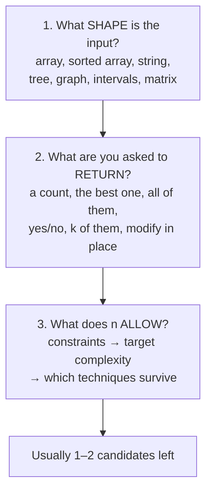
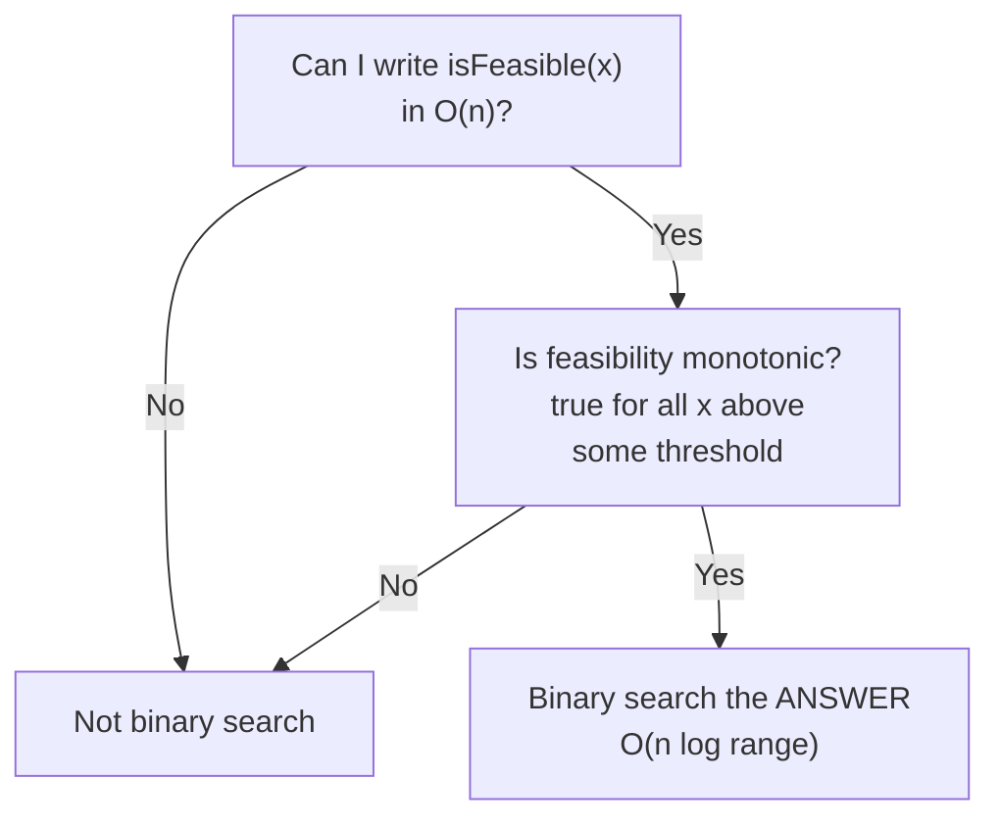
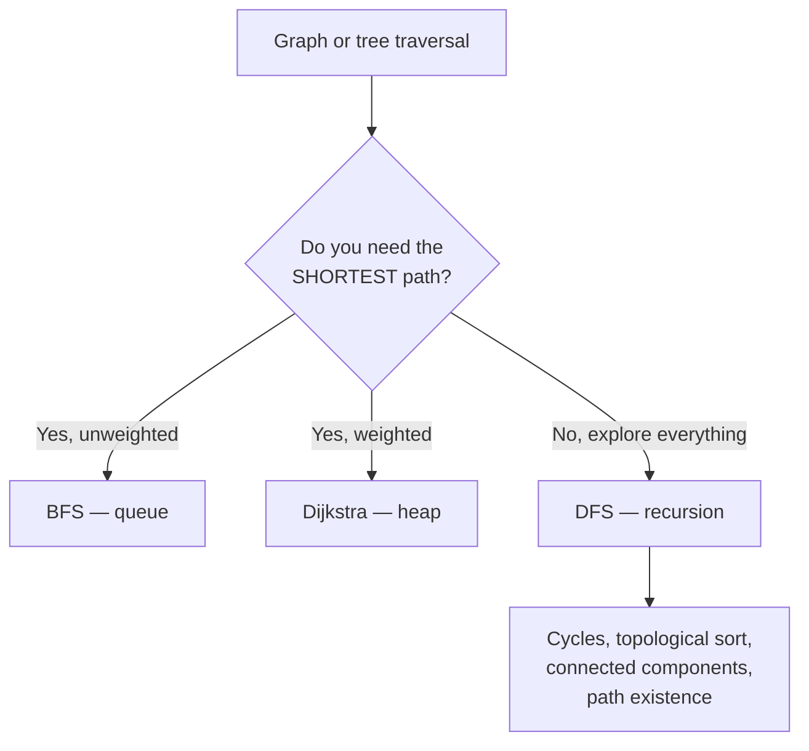

# Choosing the approach — every problem type, and how to tell which is which

[Chapter 01](01-patterns-and-complexity.md) lists seven patterns. This chapter
answers the harder question: **given a problem you have never seen, how do you
work out which technique applies** — and why that one rather than the five that
also seem plausible.

That is the entire skill. Nobody fails a coding round because they can't write
binary search; they fail because forty minutes in they're still deciding what
kind of problem it is. Grinding problems only helps because it accidentally
trains this. Training it directly is faster.

> **To actually practise this**, [the drill plan](03-the-drill-plan.md) has ~60
> problems grouped by the patterns below, with a time-box rule and an exit test
> per block.

---

## The three questions that pick the pattern

Ask them in this order, always. By the end of the third you have usually
narrowed twenty techniques to two.


*Shape, return type, and budget — in that order. Most wrong turns come from jumping to a technique before asking the third question.*

### Question 1 — what shape is the input?

The shape eliminates most of the space immediately.

| Input shape | Live candidates |
| --- | --- |
| Unsorted array | Hash map, prefix sum, sorting first, sliding window |
| **Sorted** array | Two pointers, binary search — the sortedness is *always* a hint, never decoration |
| String | Sliding window, hash map of counts, two pointers, trie, DP |
| Linked list | Fast/slow pointers, dummy head, reversal |
| Tree | DFS (recursion), BFS (level order), DP on tree |
| Graph | BFS, DFS, topological sort, union-find, Dijkstra |
| Intervals | Sort by start, then sweep/merge |
| Matrix / grid | BFS/DFS flood fill, or DP over the grid |
| Numbers, "without extra space" | Bit manipulation, cyclic sort, maths |

### Question 2 — what are you asked to return?

The return type is a stronger signal than most people use.

| You're asked for | That usually means |
| --- | --- |
| **A count** — "how many ways" | DP, or combinatorics |
| **The best one** — max/min value | DP, greedy, or sliding window |
| **All of them** — every combination | Backtracking. You cannot beat exponential; the output *is* exponential |
| **Yes or no** — "is it possible" | DFS/BFS reachability, DP feasibility, or binary search on the answer |
| **The k best** | Heap of size k, or quickselect |
| **A contiguous run** | Sliding window or prefix sum |
| **In place, O(1) extra space** | Two pointers, cyclic sort, bit tricks, in-place marking |
| **The order things must happen** | Topological sort |

**The most useful single line here:** *"all of them" means backtracking, and
"how many of them" means DP.* If the problem asks you to enumerate every valid
arrangement, stop looking for a clever polynomial trick — the answer count is
exponential, so the algorithm must be too. If it only wants the *number*, you
never build them and DP applies.

### Question 3 — what does n allow?

Constraints are not flavour text. They tell you the intended complexity, and
therefore the technique. Ask for them if they aren't given.

| n up to | Budget | What that permits |
| --- | --- | --- |
| 10–20 | O(2ⁿ) or O(n!) | Backtracking, bitmask DP, brute force over subsets |
| ~100 | O(n³) | Floyd–Warshall, interval DP |
| ~1,000 | O(n²) | 2-D DP, all-pairs comparison |
| ~10⁵ | O(n log n) | Sorting, heap, binary search, DP with a log factor |
| ~10⁶+ | O(n) or O(n log n) | One pass, hash map, prefix sum, sliding window |
| ~10⁹ | O(log n) or O(1) | Binary search on the answer, maths |

**Read it backwards, which is the trick.** `n ≤ 20` is practically an
announcement that the answer is exponential and you should stop hunting for a
greedy insight. `n ≤ 10⁹` means you can't even *touch* every element, so it's
binary search on the answer space or closed-form maths.

**Say this out loud in the round.** "n is up to 10⁵, so I need O(n log n) or
better — that rules out the O(n²) pair comparison I was about to describe."
That single sentence is worth more than the solution, because it's the reasoning
they're grading.

---

## The pattern catalogue

Every family you will meet, with the **signal** that triggers it, **why it
works**, and what it costs. The signal is the part to memorise.

---

## Array and string patterns

### 1. Hash map — trade space for lookup

**Signal:** "have I seen this?", counting occurrences, finding pairs, needing an
inner search loop.

**Why:** a nested loop searching for a value is O(n²) because the inner loop
re-scans. A map answers the same question in O(1), so the inner loop vanishes.
You are buying time with O(n) space, and that trade is almost always correct.

**Cost:** O(n) time, O(n) space.

**Canonical:** two-sum, first non-repeating character, group anagrams, count
distinct elements, **longest consecutive sequence** *(Day 5 of your plan)*.

**The tell you're missing it:** you're about to write `for i { for j { if
(a[j] === something) } }`. That inner loop is a map.

---

### 2. Prefix sum — answer range questions in O(1)

**Signal:** repeated questions about the **sum of a range**, or "subarray
summing to k".

**Why:** build `prefix[i] = sum of everything before i` in one pass. Then the
sum of `[l, r)` is `prefix[r] - prefix[l]` — constant time, no matter how wide
the range. You have converted "recompute the sum" into "subtract two numbers".

```js
// sum of any range, in O(1) after an O(n) build
const prefix = [0];
for (const x of nums) prefix.push(prefix.at(-1) + x);
const rangeSum = (l, r) => prefix[r] - prefix[l];   // [l, r)
```

**The upgrade that catches people out — prefix sum plus a hash map.** For
"count subarrays summing to k", the subarray `(j, i]` sums to k exactly when
`prefix[i] - prefix[j] === k`, i.e. `prefix[j] === prefix[i] - k`. So store
prefix sums in a map as you go and look up the complement — the same move as
two-sum, one level up.

```js
// number of subarrays summing to k — O(n)
const seen = new Map([[0, 1]]);   // empty prefix, so a whole-array match counts
let sum = 0, count = 0;
for (const x of nums) {
  sum += x;
  count += seen.get(sum - k) ?? 0;   // every earlier prefix that closes a window here
  seen.set(sum, (seen.get(sum) ?? 0) + 1);
}
```

**Cost:** O(n) time, O(n) space.

**Canonical:** subarray sum equals k, **longest subarray with zero sum**
*(Day 5)*, **equilibrium index** *(Day 1)*, range sum queries.

**Sliding window or prefix sum?** The dividing line is negative numbers. A
sliding window relies on the sum growing when you extend and shrinking when you
contract — negatives break that monotonicity, and the window becomes wrong
rather than slow. **Negatives present, or you need a count of subarrays →
prefix sum with a map. All positive, and you need one best window → sliding
window**, which is O(1) space.

**The sibling: the difference array.** For many *range updates* then one final
read, invert it — record `+v` at `l` and `-v` at `r`, then one prefix pass
materialises every value. Turns O(updates × width) into O(updates + n).

---

### 3. Forward and backward passes — precompute both directions

**Signal:** the answer at position `i` depends on **everything to the left and
everything to the right** of `i`.

**Why:** the naive version rescans both sides for every index — O(n²). But
"best so far from the left" and "best so far from the right" are each computable
in one linear pass. Precompute both into arrays, then answer each index in O(1).
Two passes plus a combine, instead of n scans.

**Canonical, and it's the clearest example:** **rain water trapped** *(Day 1 of
your plan)*. Water above bar `i` is `min(tallest to the left, tallest to the
right) - height[i]`.

```js
const n = h.length;
const leftMax = new Array(n), rightMax = new Array(n);

let m = 0;                                    // forward pass
for (let i = 0; i < n; i++) { m = Math.max(m, h[i]); leftMax[i] = m; }

m = 0;                                        // backward pass
for (let i = n - 1; i >= 0; i--) { m = Math.max(m, h[i]); rightMax[i] = m; }

let water = 0;                                // combine, O(1) per index
for (let i = 0; i < n; i++) water += Math.min(leftMax[i], rightMax[i]) - h[i];
```

**Cost:** O(n) time, O(n) space — and the space is usually removable with two
pointers once you see it, which is the natural follow-up question.

**Also:** product of array except self, stock buy/sell with one transaction,
candy distribution.

**The general lesson,** worth stating in the room: *when an answer needs
information from both sides, precompute one side in each direction rather than
rescanning.* It generalises far beyond these problems.

---

### 4. Sliding window — contiguous runs in one pass

**Signal:** the words **contiguous**, **subarray**, or **substring**, plus a
constraint ("at most k distinct", "no repeats", "sum ≥ target").

**Why:** the brute force checks every `(start, end)` pair — O(n²). But when you
extend the window right, you don't have to rebuild it: you update incrementally.
When the constraint breaks, you shrink from the left. Each element enters and
leaves at most once, so it's O(n) despite the nested-looking loop.

```js
// longest substring with no repeated characters
let left = 0, best = 0;
const lastSeen = new Map();
for (let right = 0; right < s.length; right++) {
  const c = s[right];
  // only jump forward — a stale index behind `left` must not drag it back
  if (lastSeen.has(c) && lastSeen.get(c) >= left) left = lastSeen.get(c) + 1;
  lastSeen.set(c, right);
  best = Math.max(best, right - left + 1);
}
```

**Two variants:** *fixed size* (max sum of exactly k — slide, don't grow) and
*variable size* (grow right, shrink left while invalid).

**Cost:** O(n) time, O(1) or O(alphabet) space.

**Canonical:** longest substring without repeats, minimum window substring,
**max sum contiguous subarray** *(Day 1 — though Kadane's is the cleaner framing,
see DP below)*, **subarray with given sum and length** *(Day 1)*.

**Connects to your work:** a rate limiter *is* a sliding window over a time
axis. Worth saying if it comes up — see
[resilience and rate limiting](../02-distributed-systems/08-resilience-rate-limiting.md).

---

### 5. Two pointers — sorted data, or in-place work

**Signal:** the input is **sorted**, or you must work **in place with O(1)
space**, or you're comparing from both ends.

**Why:** sortedness gives you a direction. In a sorted array, if `a[l] + a[r]`
is too small, only moving `l` right can help — so you never need to consider the
pairs you skipped. Each step eliminates a whole row of the O(n²) comparison
matrix.

**Three flavours worth separating:**

- **Opposite ends** — converge from both sides. Pair sums, palindromes,
  container-with-most-water, and the O(1)-space version of rain water.
- **Same direction (fast/slow)** — a read pointer and a write pointer. Removing
  duplicates in place, moving zeroes, partitioning.
- **Cycle detection (Floyd's)** — one pointer moves 1, the other 2. If there's a
  loop they meet inside it. **Remove loop from linked list** and **middle
  element of a linked list** *(both Day 7)*.

**Cost:** O(n) time after sorting, O(1) space — the space is the selling point.

**The decision:** two pointers and binary search both exploit sortedness. **Two
pointers when you're looking for a pair or partition; binary search when you're
looking for a single position.**

---

### 6. Monotonic stack — "next greater / smaller element"

**Signal:** "the next element larger than this one", "the previous smaller
element", "the largest rectangle", "span" — anything asking each element to
find its nearest bigger or smaller neighbour.

**Why:** keep a stack whose values only ever increase (or only decrease). When a
new element arrives and violates that order, everything you pop has just found
its answer — the new element is its next-greater. Each element is pushed once
and popped once, so it's O(n) despite the while loop inside the for loop.

```js
// nearest smaller element to the left, for every index
const stack = [], result = [];
for (const x of nums) {
  while (stack.length && stack.at(-1) >= x) stack.pop();  // can never be an answer again
  result.push(stack.length ? stack.at(-1) : -1);
  stack.push(x);
}
```

**Cost:** O(n) time, O(n) space.

**Canonical:** **nearest smaller element** and **largest rectangle in a
histogram** *(both Day 8 of your plan)*, daily temperatures, stock span, trapping
rain water again (a third solution).

**This is the pattern most people don't have**, and it converts an obvious O(n²)
into O(n) in a way that reads as genuine preparation. Largest-rectangle is
essentially unsolvable in the time limit without it.

---

### 7. Cyclic sort and index-as-hash — O(1) space on bounded values

**Signal:** the array contains numbers **in a known range**, typically `1..n`,
and you're asked for a missing, duplicate, or misplaced value — often with an
explicit "O(1) extra space" requirement.

**Why:** if values are `1..n` and the array has n slots, value `v` *belongs* at
index `v-1`. The array can be its own hash map. Either swap each value home, or
mark presence by negating the value at its home index — using the sign bit as
free storage.

**Canonical:** **first missing positive integer** *(Day 1 — and the O(1)-space
requirement is exactly what makes it hard)*, find all duplicates, find the
missing number.

**Cost:** O(n) time, O(1) space, and it mutates the input — say that out loud,
because it's a real trade an interviewer may object to.

---

### 8. Bit manipulation — XOR and masks

**Signal:** "appears once while others appear twice", "without using extra
space", subsets of a small set, or anything that mentions bits directly.

**Why:** XOR has two properties that do the work: `x ^ x === 0` and `x ^ 0 === x`.
So XOR-ing an entire array cancels every pair and leaves the loner — O(n) time,
O(1) space, no map at all.

**The three-level ladder, which is exactly your Day 2:**
- **Single Number** — everything twice but one. XOR everything.
- **Single Number II** — everything three times but one. XOR fails (three
  copies don't cancel), so count bits at each position mod 3.
- **Single Number III** — two loners. XOR everything to get `a ^ b`, take its
  lowest set bit — a position where a and b differ — and use it to split the
  array into two groups, each with one loner.

**Also:** subsets via a bitmask (`for (let m = 0; m < 1 << n; m++)`) is the
standard way to enumerate all subsets when `n ≤ 20`, which ties straight back to
the constraints table.

---

## Search and ordering patterns

### 9. Binary search — including on the answer

**Signal, the obvious one:** a sorted array and you want a position.

**Signal, the one that wins interviews:** the problem asks for a **minimum or
maximum value that satisfies some condition**, and *checking* a candidate value
is easy while *finding* it is not.


*Binary search on the answer needs exactly two things: a cheap feasibility check, and monotonicity. Test for both explicitly.*

**Why it works:** you're not searching the array, you're searching the *range of
possible answers*. If "can we do it with capacity x" is true for every x above
some threshold and false below, that boolean array is sorted — so binary search
applies to it even though nothing in the input is sorted.

**Canonical, and both are in your plan:** **painter's partition problem** and
**aggressive cows** *(Day 4)* are the two textbook cases. Also: minimum days to
ship packages, split array largest sum, median of two sorted arrays.
**Rotated sorted array search** *(Day 4)* is the other kind — still binary
search, but the trick is that one half is always properly sorted, so you test
which half and recurse there.

**Cost:** O(n log(range)) — the log is over the *answer space*, not the input.

**How to recognise it in the room:** the problem says "minimum largest", "maximum
minimum", or "smallest k such that…". That superlative-of-a-superlative phrasing
is nearly a guarantee.

---

### 10. Heap — the k best, without sorting everything

**Signal:** "top k", "k largest/smallest", "k closest", a running median, or
merging sorted sequences.

**Why:** sorting to get the top k is O(n log n) and does far more work than
asked. A heap capped at size k is O(n log k), and when k is small that's
effectively O(n). Counter-intuitively, for **k largest you keep a MIN-heap** —
the smallest of your current best k sits on top, so it's the one to evict.

**Canonical:** **B closest points to origin** *(Day 3 of your plan — and its
"custom comparator" note is the real lesson: the comparator is the whole
problem)*, top-k frequent elements, merge k sorted lists.

**Cost:** O(n log k) time, O(k) space.

**Say this if pushed:** quickselect gets the k-th element in O(n) average, but
it's O(n²) worst case and destroys the input. A heap is the safer answer in an
interview, and knowing both distinguishes you.

**JS has no built-in heap** — see [chapter 01](01-patterns-and-complexity.md#data-structures-not-libraries).
Naming that gap before you're asked is itself a signal.

---

### 11. Sorting as a preprocessing step

**Signal:** the problem involves **intervals**, or grouping, or "the k
closest/most similar", or any comparison that becomes obvious once ordered.

**Why:** sorting costs O(n log n) once and can collapse an O(n²) relationship
into a single linear scan. For intervals it is nearly always the first move:
**sort by start time, then sweep** — merging overlaps, finding gaps, and
counting maximum concurrent events all become one pass.

**Cost:** O(n log n), and it's usually free relative to the rest.

**Also worth knowing:** custom comparators (Day 3's closest-points), and that
counting sort is O(n) when the value range is small and bounded.

---

## Recursion, DP and greedy

This trio is where most candidates lose the most time, because all three look
applicable and only one is correct.

### 12. Backtracking — build, test, undo

**Signal:** "generate **all**", "find every valid arrangement", permutations,
combinations, and small n (≤ 20, per the constraints table).

**Why:** you're exploring a decision tree. At each node, make a choice, recurse,
then **undo the choice** — that undo is what makes it backtracking rather than
plain recursion, and forgetting it is the classic bug.

```js
function backtrack(path, choices) {
  if (isComplete(path)) { results.push([...path]); return; }  // copy — path mutates
  for (const c of choices) {
    if (!isValid(path, c)) continue;   // prune early — this is where the speed is
    path.push(c);
    backtrack(path, remaining(choices, c));
    path.pop();                        // undo: the whole point
  }
}
```

**Canonical:** **N-Queens** and **generate all parentheses** *(both Day 11)*,
subsets, permutations, sudoku, word search.

**Cost:** exponential, and that's correct rather than a failure — the output is
exponential. The optimisation available is **pruning**: reject a partial path as
early as possible. In N-Queens you check the diagonal at placement time, not
after placing all eight.

---

### 13. Dynamic programming — when subproblems repeat

**Signal:** "how many ways", "minimum/maximum cost", "can it be partitioned",
"longest something" — *and* you notice the same subproblem being recomputed.

**Why:** the naive recursion is exponential purely because it recomputes.
Caching each subproblem once collapses it to (number of distinct subproblems ×
work per subproblem), which is usually polynomial.

**The reliable way to derive one,** and do it in this order — deriving a
bottom-up table from scratch under pressure is how people freeze:

1. **Write the brute-force recursion.** What's the decision at each step? For
   0-1 knapsack: take this item, or don't.
2. **Identify the state** — the minimum set of arguments that determines the
   answer. Knapsack: `(index, remainingCapacity)`.
3. **Add memoisation.** A map keyed by the state. You are now done, and this is
   usually accepted.
4. **Convert to a table only if asked**, for the constant-factor win or O(1)
   space by keeping one row.

```js
// 0-1 knapsack: recursion + memo. Deriving this beats reciting a table.
const memo = new Map();
function best(i, cap) {
  if (i === items.length || cap === 0) return 0;
  const key = `${i},${cap}`;
  if (memo.has(key)) return memo.get(key);
  let r = best(i + 1, cap);                                    // skip it
  if (items[i].w <= cap)                                       // or take it
    r = Math.max(r, items[i].v + best(i + 1, cap - items[i].w));
  memo.set(key, r);
  return r;
}
```

**Canonical, and Day 13 is a good spread:** **0-1 knapsack, N stairs, minimum
number of squares, max sum without adjacent elements, longest common
subsequence**. Note that **max sum contiguous subarray** *(Day 1)* is really DP
too — Kadane's is "best ending here = max(this element, this element + best
ending at previous)", a one-variable DP.

**Cost:** states × transitions. Say it that way — "O(n × capacity), because
that's the state space" is a much stronger answer than guessing "O(n²)".

---

### 14. Greedy — take the best local choice, and prove you can

**Signal:** an optimisation where sorting by some key and then taking greedily
seems to work.

**Why it's dangerous:** greedy is either exactly right or badly wrong, and it
*looks* right in both cases. The difference is whether the problem has the
**greedy-choice property**: a locally optimal choice is part of some globally
optimal solution.

**How to tell greedy from DP — the practical test:**

| | Greedy | DP |
| --- | --- | --- |
| Choice made | Once, never revisited | All options explored |
| Needs | A proof, or an exchange argument | Just overlapping subproblems |
| Fails when | A worse choice now enables a better one later | — |
| Classic split | **Fractional** knapsack: greedy by value/weight | **0-1** knapsack: DP |

That knapsack pair *is* the test, and both are in your plan — fractional on
Day 12, 0-1 on Day 13. Fractional works greedily because you can take part of an
item, so the best ratio is always worth taking. 0-1 forces all-or-nothing, so
taking the best ratio can waste capacity that two lesser items would have filled
better. **When you can't argue why the local choice is safe, use DP.**

**Canonical:** fractional knapsack, interval scheduling (sort by *end* time —
counter-intuitive and the whole trick), **distribute candies** and **weighted
job scheduling** *(Day 12 — though weighted job scheduling is actually DP plus
binary search, which is a fair thing to notice out loud)*.

---

## Graph and tree patterns

### 15. BFS vs DFS — the choice is about what you're asked


*BFS is for distance, DFS is for structure. Weighted edges break BFS's guarantee and you need Dijkstra.*

**BFS** explores level by level, so the first time it reaches a node it has done
so in the fewest edges — that's the shortest-path guarantee, and it only holds
when every edge costs the same. **Rotten oranges** and **number of islands**
*(both Day 14)* are BFS: the first is literally "how many minutes", which is
levels, and the second is flood fill where either works.

**DFS** goes deep and unwinds, which makes it right for structure: cycle
detection, topological ordering, connected components. **Cycle in a directed
graph** *(Day 14)* needs the three-colour version — white unvisited, grey on the
current path, black finished — because an edge to a *grey* node is a back edge
and therefore a cycle, while an edge to a black node is merely a revisit. In an
undirected graph the test is different: any visited neighbour that isn't your
parent.

**Dijkstra** *(Day 14)* is BFS with a priority queue instead of a plain queue, so
the cheapest-so-far node is expanded next. It requires non-negative weights —
negative edges need Bellman-Ford, and saying so unprompted is a good signal.

**Cost:** BFS and DFS are O(V + E). Dijkstra is O((V + E) log V) with a heap.

**Connects to your work:** permission inheritance is graph reachability — "does
this user have access through any role or group" is exactly a DFS. See
[RBAC and ABAC](../01-auth-identity/08-rbac-abac.md).

---

### 16. Topological sort — ordering under dependencies

**Signal:** "build order", "course prerequisites", "task scheduling with
dependencies", anything with a "must happen before" relation.

**Why:** a valid order exists precisely when the dependency graph has no cycle.
Kahn's algorithm — repeatedly take a node with in-degree zero — both produces
the order and detects the cycle: if you finish with nodes left over, they're in
a cycle.

**Cost:** O(V + E).

---

### 17. Union-Find (disjoint set) — "are these connected?"

**Signal:** connectivity queries, grouping elements, detecting a cycle in an
*undirected* graph, Kruskal's minimum spanning tree, and especially connectivity
that changes as edges arrive.

**Why:** DFS answers "are these connected" in O(V + E) *per query*. Union-Find
answers it in near-O(1) amortised, and handles edges being added incrementally,
which DFS cannot do without re-running.

**Cost:** near O(1) amortised per operation with path compression and union by
rank.

**Not in your 15-day plan**, and worth adding — it's a frequent gap, and it
appears often enough (number of provinces, redundant connection, accounts merge)
that not knowing it is noticeable.

---

### 18. Tree traversals and tree DP

**Signal:** anything on a binary tree.

The four traversals and what each is *for*, which is the part that gets asked:

| Traversal | Order | Use it for |
| --- | --- | --- |
| **Inorder** | left, node, right | A **BST inorder is sorted** — that's the whole reason it matters |
| **Preorder** | node, left, right | Serialising, copying a tree |
| **Postorder** | left, right, node | Anything needing children's answers first — deleting, computing height |
| **Level order** | breadth-first | Level-by-level output, tree width |

**Tree DP** is postorder in disguise: solve for both children, combine at the
node. **Diameter of a binary tree** *(Day 9)* is the model — each node returns
its height to its parent while separately updating a global best of
`leftHeight + rightHeight`. The trick worth internalising is that the value you
*return* and the value you *record* are different, and that split is what makes
these problems feel hard until it clicks.

**Also Day 9:** **build a tree from inorder and preorder** (preorder gives the
root, inorder splits left from right — recurse, with a hash map from value to
inorder index so lookup is O(1) instead of O(n)), **zigzag level order** (BFS
with an alternating reverse), and **lowest common ancestor** (postorder: if both
sides return non-null, this node is the LCA).

---

## Putting it together — the ten-second triage

In the round, run this before writing anything:

1. **Restate**, and confirm what's being returned.
2. **Ask for constraints.** `n`? Value range? Sorted? Duplicates? Negatives?
3. **Name the target complexity** out loud from the constraints table.
4. **Say the brute force** and its complexity. This buys thinking time, is never
   wrong, and shows you understand the problem.
5. **Pick the pattern** from shape + return type, and *say why*: "the input is
   sorted and I want a pair, so two pointers rather than a map — O(1) space."
6. **State the trade** you're making. Almost always space for time.

Steps 3 and 5 are the graded ones. A candidate who says "n is 10⁵ so O(n²) is
out, and since this asks for a contiguous run with all-positive values, sliding
window" has already demonstrated the thing being tested, before writing a line.

### The signal → pattern cheat sheet

| Words in the problem | Reach for |
| --- | --- |
| "contiguous subarray / substring" | Sliding window (positives) or prefix sum (negatives, or counting) |
| "sum of a range", "subarray sums to k" | Prefix sum + hash map |
| "left and right of each element" | Forward and backward passes |
| "sorted array" | Two pointers, or binary search |
| "minimum largest" / "maximum minimum" | Binary search on the answer |
| "next greater / previous smaller", "largest rectangle" | Monotonic stack |
| "top k", "k closest", "running median" | Heap of size k |
| "generate all", "every combination" | Backtracking |
| "how many ways", "minimum cost", "longest common" | DP |
| "in place, O(1) space" with values 1..n | Cyclic sort / index-as-hash |
| "appears once, others twice" | XOR |
| "shortest path, unweighted" | BFS |
| "shortest path, weighted" | Dijkstra |
| "cycle", "ordering", "prerequisites" | DFS / topological sort |
| "are these connected", edges arriving over time | Union-Find |
| "intervals", "overlapping", "meeting rooms" | Sort by start, then sweep |
| "prefix", "autocomplete", "dictionary" | Trie |

---

## Data structures

A DSA round tests that you reach for the right built-in rather than a
dependency. Beyond the table in
[chapter 01](01-patterns-and-complexity.md#data-structures-not-libraries), what
the patterns above actually need in JS/TS:

| Pattern | Structure | Note |
| --- | --- | --- |
| Prefix sum | Plain `Array` of length n+1 | The leading `0` is not decoration — it's what makes `prefix[r] - prefix[l]` work when `l` is 0 |
| Prefix sum + counting | `Map` seeded with `[0, 1]` | The seed counts subarrays starting at index 0. Forgetting it is the standard off-by-one |
| Forward/backward passes | Two `Array`s | Or two scalars, if you can fuse the combine into the second pass |
| Monotonic stack | `Array` with `push`/`pop`/`at(-1)` | Store *indices*, not values, whenever you need widths — histogram problems always do |
| Sliding window | Two indices + a `Map` of counts | Never a copied subarray; copying reintroduces the O(n²) you're removing |
| Cyclic sort | The input array itself | It mutates the caller's data — say so; some interviewers care |
| Heap of size k | Hand-rolled binary heap in an `Array` | No built-in. A min-heap for k *largest* — the top is what you evict |
| Backtracking | `Array` as the path + explicit `pop()` | Push a **copy** into results; the path keeps mutating |
| DP memo | `Map` keyed by a stringified state | `Map` over an object so numeric and composite keys behave |
| Union-Find | Two `Array`s: `parent`, `rank` | ~15 lines. Path compression in `find` is one line and turns O(n) into near-O(1) |
| Trie | Nested objects, or `Map` per node | A plain object per node is fine; reserve a sentinel key for end-of-word |

**Pseudocode — Union-Find, because it's the one most likely to be missing**

```js
const parent = Array.from({ length: n }, (_, i) => i);
const rank = new Array(n).fill(0);

function find(x) {
  // Path compression: point every node on the way up straight at the root,
  // so the next find on this branch is O(1) rather than walking the chain.
  if (parent[x] !== x) parent[x] = find(parent[x]);
  return parent[x];
}

function union(a, b) {
  const ra = find(a), rb = find(b);
  if (ra === rb) return false;      // already connected — in a cycle check, this IS the cycle
  // Union by rank: hang the shorter tree off the taller one so depth barely grows.
  if (rank[ra] < rank[rb]) parent[ra] = rb;
  else if (rank[rb] < rank[ra]) parent[rb] = ra;
  else { parent[rb] = ra; rank[ra]++; }
  return true;
}
```

The `return false` is doing double duty: for Kruskal's it means "skip this
edge", and for undirected cycle detection it means "you found one".

---

## Interview Q&A

### Q: You're given an unfamiliar problem. How do you decide which technique to use?
**Level:** intermediate · **Tags:** dsa, problem-solving, patterns

<details><summary>Model answer</summary>

Three questions, in order, before I write anything.

First, what shape is the input? Sorted array points at two pointers or binary
search; a graph points at BFS, DFS or union-find; intervals almost always mean
sort by start and sweep. Sortedness in particular is never incidental — if the
problem mentions it, it's load-bearing.

Second, what am I being asked to return? This is the signal people
under-use. "Generate all" means backtracking, because the output is exponential
so the algorithm must be. "How many ways" means DP, because I need the count and
never the objects. "The k best" means a heap of size k rather than a full sort.
"In place with O(1) space" rules out the hash map I'd otherwise reach for and
points at two pointers or a cyclic-sort trick.

Third, what do the constraints allow? I'd ask for n if it isn't given, then say
the target complexity out loud. n up to 10⁵ means O(n log n) or better. n up to
20 is practically an announcement that the answer is exponential and I should
stop hunting for a greedy insight. n up to 10⁹ means I can't touch every
element, so it's binary search on the answer space.

By the end of the third question I'm usually down to one or two candidates, and
I'd state the brute force with its complexity first anyway — it's never wrong,
it proves I understand the problem, and it buys me thinking time.

The part I'd stress is that I say all of this aloud. The reasoning is what's
being graded, not the fact that I eventually wrote a correct loop.

</details>

**Follow-ups:**

1. Q: The problem says a contiguous subarray. Sliding window or prefix sum?
   <details><summary>Answer</summary>

   Two things decide it: whether the values can be negative, and whether I want
   one best window or a count of windows.

   A sliding window depends on monotonicity — extending the window increases the
   sum, shrinking it decreases the sum. That's what makes "shrink from the left
   while invalid" correct. Negative numbers break it: shrinking might *increase*
   the sum, so the window logic isn't just slow, it's wrong.

   So for all-positive values and a single best window — longest substring
   without repeats, smallest window covering a target — sliding window, O(n)
   time and O(1) space.

   For negatives present, or "count how many subarrays sum to k", prefix sums in
   a hash map. The subarray from j to i sums to k exactly when
   `prefix[i] - prefix[j] === k`, so I look up `prefix[i] - k` as I go — the
   same complement trick as two-sum. That costs O(n) space, which is the trade.

   And the detail I'd mention because it's the usual bug: seed the map with
   `{0: 1}`, otherwise subarrays starting at index 0 don't get counted.

   </details>

2. Q: How do you tell whether greedy will work, or whether you need DP?
   <details><summary>Answer</summary>

   Whether I can argue that a locally optimal choice is safe — that it's part of
   *some* globally optimal solution. If I can't construct that argument, I use
   DP, because greedy failing is silent. It produces a plausible wrong answer
   rather than an error.

   The cleanest illustration is the two knapsacks. Fractional knapsack is
   greedy: sort by value per unit weight and take the best ratio first, and
   because I can take a fraction of an item there's never a reason not to. 0-1
   knapsack is DP: all-or-nothing means taking the best ratio can waste capacity
   that two lesser items would have filled better, so the local choice isn't
   safe and I have to explore both branches.

   The other test I use is whether a choice now constrains later choices. If it
   does, greedy is suspect. Interval scheduling is a nice case where greedy does
   work but on a counter-intuitive key — sort by *end* time, not start, because
   finishing earliest leaves the most room for everything after.

   In a real round, if I'm unsure I'd say so, try to construct a counterexample
   to the greedy choice, and if I find one go to DP. Finding my own
   counterexample is a stronger signal than guessing right.

   </details>

### Q: Explain why prefix sums, and when you'd reach for them over a sliding window.
**Level:** intermediate · **Tags:** dsa, prefix-sum, arrays

<details><summary>Model answer</summary>

A prefix sum turns repeated range questions into constant-time subtraction. I
build an array where `prefix[i]` is the sum of everything before index i, in one
O(n) pass. Then the sum of any range `[l, r)` is `prefix[r] - prefix[l]`,
regardless of how wide the range is. Without it, answering q range queries is
O(q × n); with it, it's O(n + q).

The version that actually shows up in interviews is prefix sums combined with a
hash map. For "count subarrays summing to k", the subarray ending at i and
starting after j sums to k exactly when `prefix[i] - prefix[j] === k`. So as I
scan I look up `prefix[i] - k` in a map of prefix sums I've already seen. That's
the two-sum complement trick applied to prefixes, and it makes an O(n²) problem
O(n).

Against a sliding window: the window is cheaper — O(1) space — but it needs the
sum to move monotonically as I grow and shrink, which only holds for
non-negative values. So all-positive and one best window is a sliding window;
negatives, or a count of subarrays rather than a single best, is prefix sums.

Two details worth knowing. The prefix array is length n+1 with a leading zero,
which is what makes ranges starting at index 0 work without a special case. And
the inverse — a difference array — handles the opposite workload: many range
updates and one final read. Record `+v` at l and `-v` at r, then one prefix pass
materialises everything, turning O(updates × width) into O(updates + n).

</details>

**Follow-ups:**

1. Q: What's the "forward and backward pass" idea, and where does it apply?
   <details><summary>Answer</summary>

   It's for problems where the answer at index i depends on information from
   both sides of i. The naive version rescans left and right for every index,
   which is O(n²), but each side is computable in a single linear pass — so I
   precompute one array going forward and one going backward, then combine them
   in O(1) per index.

   Trapping rain water is the clearest case. Water above bar i is
   `min(tallest to its left, tallest to its right) - height[i]`. One forward
   pass builds the running left maximum, one backward pass builds the running
   right maximum, then a third pass sums the differences. Three linear passes
   instead of n scans.

   Product of array except self is the same shape with products instead of
   maxima, and best-time-to-buy-and-sell-stock is a degenerate version where the
   forward pass is just a running minimum.

   The natural follow-up is space: both of these can drop to O(1) by converging
   two pointers from the ends, because you only ever need whichever side's
   maximum is currently smaller. I'd mention that as the optimisation rather
   than lead with it, since the two-array version is easier to get right under
   time pressure.

   </details>

2. Q: When would a monotonic stack be the right tool?
   <details><summary>Answer</summary>

   When every element needs to find its nearest greater or smaller neighbour —
   next greater element, previous smaller element, stock span, largest rectangle
   in a histogram, daily temperatures.

   The idea is to keep a stack whose values are always increasing, or always
   decreasing. When a new element arrives that violates the order, everything I
   pop has just found its answer: the new element is its next-greater. And once
   popped, that element can never be the answer for anything later, because the
   new element is both closer and larger. Every element is pushed once and
   popped once, so it's O(n) even though there's a while loop inside a for loop
   — which is worth pointing out, because it looks quadratic.

   Largest rectangle in a histogram is the one I'd flag, because it's very hard
   to do in time without this and straightforward with it: for each bar, the
   rectangle it can anchor extends until the first shorter bar on each side,
   which is exactly what the stack gives you.

   The implementation detail that matters is storing indices rather than values,
   because you need the width, and width needs positions.

   </details>

---

## What a weak answer sounds like

- **Naming a technique with no reason.** "I'd use DP here" without saying which
  subproblem repeats is a guess, and follow-up questions expose it immediately.
- **Ignoring the constraints.** Being given `n ≤ 20` and still hunting for a
  polynomial solution means you didn't read the strongest hint in the problem.
- **Jumping straight to the optimal solution** without stating the brute force.
  If it's wrong you have nothing on the board, and you've skipped the step that
  demonstrates you understood the problem.
- **Sliding window on an array with negative numbers.** Confidently wrong, and a
  standard trap.
- **Greedy with no justification.** Greedy that's wrong still produces an
  answer, which is exactly what makes it dangerous.
- **A max-heap for the k largest.** It's a min-heap of size k — the top is the
  weakest of your current best, and that's what you evict.
- **Not stating complexity unprompted.** Time *and* space, at the end, every
  time. Recursion costs stack space even when it allocates nothing.
- **Silence.** Still the most common cause of a bad outcome, and the most fixable.

---

## Glossary

- **Prefix sum** — a precomputed array of running totals; any range sum becomes one subtraction.
- **Difference array** — the inverse; cheap range updates, one prefix pass to materialise.
- **Forward/backward pass** — precomputing a running value from each direction so each index can be answered in O(1).
- **Sliding window** — a range with two moving edges; valid only when the metric moves monotonically.
- **Two pointers** — indices converging from both ends, or a fast/slow pair.
- **Floyd's cycle detection** — fast and slow pointers meeting inside a loop.
- **Monotonic stack** — a stack kept sorted, used for nearest greater/smaller queries.
- **Cyclic sort** — placing values `1..n` at their own indices to get O(1) extra space.
- **Index-as-hash** — using the sign or position of array entries as free storage.
- **Binary search on the answer** — searching the range of possible answers, given a monotonic feasibility check.
- **Monotonic feasibility** — if x works, everything above x works. The precondition for the above.
- **Quickselect** — O(n) average k-th element; O(n²) worst case, and it mutates the input.
- **Backtracking** — choose, recurse, undo. Undoing is what makes it backtracking.
- **Pruning** — rejecting a partial solution early, which is where backtracking's speed comes from.
- **Memoisation** — caching subproblem results on a recursive solution (top-down DP).
- **Tabulation** — filling a DP table iteratively (bottom-up).
- **State** — the minimal set of arguments that determines a DP subproblem's answer.
- **Greedy-choice property** — a locally optimal choice is part of some globally optimal solution.
- **Topological sort** — an ordering respecting dependencies; exists only without a cycle.
- **Kahn's algorithm** — topological sort by repeatedly taking in-degree-zero nodes.
- **Union-Find / DSU** — near-O(1) connectivity with path compression and union by rank.
- **Path compression** — repointing nodes straight at the root during `find`.
- **Trie** — a prefix tree for dictionary and autocomplete lookups.
- **Sweep line** — sorting events by position and processing them in order.
