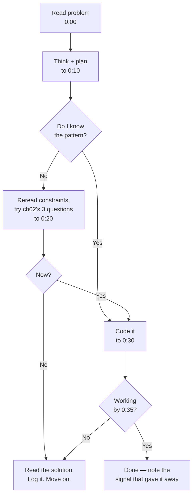

# The drill plan — how to practise, and what to practise

[Chapter 01](01-patterns-and-complexity.md) is the framework and
[chapter 02](02-choosing-the-approach.md) is how to pick a technique. Neither
of them is practice. This chapter is the practice: roughly 60 problems, grouped
by what they teach rather than by calendar day, with a rule for when to stop
struggling and a rule for when a block is actually finished.

Each block below has a **structure chapter** behind it — [arrays](04-arrays.md),
[strings](05-strings.md), [linked lists](06-linked-lists.md),
[matrices](07-matrices.md), [stacks and queues](08-stacks-and-queues.md),
[trees](09-trees.md), [heaps](10-heaps.md), [graphs](11-graphs.md) — covering
that structure's costs, idioms and bugs. Read the chapter, then drill the block.

It's adapted from a 15-day guided plan, deliberately loosened. **Days are the
wrong unit.** Some blocks take an evening and some take three, and a schedule
that says "Tuesday is graphs" makes you either rush past something you haven't
got or sit around after something you have. Blocks with exit tests fix that.

> **If you only change one thing** about how you currently practise, make it the
> time-box in the next section. Not the problem list. Unbounded struggling is
> what turns a two-week plan into a six-week one.

---

## The rules that matter more than the list

### 1. Time-box every problem


*Thirty-five minutes, then you read the solution regardless. Reading a solution is not failure; spending ninety minutes not reading it is.*

The whole rule: **10 minutes to find the approach, 25 to implement, then stop.**
A real round is 35–45 minutes including the conversation, so anything longer
isn't practising the thing you're being tested on.

When you do read the solution, the work isn't finished — see rule 3.

### 2. Solve out loud, from the first block

The doc this is adapted from saves interview simulation for the last day. That's
too late: you find out on day 15 that narration is your weak point, with no time
left to fix it.

So from block 1, on **at least one problem per session**: say the constraints,
say the target complexity, say the brute force, then say why you're picking the
pattern you're picking — out loud, before typing. It feels ridiculous alone in a
room. It is also the single highest-return habit here, because narration is what
the round actually grades.

### 3. Keep a mistake log, and re-solve from it

One file, one line per problem you didn't get:

```
Rain water trapped — saw it as a stack problem, missed that it's two
  precomputed passes. Signal I missed: "depends on both sides of i".
```

The important column is **the signal you missed**, not the solution. You are
training pattern recognition, and the recognisable thing is the signal.

Then: **re-solve every logged problem from scratch two days later.** Not
re-read — re-solve, blank editor. This is the step that converts recognition
into recall, and skipping it is why people finish a plan and still freeze.

### 4. Exit tests, not day counts

Each block below ends with a specific test. Pass it and move on, whether that
took one evening or four. Fail it and repeat the block's weakest topic rather
than pressing ahead — a shaky foundation compounds, because later blocks reuse
earlier patterns.

---

## The blocks

Roughly 60 problems in six blocks, ordered so each one reuses the last. The
**pattern** column points at the section in
[chapter 02](02-choosing-the-approach.md) that explains why the technique
applies — read that section *before* attempting the block, not after.

### Block 1 — Arrays, and the three techniques that hide in them

The largest and most important block. Most interview problems are array
problems wearing a costume, and three techniques cover most of them.

| Problem | Pattern |
| --- | --- |
| Two sum | Hash map |
| Equilibrium index of an array | Prefix sum |
| Longest subarray with zero sum | Prefix sum + hash map |
| Subarray sum equals k *(count, not existence)* | Prefix sum + hash map |
| Max sum contiguous subarray *(Kadane's)* | DP in one variable |
| Subarray with given sum and length | Sliding window |
| Longest substring without repeating characters | Sliding window |
| Rain water trapped | Forward + backward passes |
| Product of array except self | Forward + backward passes |
| Move zeroes / remove duplicates in place | Two pointers |
| First missing positive integer | Cyclic sort |

**Exit test:** given a new contiguous-subarray problem, you can say within thirty
seconds whether it's a sliding window or a prefix sum, **and say why**. The
answer is about negative values and whether you need a count — if that isn't
instant, redo the four prefix-sum problems.

> **Added to the original plan:** the prefix-sum group and *product of array
> except self*. The source plan had rain water on day 1 with no build-up, which
> is why it's most people's first wall — it needs the forward/backward idea and
> nothing before it teaches that.

---

### Block 2 — Strings

Absent as a topic from the original plan, and heavily represented in real
screens. Mostly the same techniques as block 1, which is why it goes here.

| Problem | Pattern |
| --- | --- |
| Valid palindrome *(ignoring non-alphanumerics)* | Two pointers |
| Group anagrams | Hash map with a sorted or counted key |
| Longest palindromic substring | Expand around centre |
| Minimum window substring | Sliding window + counts |
| Longest repeating character replacement | Sliding window |
| String compression / run-length encode | Two pointers, in place |

**Exit test:** minimum window substring, working, in under 35 minutes. It's the
hardest sliding window in common rotation, and passing it means the pattern is
solid rather than memorised.

---

### Block 3 — Searching, sorting and bit tricks

Short block, high yield. Binary search on the answer is the piece that most
distinguishes a prepared candidate.

| Problem | Pattern |
| --- | --- |
| Binary search, written from scratch | Binary search |
| Search in a rotated sorted array | Binary search, modified |
| Painter's partition problem | **Binary search on the answer** |
| Aggressive cows | **Binary search on the answer** |
| Merge sort, written from scratch | Divide and conquer |
| K closest points to origin | Heap + custom comparator |
| Top-k frequent elements | Hash map + heap |
| Sort a nearly-sorted array *(k places apart)* | Min-heap of size k+1 |
| Single number I, II and III | XOR / bit counting |
| Count set bits, check/flip a bit | Bit manipulation |

**Exit test:** you can explain, unprompted, the two conditions that make binary
search on the answer legal — a cheap feasibility check, and monotonic
feasibility — and identify them in painter's partition.

> **Added:** top-k frequent elements and the nearly-sorted array. The original
> plan has no heap day at all, despite "k closest points" appearing on its
> sorting day; top-k is where the min-heap-for-k-largest inversion becomes
> obvious, and the nearly-sorted array is the cleanest "why a heap rather than
> just sorting" problem there is — a size k+1 heap gives O(n log k) where a
> sort gives O(n log n).

---

### Block 4 — Linked lists, stacks and queues

| Problem | Pattern |
| --- | --- |
| Middle of a linked list | Fast/slow pointers |
| Detect and remove a loop | Floyd's cycle detection |
| Reverse a linked list *(iterative)* | Three-pointer reversal |
| Merge two sorted lists | Dummy head |
| LRU cache | Hash map + doubly linked list |
| Balanced parentheses | Stack |
| Queue using two stacks | Amortised analysis |
| Nearest smaller element | **Monotonic stack** |
| Largest rectangle in a histogram | **Monotonic stack** |
| Daily temperatures | **Monotonic stack** |

**Exit test:** largest rectangle in a histogram, and you can explain why it's
O(n) despite the while-inside-for — each element is pushed once and popped once.

> **Added:** reverse a linked list, merge two sorted lists, and daily
> temperatures. Reversal is a building block for half of the harder list
> problems and the original plan skips straight to LRU cache. The extra
> monotonic-stack problem is there because one exposure to that pattern is not
> enough, and histogram is brutal as a first contact.

---

### Block 5 — Trees and graphs

| Problem | Pattern |
| --- | --- |
| All four traversals, from scratch | Recursion / BFS |
| Zigzag level order | BFS with alternating direction |
| Diameter of a binary tree | Tree DP — return vs record |
| Lowest common ancestor | Postorder |
| Build a tree from inorder + preorder | Recursion + index map |
| Validate a BST | Inorder is sorted |
| Number of islands | DFS/BFS flood fill |
| Rotten oranges | **Multi-source** BFS |
| Cycle in a directed graph | DFS, three-colour |
| Course schedule / build order | Topological sort |
| Dijkstra, from scratch | Heap-based shortest path |
| Number of provinces *(or redundant connection)* | **Union-Find** |

**Exit test:** you can state, without hesitating, when BFS is required rather
than merely convenient — shortest path in an unweighted graph — and why rotten
oranges is BFS specifically (the answer is a number of levels).

> **Added:** validate a BST, course schedule, and a union-find problem.
> Union-Find is the clearest gap in the original plan: near-O(1) connectivity,
> ~15 lines, and it shows up often enough that not having it is noticeable. The
> implementation is in [chapter 02](02-choosing-the-approach.md#data-structures).

---

### Block 6 — Recursion, backtracking, greedy and DP

Last because it's hardest, and because it reuses everything above.

| Problem | Pattern |
| --- | --- |
| Implement `pow(x, n)` | Divide and conquer |
| Subsets / permutations | Backtracking |
| Generate all parentheses | Backtracking + pruning |
| N-Queens | Backtracking + pruning |
| Fractional knapsack | **Greedy** |
| Interval scheduling *(sort by end time)* | **Greedy** |
| Merge intervals / insert interval | **Sort + sweep** |
| Distribute candies | Greedy, two passes |
| Climbing stairs / Fibonacci | DP, 1-D |
| House robber *(max sum, no adjacent)* | DP, 1-D |
| Minimum number of squares | DP, unbounded |
| 0-1 knapsack | **DP, 2-D** |
| Longest common subsequence | DP, 2-D |
| Coin change | DP, unbounded |

**Exit test:** you can explain the fractional-vs-0-1 knapsack split as the
difference between greedy and DP, in your own words, without looking. That one
comparison is the most reliable way to tell the two apart under pressure, and
it's why both sit in the same block here rather than a day apart.

> **Added:** merge intervals. Intervals are a whole problem family — sort by
> start, then sweep — and the original plan has none of them, despite meeting
> rooms and interval merging being near-universal in screens.

---

## The actual mock pool

A guided mock draws from a published list of 25 problems across 14 topic
buckets. If you have one scheduled, this is the syllabus — and the *weighting*
is the part to read, because it tells you where the questions actually come
from.

| Bucket | In pool | Problem | Pattern | Block |
| --- | --- | --- | --- | --- |
| **Stack** | 2 | Balanced parenthesis | Stack | 4 |
| | | Largest rectangle in histogram | **Monotonic stack** | 4 |
| **Queues** | 2 | LRU cache | Hash map + doubly linked list | 4 |
| | | Queue using stacks | Amortised analysis | 4 |
| **Trees** | 3 | Zigzag level order | BFS, alternating | 5 |
| | | Build tree from inorder + preorder | Recursion + index map | 5 |
| | | Diameter of a binary tree | Tree DP — return vs record | 5 |
| **DP** | 3 | 0-1 knapsack | DP, 2-D | 6 |
| | | Fibonacci sequence | DP, 1-D | 6 |
| | | N stairs | DP, 1-D | 6 |
| **Arrays** | 2 | Equilibrium index | **Prefix sum** | 1 |
| | | Rain water trapped | **Forward + backward passes** | 1 |
| **Bits** | 2 | Single Number II | Bit counting mod 3 | 3 |
| | | Single Number III | XOR + lowest set bit split | 3 |
| **Sorting** | 2 | Merge sort | Divide and conquer | 3 |
| | | B closest points to origin | Heap + custom comparator | 3 |
| **Searching** | 2 | Rotated sorted array search | Binary search, modified | 3 |
| | | Painter's partition | **Binary search on the answer** | 3 |
| **Two pointers** | 1 | Pairs with given sum II | Two pointers, sorted | 1 |
| **Hashing** | 1 | Longest subarray zero sum | **Prefix sum + hash map** | 1 |
| **Linked list** | 1 | Remove loop from linked list | Floyd's cycle detection | 4 |
| **Heaps** | 1 | K places apart | Min-heap of size k+1 | 3 |
| **Greedy** | 1 | Finish maximum jobs | Greedy, **sort by end time** | 6 |
| **Backtracking** | 1 | N-Queens | Backtracking + pruning | 6 |

### What the list tells you

**Graphs are absent.** No islands, no rotten oranges, no cycle detection, no
Dijkstra, no topological sort — despite all of them appearing on the day-plan
this chapter is adapted from. For a mock drawing on this pool, block 5's graph
half is low priority. **Do not drop it permanently**: real screens ask graph
questions constantly, and union-find and topological sort remain genuine gaps.
It's a scheduling decision, not a syllabus decision.

**Sliding window is absent too.** The array problems here are prefix sum and
forward/backward passes instead. Those are precisely the two techniques the
source plan opened with and never taught, which is why block 1 builds up to
them — it's now the highest-value block you have.

**Stack and queue is the joint-largest bucket**, and it contains largest
rectangle in a histogram. That problem is close to unsolvable inside the time
limit without a monotonic stack and routine with one. If you drill a single
thing, drill that.

**Trees are the other joint-largest**, and all three are the standard trio.
Diameter is the one to be careful with: the value you *return* to the parent
(height) differs from the value you *record* (the best left+right seen). That
split is what makes tree DP feel hard until it clicks.

### Priority order for a scheduled mock

Weighted by how often the bucket appears and how badly it goes without the
pattern:

1. **Monotonic stack** — largest rectangle. Highest cost of not knowing it.
2. **Prefix sum, and prefix sum + hash map** — covers 2 of the 25 directly and
   the technique generalises further than any other here.
3. **Tree traversals and tree DP** — 3 problems, one bucket.
4. **DP: recursion + memo** — 3 problems, and knapsack is the hard one.
5. **Binary search on the answer** — painter's partition is unrecognisable
   without it and mechanical with it.
6. **Forward + backward passes** — rain water.
7. **Heap with a custom comparator** — 2 problems across two buckets.
8. **The rest** — balanced parens, LRU, queue-from-stacks, Floyd's, merge sort,
   the bit problems, N-Queens, interval scheduling. All standard, all covered.

**Two problems in the pool that trip people up for non-obvious reasons:**
*Finish maximum jobs* is interval scheduling and the key is sorting by **end**
time rather than start — counter-intuitive, and the whole trick. *Single Number
II* breaks the XOR habit built by Single Number I, because three copies don't
cancel; you count bits per position mod 3 instead.

---

## Sequencing, and what to do when time is short

The blocks assume you have a couple of weeks. If you don't:

| You have | Do this |
| --- | --- |
| **A week** | Blocks 1, 3 and 5, plus 0-1 knapsack and backtracking from block 6. Skip block 2 |
| **Three days** | Block 1 entirely, then binary search on the answer, BFS/DFS, and 0-1 knapsack |
| **Tomorrow** | Reread [chapter 02](02-choosing-the-approach.md)'s three questions and the signal → pattern table. Solve two-sum, longest substring without repeats, number of islands, and climbing stairs. Then sleep |

Interleave rather than blocking, if you can. Doing all eleven array problems
consecutively means problem four is easy because you're still primed from
problem three — which feels like progress and isn't. Mixing two or three blocks
per session is measurably better for recall, and it's also what an interview
does to you: no warning about which pattern is coming.

**Two rest points**, roughly after block 3 and after block 5. Not days off — use
them to re-solve everything in the mistake log from blank. That's the spacing
that makes the earlier blocks stick.

---

## Data structures

Before block 1, implement these from scratch once each. They take an evening
total, and a DSA round is explicitly testing that you reach for the right
structure rather than a dependency.

| Structure | Why implement it | Where it's needed |
| --- | --- | --- |
| **Binary heap** | JS has no built-in. You *will* need it and you can't install one | Block 3 (top-k), block 5 (Dijkstra) |
| **Union-Find** | ~15 lines, and near-O(1) connectivity is otherwise unavailable | Block 5 |
| **Trie** | Nested objects; 20 lines | Prefix problems, if they come up |
| **Deque** | `array.shift()` is O(n); know the ring-buffer answer if asked | Block 5 (BFS) |

Everything else is a `Map`, a `Set`, or array indices — see
[chapter 01](01-patterns-and-complexity.md#data-structures-not-libraries) and
[chapter 02](02-choosing-the-approach.md#data-structures) for the per-pattern
tables.

**Pseudocode — the min-heap you'll need in block 3**

```js
class MinHeap {
  constructor(cmp = (a, b) => a - b) { this.a = []; this.cmp = cmp; }

  push(v) {
    this.a.push(v);
    let i = this.a.length - 1;
    // Sift up: swap with the parent while it's larger. Parent of i is (i-1)>>1.
    while (i > 0) {
      const p = (i - 1) >> 1;
      if (this.cmp(this.a[i], this.a[p]) >= 0) break;
      [this.a[i], this.a[p]] = [this.a[p], this.a[i]];
      i = p;
    }
  }

  pop() {
    const top = this.a[0], last = this.a.pop();
    if (this.a.length) {
      this.a[0] = last;
      // Sift down: swap with the SMALLER child, otherwise the heap property
      // breaks on the other side.
      let i = 0;
      for (;;) {
        const l = 2 * i + 1, r = l + 1;
        let m = i;
        if (l < this.a.length && this.cmp(this.a[l], this.a[m]) < 0) m = l;
        if (r < this.a.length && this.cmp(this.a[r], this.a[m]) < 0) m = r;
        if (m === i) break;
        [this.a[i], this.a[m]] = [this.a[m], this.a[i]];
        i = m;
      }
    }
    return top;
  }

  get size() { return this.a.length; }
}
```

For **k largest**, push everything and `pop()` whenever `size > k`. The min-heap
keeps the weakest of your current best k on top, so that's exactly what gets
evicted — the inversion that catches people out.

---

## Tracking it

Copy this into your own notes and fill the last two columns. The mistake log is
the column that matters; the tick is just momentum.

If a mock is scheduled, track [the mock pool](#the-actual-mock-pool) separately
— it's 25 specific problems and the blocks below cover all of them.

| Block | Problems | Done | Logged mistakes | Re-solved |
| --- | --- | --- | --- | --- |
| 1 — Arrays | 11 | | | |
| 2 — Strings | 6 | | | |
| 3 — Search, sort, bits | 9 | | | |
| 4 — Lists, stacks, queues | 10 | | | |
| 5 — Trees and graphs | 12 | | | |
| 6 — Recursion, greedy, DP | 14 | | | |

**You are ready when** you can look at an unseen problem and name the likely
pattern in under a minute with a reason attached — not when the ticks are all
filled in. Those are different things, and only the first one is being tested.

---

## Interview Q&A

### Q: How do you prepare for a coding round when you haven't done DSA in a while?
**Level:** foundation · **Tags:** dsa, preparation, process

<details><summary>Model answer</summary>

Pattern coverage over problem volume, and I'd time-box everything.

The realisation that changes how you practise is that interview problems are a
fairly small number of patterns in different costumes — maybe fifteen. So I'd
work in blocks by pattern rather than by problem count: arrays with the three
techniques that hide in them, strings, search and bit tricks, linked structures
with monotonic stacks, trees and graphs, then recursion and DP last because it
reuses everything. Roughly sixty problems, not six hundred.

The rule I'd hold to is 35 minutes per problem — ten to find the approach,
twenty-five to implement — and then read the solution regardless. Unbounded
struggling feels virtuous and it's the main reason a two-week plan becomes six.
A real round is 35 to 45 minutes anyway, so practising longer isn't practising
the thing being tested.

Two habits matter more than the list. First, solve at least one problem per
session out loud — constraints, target complexity, brute force, then why this
pattern — because narration is what's actually graded and you don't want to
discover that in the round. Second, keep a log of what I missed, recording the
*signal* I failed to spot rather than the solution, and re-solve those from
blank two days later. That last step is what converts recognition into recall.

And I'd measure readiness by whether I can name a likely pattern on an unseen
problem within a minute, with a reason. Not by how many problems I've ticked
off.

</details>

**Follow-ups:**

1. Q: How long should you spend on a problem before looking at the answer?
   <details><summary>Answer</summary>

   About 35 minutes total, split ten and twenty-five. Ten minutes to identify
   the approach, and if I haven't got it by then I reread the constraints and
   run the shape/return-type/budget questions deliberately. Twenty-five to
   implement. Then I read the solution regardless of where I am.

   The reason for a hard cap is that the marginal value drops off sharply.
   Struggling for two hours and getting there teaches you slightly more than
   struggling for thirty minutes and reading it — but it costs four times the
   time, and the interview is time-limited anyway. Practising a ninety-minute
   grind is practising something that never happens.

   The important part is what comes after reading it. I write down the signal I
   missed, not the solution — "depends on both sides of i, so it's two
   precomputed passes" — and then re-solve it from a blank editor two days
   later. Reading a solution and moving on produces recognition, which feels
   like knowing and disappears under pressure.

   </details>

2. Q: You've got three days before a coding screen. What do you actually do?
   <details><summary>Answer</summary>

   Triage hard, and accept that coverage is now the goal rather than depth.

   Day one is arrays, because most problems are array problems in disguise:
   hash map for lookups, sliding window, prefix sum, and the forward/backward
   pass. That's the highest-density block by a distance.

   Day two is binary search — including binary search on the answer, which is
   the piece that most distinguishes a prepared candidate — plus BFS and DFS
   with one flood-fill problem and one shortest-path problem.

   Day three is one 0-1 knapsack for DP, one backtracking problem, and then
   stop adding new material. I'd spend the last part of it re-solving whatever
   I got wrong on days one and two, out loud, timed.

   What I'd deliberately skip: tries, union-find, advanced DP, anything exotic.
   And I'd make sure I can talk through the process cleanly — restate,
   constraints, brute force with complexity, then optimise — because that
   structure earns credit even on a problem I don't finish, and in three days
   it's a more reliable investment than one more pattern.

   </details>

---

## What a weak answer sounds like

- **"I've done 400 problems."** Volume without pattern vocabulary. The follow-up
  — "what kind of problem is this?" — exposes it immediately.
- **Grinding without a time-box.** Produces a small number of deeply learned
  problems and no breadth.
- **Reading solutions and moving on.** That builds recognition, which collapses
  the moment you face a blank editor.
- **Practising silently, then narrating for the first time in the round.**
  Narration is a separate skill and it needs its own reps.
- **Treating a day plan as the goal.** Ticking day 9 while trees are still shaky
  means block 5 will fail, because later patterns build on earlier ones.
- **Skipping the boring reps** — writing binary search, merge sort and a heap
  from scratch once each. These show up as sub-steps everywhere.

---

## Glossary

- **Time-box** — a fixed cap per problem (35 min here), after which you read the solution.
- **Mistake log** — a running record of missed problems, keyed by the *signal* you failed to spot.
- **Re-solve from blank** — reattempting a logged problem days later with no notes; the step that builds recall.
- **Exit test** — the specific check that a block is finished, replacing a day count.
- **Interleaving** — mixing topics within a session rather than blocking one topic, which improves recall.
- **Spacing** — revisiting material after a gap, which is why the two rest points are re-solve sessions.
- **Recognition vs recall** — being able to follow a solution vs being able to produce one. Only the second is tested.
