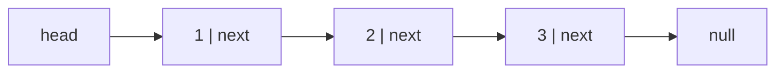

# Linked lists — pointer surgery under time pressure

Linked lists are rare in production JavaScript and common in interviews, for a
specific reason: they test whether you can hold a mutable pointer structure in
your head and not corrupt it. There is very little cleverness. There is a lot of
careful order-of-operations.

The good news is that the whole topic is about **four idioms**. Learn those and
almost every linked-list problem is an assembly of them.

---

## The costs

| Operation | Singly linked | Array | Why the difference |
| --- | --- | --- | --- |
| Access the i-th element | **O(n)** | O(1) | You must walk from the head |
| Insert/delete at the head | **O(1)** | O(n) | No shifting |
| Insert/delete **given the node** | **O(1)** | O(n) | Just rewire two pointers |
| Insert/delete by value | **O(n)** | O(n) | Finding it dominates |
| Search | **O(n)** | O(n) | Same, but arrays win on cache |
| Memory per element | Higher | Lower | Every node stores a pointer too |

**The distinction that matters:** deletion is O(1) *given the node*, and O(n) if
you have to find it first. That caveat is why linked lists are almost never the
right production choice on their own — and why they're perfect in an **LRU
cache**, where a hash map hands you the node directly and the list only ever
does O(1) rewiring.

---

## How it actually works


*A chain of nodes, each holding a value and a reference to the next. `null` marks the end, and losing your only reference to a node loses the rest of the list with it.*

### Who's who

| Term | Meaning |
| --- | --- |
| **Node** | `{ val, next }` — a value plus a reference |
| **Head** | The first node. Lose it and you've lost the list |
| **Tail** | The last node; its `next` is `null` |
| **Singly linked** | Each node points forward only |
| **Doubly linked** | Each node has `prev` and `next` — needed for O(1) removal without the predecessor |
| **Circular** | The tail points back into the list rather than to `null` |
| **Dummy / sentinel node** | A fake node before the head, so the head needs no special case |

### The one thing that makes them hard

There is no going back and no random access. If you overwrite `node.next`
before you've saved it, the rest of the list is unreachable and gone. Every
linked-list bug is some version of that.

**So: draw it.** Three or four boxes with arrows, on paper or the whiteboard,
and physically move the arrows as you write each line. Everyone who is good at
these draws them. Trying to hold it purely in your head is how you produce code
that looks right and loses half the list.

---

## The four idioms

Almost every problem is these, combined.

### 1. The dummy head — kill the special case

Any problem where the head itself might be removed or replaced. Instead of
`if (head === null)` and `if (removing the head)` branches scattered through
your code, put a fake node in front and return `dummy.next` at the end.

```js
// Remove all nodes with a given value — no head special case anywhere
function removeElements(head, val) {
  const dummy = { val: 0, next: head };   // the whole trick
  let prev = dummy;
  while (prev.next) {
    if (prev.next.val === val) prev.next = prev.next.next;   // skip it
    else prev = prev.next;                                   // only advance if we kept it
  }
  return dummy.next;    // works even if the original head was removed
}
```

The `else` matters: if you advance `prev` after a deletion you skip the node you
just linked in, and consecutive matches survive.

**Use a dummy whenever the head can change.** Merging two lists, removing nodes,
partitioning, inserting in sorted order. It removes roughly half the bugs in the
topic.

### 2. Fast and slow pointers

One pointer moves one step, the other two. Three problems fall out of it.

**Find the middle** — when fast reaches the end, slow is at the middle.

```js
let slow = head, fast = head;
while (fast && fast.next) { slow = slow.next; fast = fast.next.next; }
// slow is now the middle (the second middle if the length is even)
```

The `fast && fast.next` guard is the whole correctness argument: it handles both
odd and even lengths without a null dereference. Getting that condition wrong is
the most common crash in the topic.

**Detect a cycle (Floyd's)** — if there is a loop, fast laps slow and they meet.
If there isn't, fast hits `null`.

**Find the cycle's start** — this is the part worth memorising, because it isn't
derivable in the moment. Once they meet, reset one pointer to the head and
advance both one step at a time; where they meet again is the entry to the loop.

```js
function detectCycleStart(head) {
  let slow = head, fast = head;
  while (fast && fast.next) {
    slow = slow.next; fast = fast.next.next;
    if (slow === fast) {                      // a cycle exists
      let p = head;
      while (p !== slow) { p = p.next; slow = slow.next; }
      return p;                               // the entry node
    }
  }
  return null;
}
```

**Find the k-th from the end** — the same idea with a fixed gap: advance one
pointer k steps, then move both together until the leader hits the end.

### 3. Reversal — the three-pointer dance

The single most important linked-list skill. Half the harder problems contain a
reversal.

```js
function reverse(head) {
  let prev = null, curr = head;
  while (curr) {
    const next = curr.next;   // 1. SAVE first — everything after depends on this
    curr.next = prev;         // 2. flip the arrow backwards
    prev = curr;              // 3. advance prev
    curr = next;              // 4. advance curr
  }
  return prev;                // curr is null; prev is the new head
}
```

Those four lines in that order, every time. **Line 1 is the one people drop**,
and dropping it severs the list at `curr` — you lose everything downstream on
the very first iteration.

Say the loop out loud as "save, flip, advance, advance". Practise it until you
can write it without thinking, because in a harder problem it'll be a subroutine
and you won't have attention to spare for it.

### 4. Merging two sorted lists

The building block for merge-sorting a list, and a dummy-head problem.

```js
function merge(a, b) {
  const dummy = { next: null };
  let tail = dummy;
  while (a && b) {
    if (a.val <= b.val) { tail.next = a; a = a.next; }
    else                { tail.next = b; b = b.next; }
    tail = tail.next;
  }
  tail.next = a ?? b;    // one list is exhausted; attach the rest wholesale
  return dummy.next;
}
```

The last line is the neat part: you don't loop over the remainder, you attach
it. Missing it and looping instead is correct but reads as less fluent.

---

## Putting the idioms together

The harder problems are compositions, and recognising that is the skill.

| Problem | = |
| --- | --- |
| Palindrome linked list, O(1) space | find middle + **reverse** second half + compare |
| Reorder list (`L0→Ln→L1→Ln-1…`) | find middle + **reverse** second half + **merge** alternately |
| Sort a linked list, O(n log n) | find middle + recurse + **merge** |
| Remove the n-th node from the end | **dummy** + fast/slow with a gap of n |
| Reverse in groups of k | **reverse** as a subroutine, k nodes at a time |
| Rotate right by k | find length, connect into a circle, walk to the new tail, break |

**Say the decomposition out loud** before you write anything: "this is find the
middle, reverse the second half, then compare — three pieces I know". That is a
much stronger opening than starting to type.

---

## The bugs

| Bug | Fix |
| --- | --- |
| **Losing the rest of the list** | Save `next` before you overwrite it. Always |
| **Null dereference on `fast.next.next`** | Guard with `while (fast && fast.next)` |
| **Head special cases everywhere** | Use a dummy node |
| **Advancing after a deletion** | Only advance `prev` when you *didn't* delete |
| **Off-by-one on "k-th from the end"** | Test on a two-node list; that's where it breaks |
| **Not restoring a mutated list** | If you reverse half a list to check a palindrome, some interviewers want it restored. Ask |
| **Infinite loop on a cycle** | Any traversal on possibly-cyclic input needs Floyd's or a visited `Set` |
| **Returning `head` after a dummy** | Return `dummy.next` — `head` may no longer be the head |

---

## Practice ladder

| # | Problem | What it teaches |
| --- | --- | --- |
| 1 | Reverse a linked list, iteratively | The three-pointer dance. Everything else needs it |
| 2 | Middle of a linked list | Fast/slow, and the `fast && fast.next` guard |
| 3 | Merge two sorted lists | Dummy head; attach-the-remainder |
| 4 | Remove n-th node from the end | Dummy + a fixed-gap two-pointer |
| 5 | Linked list has a cycle | Floyd's detection |
| 6 | Find where the cycle starts / remove the loop | The reset-to-head step |
| 7 | Palindrome linked list, O(1) space | Composition: middle + reverse + compare |
| 8 | Reorder list | Composition: middle + reverse + alternate merge |
| 9 | LRU cache | Doubly linked list + hash map. The one that's genuinely used in production |
| 10 | Reverse nodes in k-groups | Reversal as a subroutine with bookkeeping |
| 11 | Merge k sorted lists | Merge + a heap. Bridges to [heaps](10-heaps.md) |

**Exit test:** write `reverse` from memory in under two minutes, correct first
time, and then solve palindrome-linked-list by decomposing it out loud. If
reversal isn't automatic, nothing above rung 6 will be.

---

## Data structures

| Need | Use | Note |
| --- | --- | --- |
| A node | A plain object `{ val, next }` | No class needed. Interviewers usually supply the definition |
| A doubly linked node | `{ val, prev, next }` | Required for O(1) removal when you don't have the predecessor |
| Avoiding head special cases | A dummy node | `{ next: head }`, return `dummy.next` |
| Cycle detection | Two pointers | O(1) space. A `Set` of visited nodes also works but costs O(n) |
| LRU cache | `Map` + doubly linked list | The map gives O(1) find, the list gives O(1) reorder |

**Pseudocode — the LRU cache, since it's the one that shows up most**

```js
// O(1) get and put. The hash map finds the node; the list keeps the order.
// Sentinel head and tail remove every edge case at the boundaries.
class LRUCache {
  constructor(capacity) {
    this.cap = capacity;
    this.map = new Map();                       // key -> node
    this.head = { };                            // sentinel: most-recent side
    this.tail = { };                            // sentinel: least-recent side
    this.head.next = this.tail;
    this.tail.prev = this.head;
  }

  #remove(node) {                               // O(1) — needs prev, hence doubly linked
    node.prev.next = node.next;
    node.next.prev = node.prev;
  }

  #addFront(node) {                             // insert just after head
    node.next = this.head.next;
    node.prev = this.head;
    this.head.next.prev = node;
    this.head.next = node;
  }

  get(key) {
    const node = this.map.get(key);
    if (!node) return -1;
    this.#remove(node);                         // touching it makes it most-recent
    this.#addFront(node);
    return node.val;
  }

  put(key, val) {
    if (this.map.has(key)) this.#remove(this.map.get(key));
    const node = { key, val };
    this.#addFront(node);
    this.map.set(key, node);

    if (this.map.size > this.cap) {
      const lru = this.tail.prev;               // the node just before the tail sentinel
      this.#remove(lru);
      this.map.delete(lru.key);                 // node stores `key` SO we can do this
    }
  }
}
```

Two details are the whole design. The node stores its own `key` — without it you
couldn't delete the evicted entry from the map, because you'd have the node but
not its key. And the list must be **doubly** linked: eviction removes the node
before the tail, and removing a node in O(1) requires knowing its predecessor.

---

## Interview Q&A

### Q: Reverse a linked list. Then explain why the order of operations matters.
**Level:** foundation · **Tags:** dsa, linked-lists, pointers

<details><summary>Model answer</summary>

Three pointers: `prev` starting at null, `curr` at the head, and a temporary
`next` inside the loop. Each iteration: save `curr.next` into `next`, point
`curr.next` at `prev`, move `prev` to `curr`, move `curr` to `next`. When `curr`
is null, `prev` is the new head.

The order matters because the moment I write `curr.next = prev` I have destroyed
my only reference to the rest of the list. Nothing else points to it — that's
what a singly linked list means. So saving `next` first isn't tidiness, it's the
difference between reversing the list and truncating it to one node.

That's really the general lesson for the whole topic: in a singly linked list
every node is reachable through exactly one pointer, so overwriting a pointer
before saving it loses everything downstream permanently.

It's O(n) time and O(1) space. There's a recursive version that's arguably
prettier, but it's O(n) stack space and will overflow on a long list, so I'd
write the iterative one and mention the recursive one exists.

</details>

**Follow-ups:**

1. Q: How would you check whether a linked list is a palindrome in O(1) space?
   <details><summary>Answer</summary>

   Three steps, all of which are idioms I already have.

   Find the middle with fast and slow pointers. Reverse the second half in
   place. Then walk one pointer from the head and one from the new head of the
   reversed half, comparing values until one runs out. If every pair matched,
   it's a palindrome.

   O(n) time, O(1) space. The naive alternative — copy the values into an array
   and use two pointers — is much easier to write but O(n) space, so I'd offer
   it as the baseline and then do this if O(1) is required.

   The thing I'd raise unprompted is that this mutates the input. Some
   interviewers care, and it's a legitimate objection if other code holds a
   reference to that list. If it matters, I reverse the second half back before
   returning, which is another O(n/2) pass and keeps the same complexity.

   </details>

2. Q: When would you use a linked list over an array in real code?
   <details><summary>Answer</summary>

   Rarely on its own, and I'd say that directly, because arrays win on random
   access and cache locality and those dominate most workloads.

   The genuine case is when you have O(1) access to the node already and need
   O(1) structural change. LRU cache is the canonical one: a hash map maps key
   to node, so finding is O(1), and then moving that node to the front is
   pointer rewiring rather than shifting an array. That combination is why every
   real LRU implementation is a hash map plus a doubly linked list.

   The other case is splicing — moving a run of elements between structures
   without copying, which is why intrusive lists show up in kernels and
   allocators.

   What people usually cite — "insertion is O(1)" — is misleading, because
   finding the position is still O(n), so insert-by-value is O(n) either way.
   The array often wins in practice even then, because shifting contiguous
   memory is extremely fast compared to chasing pointers across the heap.

   </details>

### Q: How do you detect a cycle in a linked list, and find where it starts?
**Level:** intermediate · **Tags:** dsa, linked-lists, two-pointers

<details><summary>Model answer</summary>

Floyd's cycle detection — two pointers, one moving a step at a time and one
moving two.

For detection: if there's no cycle, the fast pointer reaches null and I'm done.
If there is one, the fast pointer enters the loop and gains on the slow one by
one node per iteration, so it must eventually land on it. They meet, and that
proves a cycle exists. O(n) time, O(1) space.

Finding the entry point is the part I'd say up front I know rather than derive:
once they meet, reset one pointer to the head and advance both one step at a
time. Where they meet the second time is the start of the cycle.

The reason it works is a distance argument. If the distance from head to the
cycle entry is `a`, and from the entry to the meeting point is `b`, and the
cycle length is `c`, then when they meet the slow pointer has travelled `a + b`
and the fast one has travelled twice that. The difference is a whole number of
loops, and the algebra reduces to `a` being congruent to the remaining distance
from the meeting point back round to the entry. So a pointer from the head and a
pointer from the meeting point, both moving one step, arrive at the entry
together.

The alternative is a `Set` of visited nodes, which is O(n) space but takes ten
seconds to write and is honestly fine if nobody has asked for O(1). I'd mention
both and let the constraint decide.

</details>

**Follow-ups:**

1. Q: How do you actually remove the loop once you've found it?
   <details><summary>Answer</summary>

   Find the entry node as above, then find the node whose `next` points at it
   and set that to null.

   Concretely: once I have the cycle entry, walk round the loop from the entry
   until I find the node whose `next` is the entry again — that's the last node
   of the loop. Setting its `next` to null breaks the cycle and leaves a proper
   null-terminated list.

   The edge case worth naming is a loop back to the head itself, where the entry
   is the head. The walk still works — I go all the way round and find the tail
   — but a naive implementation that starts from `head.next` and assumes the
   entry is somewhere in the middle will miss it.

   </details>

---

## What a weak answer sounds like

- **Overwriting `next` before saving it.** The defining bug of the topic.
- **`while (fast.next && fast)`** — wrong order, and it crashes. Null-check the
  thing before you dereference it.
- **Head special cases scattered through the code** instead of a dummy node.
- **Recursive reversal with no mention of stack depth.** It's O(n) space and
  overflows on a long list.
- **"Linked lists are better for insertion"** with no caveat that finding the
  position is still O(n).
- **Not drawing it.** Everyone who is reliably good at these draws three boxes
  and moves the arrows. Trying to hold it in your head is how the bugs get in.
- **Traversing possibly-cyclic input with a plain `while (node)`** — that's an
  infinite loop.

---

## Glossary

- **Node** — `{ val, next }`; a value and a reference.
- **Head / tail** — first and last nodes.
- **Singly / doubly linked** — forward pointers only, versus `prev` and `next`.
- **Circular list** — the tail points back into the list.
- **Dummy (sentinel) node** — a fake node before the head, removing head special cases.
- **Fast/slow pointers** — one step versus two; finds middles, cycles and k-from-end.
- **Floyd's cycle detection** — the fast/slow meeting argument, plus the reset-to-head step for the entry.
- **Three-pointer reversal** — save, flip, advance, advance.
- **Splice** — moving nodes between structures by rewiring rather than copying.
- **Intrusive list** — the list pointers live inside the payload object, avoiding a wrapper allocation.
