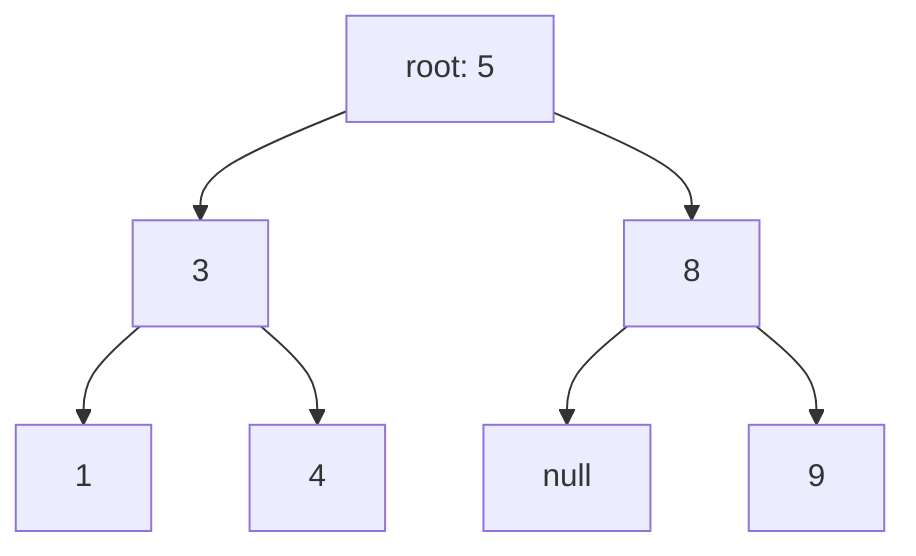

# Trees — recursion with a shape

Trees are where recursion stops being a trick and becomes the natural way to
express a problem. A tree is defined recursively — a node with subtrees that are
themselves trees — so a recursive solution usually falls out in five lines once
you ask the right question.

That question is almost always: **what do I need from my children, and what do I
return to my parent?** Get that right and the code writes itself. Get it vague
and you'll flail regardless of how well you know traversals.

---

## The costs

For a tree with n nodes and height h:

| Operation | Balanced | Worst case (a "stick") |
| --- | --- | --- |
| Search a **BST** | **O(log n)** | O(n) |
| Insert / delete in a BST | **O(log n)** | O(n) |
| Full traversal | **O(n)** | O(n) |
| Recursion stack space | **O(log n)** | **O(n)** |

**Height matters more than anything else here.** A balanced tree has
h ≈ log n; a degenerate one — inserting sorted data into an unbalanced BST — has
h = n, and every operation degrades to a linked list. That degeneration is the
entire reason self-balancing trees exist.

**Recursion depth is real space.** A recursive traversal is O(h) stack, so a
skewed tree of 10⁵ nodes overflows. Say it when it's relevant.

---

## How it actually works


*Every node is the root of its own subtree, which is why recursion fits: the solution for a node is expressed in terms of the same solution on smaller trees.*

### Who's who

| Term | Meaning |
| --- | --- |
| **Node** | `{ val, left, right }` |
| **Root** | The top node; the whole tree's handle |
| **Leaf** | A node with no children |
| **Height** | Longest path from a node down to a leaf. A leaf has height 0 |
| **Depth** | Distance from the root down to a node. The root has depth 0 |
| **Balanced** | Left and right heights differ by at most 1 at every node |
| **Binary tree** | Each node has at most two children |
| **BST** | A binary tree with the ordering invariant below |
| **Complete** | Every level full except possibly the last, filled left to right |

**Height and depth are measured in opposite directions** and are routinely
confused. Height goes down, depth goes down *to* you. If a problem says one,
check which it means.

### The BST invariant, stated correctly

For every node: **everything in the left subtree is less, everything in the
right subtree is greater** — not just the immediate children.

That "everything" is the whole point, and the reason naive BST validation is
wrong:

```js
// WRONG — only checks immediate children. Passes on a tree where a deep left
// descendant is larger than an ancestor.
function isBSTWrong(node) {
  if (!node) return true;
  if (node.left && node.left.val >= node.val) return false;
  if (node.right && node.right.val <= node.val) return false;
  return isBSTWrong(node.left) && isBSTWrong(node.right);
}

// RIGHT — carry the allowed range down. Each node narrows it for its children.
function isBST(node, min = -Infinity, max = Infinity) {
  if (!node) return true;
  if (node.val <= min || node.val >= max) return false;
  return isBST(node.left, min, node.val) && isBST(node.right, node.val, max);
}
```

Passing bounds down is a pattern in its own right, and it's the answer to a
whole family of tree problems.

---

## The four traversals, and what each is *for*

Learning the orders is easy. Knowing which to reach for is the part that gets
graded.

| Traversal | Order | Reach for it when |
| --- | --- | --- |
| **Inorder** | left, **node**, right | **A BST's inorder is sorted.** Validation, k-th smallest, sorted output |
| **Preorder** | **node**, left, right | Serialising, copying — you need the node before its subtrees exist |
| **Postorder** | left, right, **node** | You need the children's answers first: height, deletion, most tree DP |
| **Level order** | breadth-first | Per-level output, tree width, minimum depth |

The name tells you where the *node* goes relative to its children. That's the
entire mnemonic.

```js
function inorder(node, out = []) {
  if (!node) return out;
  inorder(node.left, out);
  out.push(node.val);        // move this line to change the traversal
  inorder(node.right, out);
  return out;
}
```

**Postorder is the one to internalise**, because most interesting tree problems
are postorder: you cannot compute a node's answer until both children have
reported theirs.

### Level order, and the batching trick

```js
function levelOrder(root) {
  if (!root) return [];
  const out = [], q = [root];
  let head = 0;                          // index pointer, not shift()
  while (head < q.length) {
    const size = q.length - head;        // freeze the level's size FIRST
    const level = [];
    for (let i = 0; i < size; i++) {     // exactly one level
      const node = q[head++];
      level.push(node.val);
      if (node.left) q.push(node.left);
      if (node.right) q.push(node.right);
    }
    out.push(level);
  }
  return out;
}
```

Freezing `size` before the inner loop is what separates the levels — the loop
appends the next level to the same array, so reading the length inside would run
away. **Zigzag level order** is this with `level.reverse()` on alternate rows.

---

## The recursive template

Nearly every tree problem fits this shape. Fill in three blanks.

```js
function solve(node) {
  if (!node) return BASE_CASE;              // 1. what does an empty tree return?
  const left = solve(node.left);            // 2. ask both children
  const right = solve(node.right);
  return COMBINE(left, right, node.val);    // 3. how do I combine?
}
```

Ask those three questions out loud and the code appears:

| Problem | Base case | Combine |
| --- | --- | --- |
| Height | `-1` (or 0 for node count) | `1 + max(left, right)` |
| Node count | `0` | `1 + left + right` |
| Sum | `0` | `node.val + left + right` |
| Is balanced | height `-1`, plus a flag | heights differ by ≤ 1 *and* both subtrees balanced |
| Max path sum | `0` | the return/record split, below |

### The return-versus-record split

The idea that makes "hard" tree problems easy. Sometimes **what you return to
your parent is not the answer you're computing.**

**Diameter of a binary tree** is the model. The diameter through a node is
`leftHeight + rightHeight`. But your parent can't use that — it needs your
*height* to compute its own path. So you return one thing and record another.

```js
function diameter(root) {
  let best = 0;                    // recorded: the answer, updated everywhere

  function height(node) {          // returned: what the PARENT needs
    if (!node) return 0;
    const l = height(node.left);
    const r = height(node.right);
    best = Math.max(best, l + r);  // record: the path THROUGH this node
    return 1 + Math.max(l, r);     // return: this node's height, for the parent
  }

  height(root);
  return best;
}
```

Two different values, one traversal. **Maximum path sum**, **longest univalue
path** and **house robber on a tree** are all this shape. When a tree problem
feels impossible, ask whether the thing you'd naturally return is different from
the thing you're measuring — it usually is, and separating them dissolves it.

---

## The problem families

### 1. Simple aggregation

Height, node count, sum, minimum depth, invert the tree. Straight recursive
template. Warm-ups, but write them until they're automatic.

**Minimum depth has a trap:** for a node with one child, `1 + min(left, right)`
returns 1, because the missing side is 0. A leaf is a node with *no* children,
so a one-child node must take the non-null side.

### 2. BST-specific

Exploit the ordering — if you're not, you're ignoring the premise.

- **Search / insert:** compare and go one way. O(h), not O(n).
- **Validate:** pass min/max bounds down, as above.
- **K-th smallest:** inorder traversal, stop at k. Don't collect everything.
- **Lowest common ancestor in a BST:** the first node whose value lies between
  the two targets. O(h) with no recursion into both sides.
- **Inorder successor:** if there's a right subtree, its leftmost node;
  otherwise the last ancestor you turned left from.

### 3. Structure and comparison

Same tree, symmetric tree, subtree of another, invert. Recurse on *pairs* of
nodes rather than one.

```js
function isSymmetric(root) {
  function mirror(a, b) {
    if (!a && !b) return true;              // both empty — fine
    if (!a || !b) return false;             // one empty — mismatch
    return a.val === b.val
        && mirror(a.left, b.right)          // OUTER pair
        && mirror(a.right, b.left);         // INNER pair — the crossover
  }
  return !root || mirror(root.left, root.right);
}
```

The crossed recursion is the whole idea: symmetry means left's left mirrors
right's right.

### 4. Path problems

Root-to-leaf sums, path sum with any start and end, all paths. Usually DFS
carrying state down, plus backtracking to undo it.

```js
// All root-to-leaf paths
function allPaths(root) {
  const out = [], path = [];
  function dfs(node) {
    if (!node) return;
    path.push(node.val);                                  // choose
    if (!node.left && !node.right) out.push([...path]);   // COPY — path mutates
    else { dfs(node.left); dfs(node.right); }
    path.pop();                                           // undo — backtracking
  }
  dfs(root);
  return out;
}
```

Pushing `path` itself rather than a copy is the bug: every entry ends up
pointing at the same array, which by the end is empty.

### 5. Construction

Build from inorder + preorder, or inorder + postorder. Preorder's first element
is the root; find it in inorder, and everything left of it is the left subtree.

**Use a hash map from value to inorder index.** Scanning inorder for the root
each time is O(n) per node and makes the whole build O(n²); the map makes it
O(n).

**You cannot build a unique tree from preorder + postorder alone** — inorder is
what tells you where the split is. That's a good thing to state unprompted.

### 6. Lowest common ancestor

For a general binary tree: postorder. If a node is either target, return it. If
both sides return non-null, this node is the LCA. If one side does, propagate it.

```js
function lca(node, p, q) {
  if (!node || node === p || node === q) return node;
  const l = lca(node.left, p, q);
  const r = lca(node.right, p, q);
  if (l && r) return node;      // targets are on opposite sides → this is it
  return l ?? r;                // both on one side, or neither
}
```

Five lines, and it's worth understanding rather than memorising: `l && r` means
the two targets diverge here, which is exactly what "lowest common ancestor"
means.

---

## Balanced trees, at interview depth

You will rarely implement one. You should be able to talk about them.

**The problem:** inserting sorted data into a plain BST produces a stick — every
node has one child, height is n, and every operation is O(n). Self-balancing
trees rotate on insert to keep the height O(log n).

| Tree | Character |
| --- | --- |
| **AVL** | Strictly balanced (heights differ by ≤1). Faster lookups, more rotations on write |
| **Red-black** | Loosely balanced. Fewer rotations, so better for write-heavy. What most standard libraries use |
| **B-tree / B+ tree** | High branching factor, so shallow. **This is what database indexes are** — the shallowness minimises disk reads |

**The connection worth making:** a database index is a B+ tree, and its
branching factor is chosen so a node fits one disk page. That's why an indexed
lookup is three or four reads rather than log₂(n) — a genuinely good thing to
say when a systems question meets a data-structures one. See
[databases](../05-data-cache/01-databases.md).

---

## The bugs

| Bug | Fix |
| --- | --- |
| **Missing the null base case** | Every recursive tree function starts `if (!node)` |
| **Validating a BST against immediate children only** | Pass min/max bounds down |
| **Confusing height with depth** | Height goes down to a leaf; depth comes down from the root |
| **Minimum depth with a one-child node** | `1 + min(l, r)` returns 1 wrongly; take the non-null side |
| **Pushing the path array instead of a copy** | `[...path]`, or every result aliases one array |
| **Forgetting to backtrack** | `path.pop()` after recursing |
| **Reading `queue.length` inside a level loop** | Freeze `size` first |
| **O(n²) tree construction** | Hash map from value to inorder index |
| **Stack overflow on a skewed tree** | Recursion is O(h); mention the iterative version |

---

## Practice ladder

| # | Problem | What it teaches |
| --- | --- | --- |
| 1 | Max depth of a binary tree | The recursive template, minimally |
| 2 | All four traversals, recursive | Where the node goes; what each is for |
| 3 | Level order traversal | The queue + level-batching idiom |
| 4 | Zigzag level order | The same, with alternating reversal |
| 5 | Same tree / symmetric tree | Recursing on pairs |
| 6 | Invert a binary tree | Structural mutation |
| 7 | Balanced binary tree | Returning height *and* a validity flag |
| 8 | Diameter of a binary tree | **Return vs record** — the key idea |
| 9 | Validate a BST | Passing bounds down |
| 10 | K-th smallest in a BST | Inorder is sorted; stop early |
| 11 | LCA in a BST, then in a general tree | O(h) via ordering, then the postorder version |
| 12 | Build tree from inorder + preorder | Construction, and the index map |
| 13 | Path sum II (all root-to-leaf paths) | Backtracking on a tree; copy the path |
| 14 | Binary tree maximum path sum | Return vs record, harder combine |
| 15 | Inorder traversal, **iteratively** | Making the implicit stack explicit |

**Exit test:** solve diameter and explain the return-versus-record split in your
own words. That one idea unlocks rungs 14 and most "hard" tree problems; without
it they stay mysterious.

---

## Data structures

| Need | Use | Note |
| --- | --- | --- |
| A node | `{ val, left, right }` | Usually supplied by the interviewer |
| Recursive traversal | The call stack | O(h) space. Fine for balanced trees |
| Iterative traversal | `Array` as an explicit stack | Needed when h could be ~n |
| Level order | `Array` + index pointer | Never `shift()` — it's O(n) |
| Inorder index lookup | `Map` value → index | Turns O(n²) construction into O(n) |
| Recording a global best | A closure variable | Cleaner than threading an accumulator through returns |
| Serialising | Preorder with explicit nulls | `"1,2,#,#,3"` — the nulls are what make it decodable |

**Pseudocode — iterative inorder, since "do it without recursion" is a standard follow-up**

```js
function inorderIterative(root) {
  const out = [], stack = [];
  let curr = root;

  while (curr || stack.length) {
    // Go as far left as possible, stacking the path. These are nodes we've
    // arrived at but NOT yet output — inorder means left subtree first.
    while (curr) { stack.push(curr); curr = curr.left; }

    // Nothing further left: the top of the stack is the next node in order.
    curr = stack.pop();
    out.push(curr.val);

    // Its left is done and itself is emitted, so the right subtree is next.
    curr = curr.right;
  }
  return out;
}
```

This is literally the call stack made explicit — the `stack` holds exactly the
frames recursion would have. Understanding that equivalence is more valuable
than memorising the loop, because it generalises to converting any recursive
traversal when depth is a risk.

---

## Interview Q&A

### Q: Find the diameter of a binary tree.
**Level:** intermediate · **Tags:** dsa, trees, recursion

<details><summary>Model answer</summary>

The diameter is the longest path between any two nodes, and that path doesn't
have to pass through the root — which is the thing that makes it more than a
warm-up.

The observation is that for any node, the longest path *through* that node is
its left subtree's height plus its right subtree's height. So the answer is the
maximum of that quantity over every node.

The implementation detail that makes it clean is that the value I return to my
parent is not the value I'm computing. My parent needs my height, to compute its
own path. But the diameter through me is left plus right. So I return the height
and separately record the diameter into a variable in the enclosing scope,
updating it at every node.

That gives one postorder traversal, O(n) time, O(h) space for the recursion —
O(log n) balanced, O(n) on a skewed tree.

The general lesson, which is why I like this problem, is the return-versus-record
split. When a tree problem feels impossible, it's usually because the thing you
naturally return differs from the thing you're measuring. Maximum path sum is
the same shape: return the best single-branch path so the parent can extend it,
record the best path that turns at this node.

</details>

**Follow-ups:**

1. Q: Now do maximum path sum, where values can be negative.
   <details><summary>Answer</summary>

   Same structure, with one extra decision, and the negatives are what create
   it.

   At each node I compute the best downward path through the left child and
   through the right. If either is negative, I take zero instead — meaning I
   decline to extend into that subtree, because including a negative branch only
   makes the path worse. That `Math.max(0, ...)` is the whole difference from
   diameter.

   Then I record `node.val + left + right` as a candidate answer — the path that
   turns at this node and goes down both sides. And I return
   `node.val + Math.max(left, right)` to my parent, because a path continuing
   upward can only use one branch; it can't come down the left and go back up
   through me and down the right.

   The edge case is a tree of all negative values. The answer should be the
   single largest node, not zero, so I initialise the global best to `-Infinity`
   rather than 0 and always record `node.val + left + right` even when both
   children contribute zero.

   O(n) time, O(h) space.

   </details>

2. Q: Why can't you validate a BST by checking each node against its children?
   <details><summary>Answer</summary>

   Because the BST property is about entire subtrees, not immediate children.
   Every value in the left subtree must be less than the node, not just the left
   child.

   The counterexample is small: root 10, left child 5, and 5's right child is
   12. Every local check passes — 5 is less than 10, 12 is greater than 5 — but
   12 sits in 10's left subtree while being larger than 10, so it's not a valid
   BST. An inorder traversal would produce 5, 12, 10, which isn't sorted.

   The fix is to carry an allowed range down. The root may be anything; going
   left, the upper bound becomes the node's value; going right, the lower bound
   does. Each node checks it's inside its inherited range and narrows it for its
   children.

   The alternative is an inorder traversal checking the sequence is strictly
   increasing, which works because a BST's inorder is sorted by definition. I'd
   mention both — the bounds version doesn't need to materialise anything and
   short-circuits earlier.

   The detail worth stating is strictness: whether duplicates are allowed, and
   if so which side they go. It changes `<` to `<=` and it's a fair thing to
   ask about rather than assume.

   </details>

---

## What a weak answer sounds like

- **Reciting traversal orders** without knowing what each is *for* — especially
  not knowing that a BST's inorder is sorted.
- **Validating a BST against immediate children.**
- **Not knowing recursion costs O(h) stack**, or claiming a tree solution is
  O(1) space.
- **Assuming the tree is balanced.** Say "O(log n) if balanced, O(n) if skewed".
- **Struggling with diameter or max path sum** because return and record haven't
  been separated.
- **O(n²) construction** by scanning inorder for the root at every step.
- **Pushing the mutable path array** into results instead of a copy.
- **Ignoring the BST property** on a BST problem — if you're doing a full
  traversal to search, you've thrown away the premise.

---

## Glossary

- **Root / leaf** — the top node / a node with no children.
- **Height** — longest path down to a leaf.
- **Depth** — distance from the root down to a node.
- **Balanced** — subtree heights differ by at most 1 at every node.
- **BST invariant** — every value in the left subtree is less, every value in the right is greater.
- **Inorder / preorder / postorder** — node visited between / before / after its children.
- **Level order** — breadth-first, one level at a time.
- **Return vs record** — returning what the parent needs while separately recording the answer.
- **Bounds passing** — carrying min/max down the recursion, as in BST validation.
- **Skewed / degenerate tree** — every node has one child; height n, so operations become O(n).
- **AVL / red-black tree** — self-balancing BSTs; strict versus loose balance.
- **B+ tree** — high-branching, shallow tree used for database indexes.
- **Serialisation** — encoding a tree as a sequence, with explicit nulls so it can be decoded.
