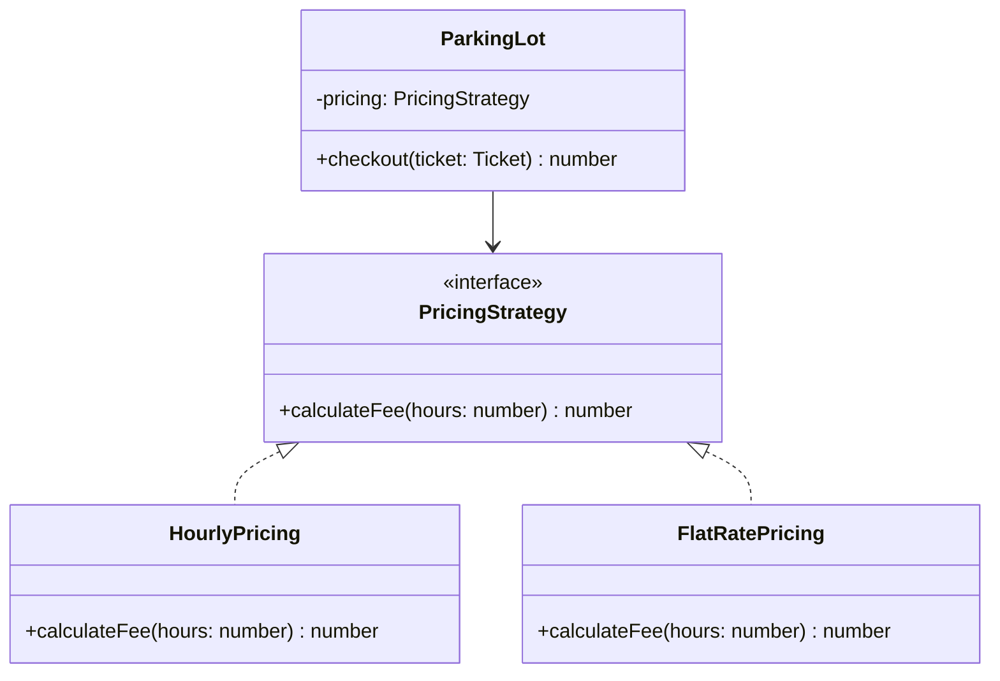
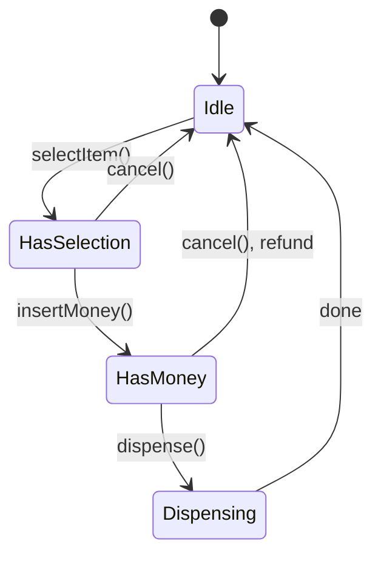

# OOP, SOLID and design patterns

The vocabulary an LLD answer is built from. None of this is impressive on
its own — reciting SOLID definitions or naming ten patterns reads as
memorization. What's graded is using the right one, once, where the
requirements actually call for it, and being able to say why.

---

## In brief

- **The four pillars are tools, not a checklist.** Encapsulation and
  abstraction do the real work in most interviews; inheritance and
  polymorphism matter mainly through *interfaces*, not deep class trees.
- **SOLID is five failure modes to avoid, not five rules to recite.** Each
  one maps to a concrete symptom: a class with two reasons to change (SRP),
  a `switch` that grows with every new type (OCP), a subtype you can't drop
  in for its parent (LSP), a fat interface forcing unused methods (ISP), and
  a class that `new`s its own dependencies instead of accepting them (DIP).
- **Strategy and Factory cover the majority of "make this extensible"
  requirements.** Learn those two cold; the rest are situational.
- **State is underused and is usually the right answer** for anything with a
  lifecycle — a vending machine, an order, a connection — where behavior
  changes based on which phase the object is in.
- **A pattern earns its place when removing it would require an `if/else`
  or `switch` to reappear.** If the code works exactly as well without the
  pattern's ceremony, that's the sign to drop it.

---

## OOP fundamentals, briefly

| Pillar | What it buys you | Where it shows up in LLD |
| --- | --- | --- |
| **Encapsulation** | Internal state can't be corrupted from outside | Private fields with methods that enforce invariants — a `ParkingSpot` that only lets its status change through `occupy()`/`vacate()`, never a raw setter |
| **Abstraction** | Callers depend on *what* an object does, not *how* | An interface (`PricingStrategy`) hides the formula from the class that uses it |
| **Inheritance** | A subtype reuses and is substitutable for a parent | Use sparingly — only when the "is-a" relationship holds everywhere the parent is used |
| **Polymorphism** | The same call does different things depending on the concrete type | Almost always delivered via an interface + multiple implementations, not a deep class hierarchy |

**Composition over inheritance** is the default in this book — see
[LLD start here §4](01-lld-start-here.md#4-define-relationships) for why. A
`Vehicle` that *has* a `PricingStrategy` and a `FuelType` adapts to new
requirements without touching existing classes; a `Vehicle` hierarchy that
tries to express both dimensions in subclasses combinatorially explodes.

---

## SOLID

### Single Responsibility — a class should have one reason to change

**Symptom:** a `ParkingLot` class with fields for spot allocation, pricing,
payment processing and notifications. A change to the tax rate and a change
to spot layout both touch the same file, and neither engineer wants to
review the other's diff.

```typescript
// Before — one class, four reasons to change
class ParkingLot {
  findSpot(vehicle: Vehicle): ParkingSpot { /* ... */ }
  calculateFee(ticket: Ticket): number { /* ... */ }
  chargeCard(amount: number): void { /* ... */ }
  sendReceipt(email: string): void { /* ... */ }
}

// After — each concern owns its own class
class ParkingLot {
  constructor(private pricing: PricingStrategy, private payments: PaymentProcessor) {}
  findSpot(vehicle: Vehicle): ParkingSpot { /* ... */ }
}
class PricingStrategy { calculateFee(ticket: Ticket): number { /* ... */ } }
class PaymentProcessor { charge(amount: number): void { /* ... */ } }
```

### Open/Closed — open for extension, closed for modification

**Symptom:** a `switch` on a type that a new class value forces you to
revisit, risking every existing case.

```typescript
// Before — adding a vehicle type means editing this function
function feeFor(type: string, hours: number): number {
  switch (type) {
    case "motorcycle": return hours * 1;
    case "car": return hours * 2;
    case "bus": return hours * 5;
    // every new type edits this file
  }
}

// After — a new type is a new class, zero edits to existing ones
interface PricingStrategy { feeFor(hours: number): number; }
class CarPricing implements PricingStrategy { feeFor(hours: number) { return hours * 2; } }
class BusPricing implements PricingStrategy { feeFor(hours: number) { return hours * 5; } }
```

### Liskov Substitution — a subtype must be usable anywhere the parent is expected

**Symptom:** code that has to check `instanceof` before calling a method, or
a subclass that throws on a method its parent promised to support.

```typescript
// Violates LSP — Penguin can't actually do what Bird promises
class Bird { fly(): void { /* ... */ } }
class Penguin extends Bird { fly(): void { throw new Error("can't fly"); } }

// Fixes it — fly is only promised by things that can
interface Flyable { fly(): void; }
class Sparrow implements Flyable { fly(): void { /* ... */ } }
class Penguin { swim(): void { /* ... */ } } // no false promise
```

### Interface Segregation — don't force a class to implement methods it doesn't need

**Symptom:** an interface with ten methods where every implementer stubs out
half of them.

```typescript
// Before — a fat interface
interface Worker { work(): void; eat(): void; }
class Robot implements Worker { work() {} eat() { throw new Error("n/a"); } }

// After — split by what's actually needed
interface Workable { work(): void; }
interface Eatable { eat(): void; }
class Robot implements Workable { work() {} }
class Human implements Workable, Eatable { work() {} eat() {} }
```

### Dependency Inversion — depend on an abstraction, not a concrete class

**Symptom:** a class that constructs its own dependency with `new`, making
it untestable and unswappable.

```typescript
// Before — hardwired to one concrete payment gateway
class Checkout {
  private gateway = new StripeGateway();
  pay(amount: number) { this.gateway.charge(amount); }
}

// After — the dependency is injected, any PaymentGateway works
interface PaymentGateway { charge(amount: number): void; }
class Checkout {
  constructor(private gateway: PaymentGateway) {}
  pay(amount: number) { this.gateway.charge(amount); }
}
```

---

## Pattern reference

| Pattern | Use it when | Skip it when |
| --- | --- | --- |
| **Strategy** | An algorithm has more than one implementation that needs to be swappable at runtime (pricing, sorting, routing) | There's only ever going to be one implementation |
| **Factory / Abstract Factory** | Object creation logic is nontrivial or needs to vary by input (vehicle type → spot size, region → tax rule) | A plain constructor already says everything |
| **Observer** | One change needs to notify a variable number of interested parties without them being tightly coupled (a `Stock` notifying `Display`s, an `Order` notifying `Notification` channels) | There's exactly one listener — just call it directly |
| **Singleton** | Exactly one instance must exist and be globally reachable (a `ParkingLot`'s central spot registry, a config loader) | Almost always — it's the most overused pattern in LLD interviews; prefer passing a shared instance via constructor injection over a global |
| **Decorator** | Behavior needs to be added to individual objects without touching the class or its siblings (toppings on a pizza, middleware on a request) | The variation is closed — a subclass is simpler |
| **State** | An object's behavior changes based on an internal lifecycle phase (vending machine, order, TCP connection, elevator) | There are only two states and no shared machinery between them |
| **Command** | An action needs to be queued, undone, logged, or passed around as a first-class value (elevator requests, undo/redo, a job queue) | The action can just be called directly with no need to defer or reverse it |
| **Builder** | Construction needs many optional parameters and step-by-step assembly (a complex `Pizza`, an HTTP request) | The constructor already has 2-3 required fields |
| **Adapter** | An existing interface doesn't match what the caller expects, usually at a third-party boundary (wrapping a legacy `PaymentGateway`) | You control both sides — just make them match |
| **Chain of Responsibility** | A request should pass through a sequence of handlers, any of which may handle it or pass it on (middleware, approval workflows, logging levels) | There's one fixed handler — a function call is clearer |

### Strategy — the one to reach for first


*`ParkingLot` holds a reference to the interface, not a concrete class — swapping `HourlyPricing` for `FlatRatePricing` needs zero changes to `ParkingLot`.*

```typescript
interface PricingStrategy { calculateFee(hours: number): number; }

class HourlyPricing implements PricingStrategy {
  calculateFee(hours: number) { return hours * 2; }
}
class FlatRatePricing implements PricingStrategy {
  calculateFee(hours: number) { return 20; }
}

class ParkingLot {
  // injected, not constructed here — Dependency Inversion again
  constructor(private pricing: PricingStrategy) {}
  checkout(ticket: Ticket): number {
    return this.pricing.calculateFee(ticket.durationHours());
  }
}
```

### State — the underused one, right for anything with a lifecycle


*Each state is its own class implementing the same interface — `insertMoney()` called in `Idle` does something different from `insertMoney()` called in `HasSelection`, and neither needs an `if machine.state === X` check to know it.*

```typescript
interface VendingState {
  selectItem(machine: VendingMachine, item: string): void;
  insertMoney(machine: VendingMachine, amount: number): void;
  dispense(machine: VendingMachine): void;
}

class IdleState implements VendingState {
  selectItem(machine: VendingMachine, item: string) {
    machine.setSelection(item);
    machine.setState(new HasSelectionState());
  }
  insertMoney() { throw new Error("select an item first"); }
  dispense() { throw new Error("select an item first"); }
}
// HasSelectionState, HasMoneyState, DispensingState follow the same shape —
// each only implements the transitions valid from that state.
```

Compare this to a single class with a `status` enum and every method
starting with `if (this.status !== X) throw`. Both are correct; State scales
better once there are more than 3-4 states or the transition logic itself
has behavior worth testing in isolation — see
[the vending machine](03-classic-lld-problems.md#vending-machine) for the
full version.

---

## Interview Q&A

### Q: When would you use Strategy versus a simple `if/else`?
**Level:** foundation · **Tags:** strategy, ocp

<details><summary>Model answer</summary>

An `if/else` or `switch` is fine when the set of cases is small, fixed, and
unlikely to grow — three shipping regions that will never be four. Strategy
earns its place when new variants are expected to keep arriving (Open/Closed
in practice) or when the variant needs to be swapped at runtime by the
caller rather than hardcoded — a `ParkingLot` constructed with
`HourlyPricing` in tests and `SurgePricing` in production, with zero code
changes either way.

The tell in an interview: if you're about to write a `switch` on a type
*and* the prompt mentioned "should support adding new X later," that's
Strategy (or Factory, if the branching is about construction rather than
behavior) asking to be used.

</details>

### Q: Why is Singleton considered risky, and what do you use instead?
**Level:** intermediate · **Tags:** singleton, testability, dependency-injection

<details><summary>Model answer</summary>

A Singleton is global mutable state with a pattern name. It makes unit
testing hard — every test shares the same instance unless it's reset between
runs — and it hides a dependency: a class that reaches for
`ParkingLot.getInstance()` internally doesn't declare that dependency in its
constructor, so a reader can't tell what it needs by looking at its
signature.

The usual fix is constructor injection: create the single instance once at
the composition root (wherever the application wires its objects together)
and pass it down to whatever needs it. This gets the same "exactly one
instance" guarantee without a global — tests can pass a fresh instance or a
mock, and the dependency is visible in the constructor.

The one case where a real Singleton still earns its keep is something like a
logger or a connection pool where global access genuinely is the
requirement and the cost of threading it through every constructor outweighs
the downside — but say that trade-off out loud rather than reaching for it
by default.

</details>

### Q: What's the difference between aggregation and composition, and why does an interviewer care?
**Level:** intermediate · **Tags:** uml, aggregation, composition, lifecycle

<details><summary>Model answer</summary>

Both describe a "has-a" relationship; the difference is ownership and
lifecycle. In composition, the contained object's lifetime is bound to the
container's — a `Vehicle`'s `Engine` doesn't exist independently, and
destroying the `Vehicle` destroys the `Engine`. In aggregation, the
contained object can outlive the container or be shared by more than one — a
`ParkingFloor` has `ParkingSpot`s, but in a redesign where spots are shared
infrastructure tracked independently of any one floor, the aggregation
reading is the honest one.

It matters because it changes how you write the constructor and cleanup
code: composition usually means the container constructs its parts
internally (or they're passed in but never shared elsewhere); aggregation
means the parts are constructed and owned externally and merely referenced.
Getting this wrong in an interview isn't usually fatal, but being able to
answer "does destroying the ParkingLot destroy its Tickets?" correctly shows
you're modeling lifecycle, not just drawing boxes.

</details>
