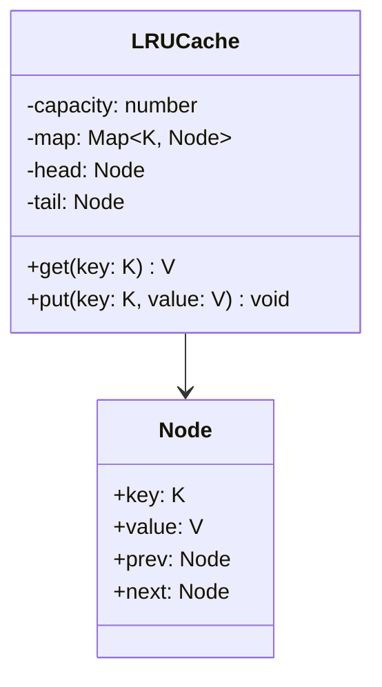
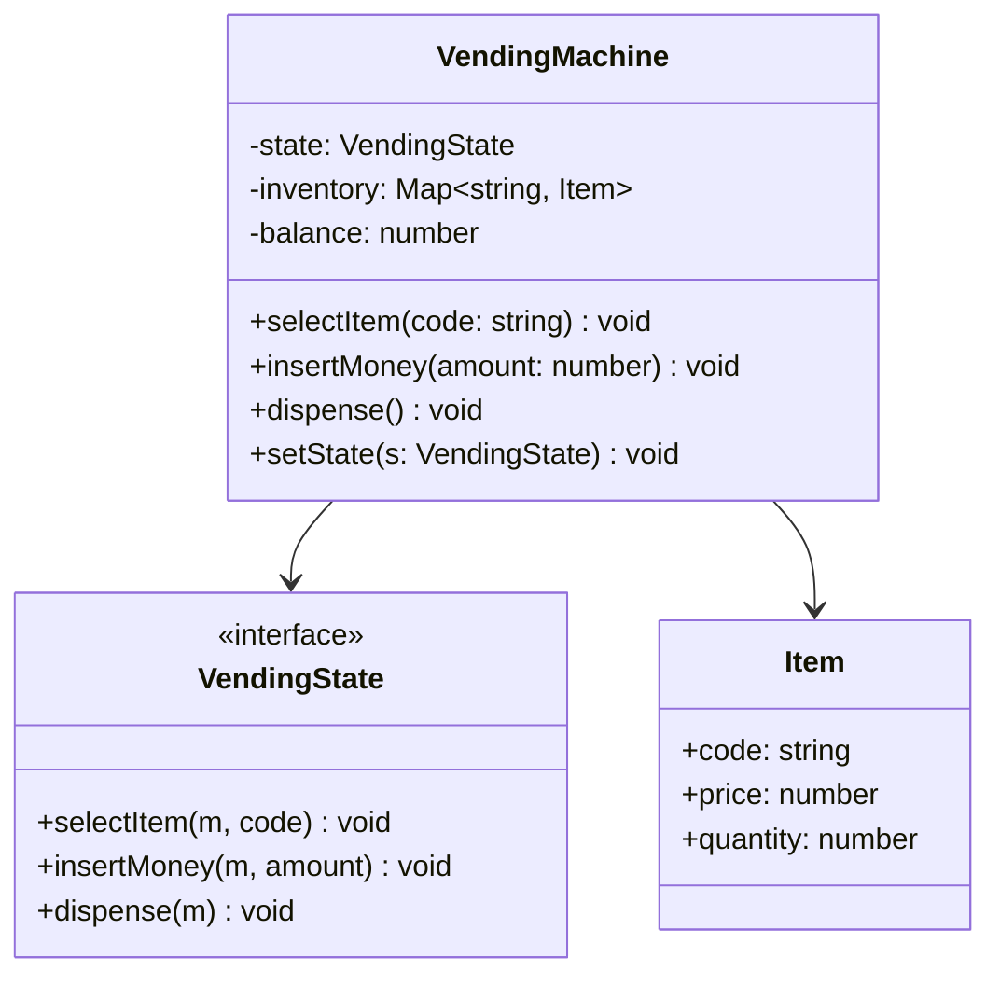
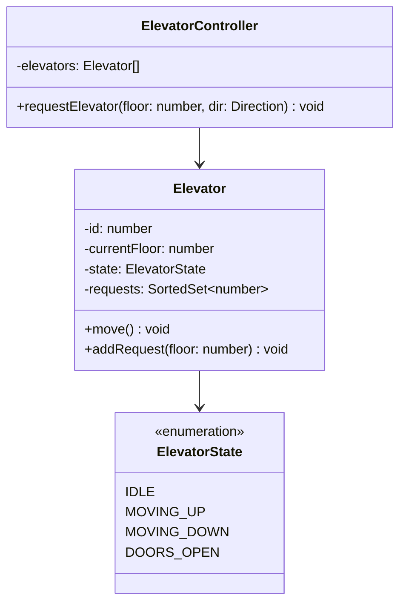
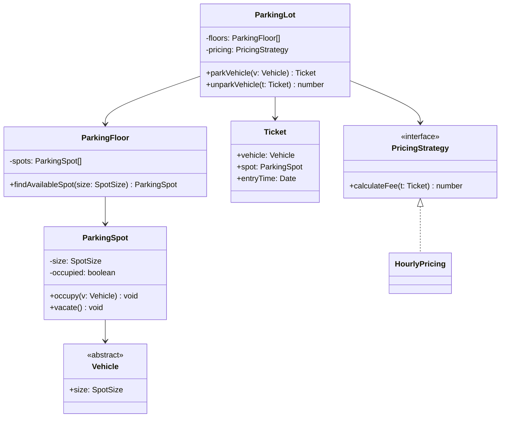
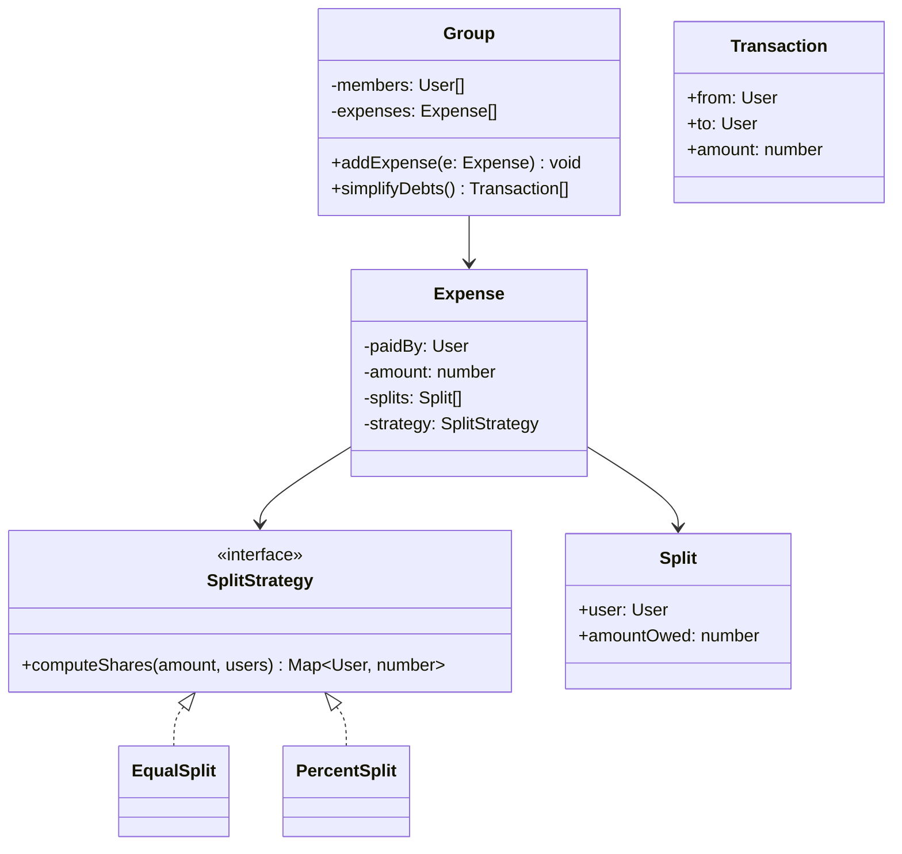
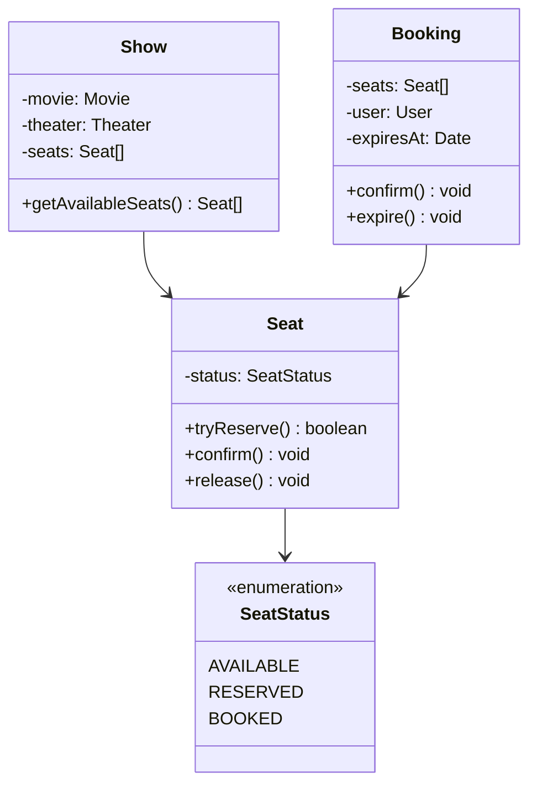

# Classic LLD problems

The standard pool. Each teaches a different shape — object composition,
lifecycle state, concurrency under contention, or a nontrivial algorithm
hiding inside a "just design the classes" prompt. Work through the method in
[LLD start here](01-lld-start-here.md) on each of these before reading the
worked solution.

---

## In brief

- **Parking lot** tests composition and Strategy — spot sizing by vehicle
  type, pricing as a swappable interface — and is the most common opener
  because it has no tricky algorithm hiding in it, just clean modeling.
- **LRU cache** is the one with real algorithmic content: a hash map for
  O(1) lookup plus a doubly linked list for O(1) move-to-front, and knowing
  *why* neither alone is enough is the actual test.
- **Elevator system** tests state (per-elevator lifecycle) and a scheduling
  algorithm (SCAN/LOOK) under a queue of requests that arrive out of order.
- **Vending machine** is the canonical State pattern problem — see
  [OOP, SOLID and patterns](02-oop-solid-and-patterns.md#state--the-underused-one-right-for-anything-with-a-lifecycle)
  for the pattern itself.
- **Splitwise** (expense sharing) tests graph thinking disguised as an LLD
  prompt — balances are edges in a debt graph, and "simplify the debts"
  is a min-cash-flow problem, not just bookkeeping.
- **Movie ticket booking** (BookMyShow-style) is where concurrency shows up
  hardest — the "two users, one seat, same second" problem from
  [LLD start here](01-lld-start-here.md#7-handle-the-concurrency-follow-up-if-it-comes)
  in its most common form.

---

## LRU cache

**Core question:** how do you get O(1) `get` and O(1) `put` while evicting
the least-recently-used entry, also in O(1)?


*A hash map gives O(1) lookup by key; a doubly linked list gives O(1) move-to-front and O(1) eviction from the tail — neither structure alone does both.*

A hash map alone gives O(1) lookup but no O(1) way to know what's least
recently used — you'd have to scan for it. A linked list alone gives O(1)
reordering but O(n) lookup by key. Combining them — the map stores `key →
node`, the list keeps nodes in recency order — gets both:

```typescript
class Node<K, V> {
  prev: Node<K, V> | null = null;
  next: Node<K, V> | null = null;
  constructor(public key: K, public value: V) {}
}

class LRUCache<K, V> {
  private map = new Map<K, Node<K, V>>();
  private head: Node<K, V>; // most recently used
  private tail: Node<K, V>; // least recently used
  constructor(private capacity: number) {
    this.head = new Node(null as any, null as any);
    this.tail = new Node(null as any, null as any);
    this.head.next = this.tail;
    this.tail.prev = this.head;
  }

  get(key: K): V | undefined {
    const node = this.map.get(key);
    if (!node) return undefined;
    this.moveToFront(node);
    return node.value;
  }

  put(key: K, value: V): void {
    const existing = this.map.get(key);
    if (existing) { existing.value = value; this.moveToFront(existing); return; }
    if (this.map.size >= this.capacity) {
      const lru = this.tail.prev!;
      this.remove(lru);
      this.map.delete(lru.key);
    }
    const node = new Node(key, value);
    this.map.set(key, node);
    this.insertAfterHead(node);
  }

  private moveToFront(node: Node<K, V>) { this.remove(node); this.insertAfterHead(node); }
  private remove(node: Node<K, V>) {
    node.prev!.next = node.next;
    node.next!.prev = node.prev;
  }
  private insertAfterHead(node: Node<K, V>) {
    node.next = this.head.next;
    node.prev = this.head;
    this.head.next!.prev = node;
    this.head.next = node;
  }
}
```

Sentinel `head`/`tail` nodes (rather than tracking `null` boundaries) remove
every edge-case branch for "is this the first/last real node" — worth
mentioning out loud, since it's exactly the kind of detail that separates a
clean implementation from one with off-by-one bugs under follow-up.

**Extension worth naming unprompted:** an LFU cache (evict least-*frequently*
used, not least-recently) needs a frequency count per key plus a bucket of
linked lists per frequency — a good one-line answer if asked "what would you
change for LFU" without being asked to implement it.

---

## Vending machine

State is the right tool the moment "what does `insertMoney()` do" has a
different answer depending on what happened before it — see
[OOP, SOLID and patterns](02-oop-solid-and-patterns.md#state--the-underused-one-right-for-anything-with-a-lifecycle)
for the pattern and the `VendingState` interface. The object model around
it:


*`VendingMachine` delegates every action to its current state object and never branches on a status flag itself — the branching lives once, inside each state's implementation.*

**Edge cases worth stating unprompted:** exact change only vs. making
change (needs a coin/note inventory of its own), out-of-stock after
selection but before payment, and a cancel path that must refund from
whichever state it's called in — three separate refund behaviors, one per
applicable state.

---

## Elevator system

**Core question:** given requests arriving from arbitrary floors in
arbitrary order, how does one elevator decide what to do next, and how do
multiple elevators split the work?


*Each elevator owns its own request set and state machine; the controller's only job is picking which elevator gets a new external request — the two concerns don't belong in the same class.*

**Per-elevator scheduling — the SCAN/LOOK algorithm:** keep pending requests
in a sorted set. While moving up, service every request at or above the
current floor in increasing order before reversing; while moving down, the
mirror. This avoids the naive FIFO trap (serving requests in arrival order
can send an elevator from floor 1 to floor 10 to floor 2 to floor 9) —
naming that trap and why SCAN avoids it is the actual test, not the
implementation.

**Controller-level assignment — which elevator answers an external call:**
pick the elevator that minimizes total detour — idle and closest wins over
one already moving away from the request. A simple, defensible heuristic:
score each elevator by distance, heavily penalize one moving in the wrong
direction, and assign the minimum. Say that a real system (destination
dispatch, as in modern high-rises) groups passengers by destination floor at
call time rather than per-elevator at arrival time, if asked to go further.

---

## Design: Design the classes for a parking lot.
**Level:** intermediate · **Tags:** composition, strategy, parking-lot

<details><summary>Model answer</summary>

**Requirements.** Multiple floors, multiple vehicle types (motorcycle, car,
bus) each needing a different spot size, a ticket issued on entry with the
fee computed on exit, and a pricing model that should be swappable without
touching the rest of the system.


*`ParkingLot` coordinates floors and pricing but computes neither itself — each responsibility lives in exactly one class, and pricing is an interface so a new pricing model needs a new class, not an edit to `ParkingLot`.*

**Core classes.** `Vehicle` is an abstract base carrying only a `size`
(`Motorcycle`, `Car`, `Bus` set it, nothing else) — composition over a
deeper hierarchy, since size is the only dimension that matters to spot
assignment. `ParkingSpot` enforces its own invariant (`occupy`/`vacate`
mutate its own state; nothing external flips its `occupied` flag directly).
`ParkingFloor` owns a collection of spots and answers "do you have a free
one this size," which keeps floor-level allocation logic out of
`ParkingLot`. `PricingStrategy` is the seam identified in step 5 of the
method — pricing is exactly the kind of thing "likely to change."

```typescript
enum SpotSize { MOTORCYCLE, COMPACT, LARGE }

abstract class Vehicle { abstract readonly size: SpotSize; }
class Motorcycle extends Vehicle { readonly size = SpotSize.MOTORCYCLE; }
class Car extends Vehicle { readonly size = SpotSize.COMPACT; }
class Bus extends Vehicle { readonly size = SpotSize.LARGE; }

class ParkingSpot {
  private occupied = false;
  constructor(readonly size: SpotSize) {}
  isAvailable() { return !this.occupied; }
  occupy() { this.occupied = true; }
  vacate() { this.occupied = false; }
}

interface PricingStrategy { calculateFee(ticket: Ticket): number; }
class HourlyPricing implements PricingStrategy {
  calculateFee(ticket: Ticket): number {
    const hours = Math.ceil((Date.now() - ticket.entryTime.getTime()) / 3_600_000);
    return hours * 2;
  }
}

class Ticket {
  readonly entryTime = new Date();
  constructor(readonly vehicle: Vehicle, readonly spot: ParkingSpot) {}
}

class ParkingFloor {
  constructor(private spots: ParkingSpot[]) {}
  findAvailableSpot(size: SpotSize): ParkingSpot | null {
    return this.spots.find(s => s.size === size && s.isAvailable()) ?? null;
  }
}

class ParkingLot {
  constructor(private floors: ParkingFloor[], private pricing: PricingStrategy) {}

  parkVehicle(vehicle: Vehicle): Ticket {
    for (const floor of this.floors) {
      const spot = floor.findAvailableSpot(vehicle.size);
      if (spot) { spot.occupy(); return new Ticket(vehicle, spot); }
    }
    throw new Error("lot full for this vehicle size");
  }

  unparkVehicle(ticket: Ticket): number {
    ticket.spot.vacate();
    return this.pricing.calculateFee(ticket);
  }
}
```

**Extension without changing existing code.** A new vehicle type is a new
`Vehicle` subclass with a `size`. A new pricing model is a new
`PricingStrategy`. Multiple entry points issuing tickets concurrently is the
natural follow-up — see the concurrency note below.

**Concurrency.** Two vehicles arriving at different entrances could both
find the same "available" spot in `findAvailableSpot` before either calls
`occupy()`. The fix is making find-and-occupy atomic per spot: either a lock
scoped to the individual `ParkingSpot` (not the whole floor or lot — that
would serialize unrelated spots), or, if spots are persisted, a
`status = 'occupied' WHERE id = ? AND status = 'available'` conditional
update and checking the affected-row count.

</details>

**Follow-ups:**

1. Q: How would you support multiple entry points issuing tickets and multiple exit points processing payment?
   <details><summary>Answer</summary>

   Each entry point is a small `EntryTerminal` that calls
   `ParkingLot.parkVehicle` — no change needed to the model, since
   `ParkingLot` was already the single coordinator rather than something
   tied to one physical terminal. Exit points similarly call
   `unparkVehicle`. The only new requirement is that spot allocation itself
   be safe under concurrent calls from different terminals, which is the
   concurrency point above — this follow-up is really asking whether you
   thought about it before being prompted.

   </details>

2. Q: How would you add a "reserve a spot in advance" feature?
   <details><summary>Answer</summary>

   Add a `RESERVED` status alongside `available`/`occupied` on
   `ParkingSpot`, and a `Reservation` (vehicle, spot, expiry) created by a
   new `reserveSpot` method that atomically transitions a spot from
   `available` to `reserved` the same way parking transitions it to
   `occupied`. `parkVehicle` needs to check for a matching reservation
   before falling back to `findAvailableSpot`, and a background sweep
   releases expired, unclaimed reservations back to `available`.

   </details>

---

## Design: Design the classes for an expense-sharing app (Splitwise-style).
**Level:** senior · **Tags:** graph, debt-simplification, splitwise

<details><summary>Model answer</summary>

**Requirements.** Users can create a group, add an expense split among some
subset of the group (equally, by exact amounts, or by percentage), and see
who owes whom. A "simplify debts" feature should minimize the number of
transactions needed to settle everyone up.


*Splitting logic lives entirely behind `SplitStrategy`, so equal, exact-amount and percentage splits are three small classes rather than three branches inside `Expense`.*

**The core insight the prompt is testing.** Balances between users form a
directed weighted graph — an edge `A → B: $30` means A owes B $30. Naively,
settling N people who each owe each other something could take up to N-1
transactions in the worst case if done pairwise as expenses are added, but
that's not the actual lower bound: the real minimum is achieved by netting
everyone's balance first, then matching debtors to creditors — which is a
variant of the min-cash-flow problem.

```typescript
interface SplitStrategy {
  computeShares(amount: number, users: User[], meta?: number[]): Map<User, number>;
}
class EqualSplit implements SplitStrategy {
  computeShares(amount: number, users: User[]) {
    const share = amount / users.length;
    return new Map(users.map(u => [u, share]));
  }
}

class Expense {
  readonly splits: Map<User, number>;
  constructor(readonly paidBy: User, readonly amount: number, users: User[], strategy: SplitStrategy) {
    this.splits = strategy.computeShares(amount, users);
  }
}

class Group {
  private balances = new Map<User, number>(); // net balance, +ve = owed to them

  addExpense(expense: Expense) {
    this.credit(expense.paidBy, expense.amount);
    for (const [user, share] of expense.splits) this.credit(user, -share);
  }
  private credit(user: User, amount: number) {
    this.balances.set(user, (this.balances.get(user) ?? 0) + amount);
  }

  // Greedy min-cash-flow: repeatedly settle the largest creditor with the largest debtor.
  simplifyDebts(): Transaction[] {
    const txns: Transaction[] = [];
    const entries = [...this.balances.entries()].filter(([, v]) => Math.abs(v) > 1e-9);
    while (entries.length > 0) {
      entries.sort((a, b) => a[1] - b[1]); // most negative (owes most) first
      const [debtor, debtAmt] = entries[0];
      const [creditor, creditAmt] = entries[entries.length - 1];
      const settled = Math.min(-debtAmt, creditAmt);
      txns.push({ from: debtor, to: creditor, amount: settled });

      entries[0][1] += settled;
      entries[entries.length - 1][1] -= settled;
      // drop any entry that has settled to ~0
      for (let i = entries.length - 1; i >= 0; i--) {
        if (Math.abs(entries[i][1]) < 1e-9) entries.splice(i, 1);
      }
    }
    return txns;
  }
}
```

**Why greedy works here.** Matching the largest creditor with the largest
debtor each round is a known-good heuristic for this problem (it isn't
provably optimal in every case, but it's the standard interview-level
answer and gets close to optimal in practice) — say that honestly rather
than claiming it's optimal, since claiming more than you can defend is the
worse failure mode. Each round zeroes out at least one person's balance, so
it terminates in at most N-1 transactions for N people with nonzero
balances.

</details>

**Follow-ups:**

1. Q: A user disputes an expense after it's been added. How does the model handle edits and deletes?
   <details><summary>Answer</summary>

   `Group` needs to reverse the original expense's effect on `balances`
   (credit `paidBy` by `-amount`, credit each split user by `+share`) before
   applying the edited version — an `Expense` should be treated as
   immutable once created, and an edit is "reverse, then re-add a new one,"
   which also gives you a clean audit trail for free.

   </details>

2. Q: How would you extend this to support multiple currencies?
   <details><summary>Answer</summary>

   Balances would need to be tracked per currency pair rather than a single
   number per user, and `simplifyDebts` would run independently within each
   currency unless the product wants cross-currency netting — which adds an
   exchange-rate dependency and a decision about which rate (transaction-
   time vs. settlement-time) to use. Worth naming the ambiguity rather than
   silently picking one.

   </details>

---

## Design: Design a movie ticket booking system, and handle two users booking the last seat at once.
**Level:** senior · **Tags:** concurrency, locking, bookmyshow, seat-booking

<details><summary>Model answer</summary>

**Requirements.** Browse shows by movie/theater/time, view seat
availability, hold a seat during checkout, confirm on payment, and release
the hold if payment doesn't complete in time. The concurrency requirement —
never double-book a seat — is the one the interviewer is actually grading.


*A seat's status is the only piece of shared mutable state that matters here — everything else on the diagram is read-heavy and uncontended, which is why the design concentrates all the locking on `Seat.tryReserve`.*

```typescript
enum SeatStatus { AVAILABLE, RESERVED, BOOKED }

class Seat {
  private status = SeatStatus.AVAILABLE;
  // one lock per seat, not per show — unrelated seats must never block each other
  private locked = false;

  // atomic compare-and-set: only succeeds if currently AVAILABLE
  tryReserve(): boolean {
    if (this.locked) return false;
    this.locked = true;
    try {
      if (this.status !== SeatStatus.AVAILABLE) return false;
      this.status = SeatStatus.RESERVED;
      return true;
    } finally { this.locked = false; }
  }
  confirm(): void { this.status = SeatStatus.BOOKED; }
  release(): void { this.status = SeatStatus.AVAILABLE; }
}

class Booking {
  readonly expiresAt = new Date(Date.now() + 5 * 60_000); // 5-minute hold
  constructor(readonly user: User, readonly seats: Seat[]) {}

  confirm(): void { this.seats.forEach(s => s.confirm()); }
  expire(): void { this.seats.forEach(s => s.release()); }
}

class BookingService {
  createBooking(user: User, seats: Seat[]): Booking | null {
    const reserved: Seat[] = [];
    for (const seat of seats) {
      if (!seat.tryReserve()) {
        reserved.forEach(s => s.release()); // roll back partial reservation
        return null;
      }
      reserved.push(seat);
    }
    const booking = new Booking(user, reserved);
    // in a real system: schedule booking.expire() via a delayed job/TTL if not confirmed
    return booking;
  }
}
```

**Walking through the race.** Two users click the same seat within
milliseconds. Both calls reach `tryReserve`. In a single-process in-memory
model, the `locked` flag (or, in TypeScript specifically, the fact that
synchronous code doesn't interleave within a single event-loop turn) makes
the check-then-set atomic per seat — whichever call runs first wins, the
second sees `status !== AVAILABLE` and returns `false`. **This is a
single-process illustration, not the production answer** — say that
explicitly rather than letting it pass as the final design.

**The production version.** Across multiple servers, seat status lives in a
database, and the same atomicity has to be enforced there:
`UPDATE seats SET status = 'RESERVED' WHERE id = ? AND status = 'AVAILABLE'`
and check the affected-row count — exactly the pattern from
[LLD start here](01-lld-start-here.md#7-handle-the-concurrency-follow-up-if-it-comes).
A hold that isn't confirmed within its TTL must be released — either a
background sweep on `expiresAt`, or (better at scale) a Redis key with a TTL
that auto-expires the reservation, with the database write only happening on
confirm. Don't hold a lock or an open transaction across the payment call
itself — reserve, release the lock, call the payment provider, then confirm
or release based on the result, so a slow provider can't block every other
booking on that seat's row.

</details>

**Follow-ups:**

1. Q: What if a booking is for 4 seats and 2 succeed, 2 fail?
   <details><summary>Answer</summary>

   All-or-nothing: as written above, `createBooking` rolls back every seat
   it already reserved the moment one fails, rather than leaving a partial
   hold. Booking 2 of the 4 requested seats without telling the user is
   worse than failing the whole request and letting them pick again.

   </details>

2. Q: How do you prevent a user from spamming reserve-then-abandon to grief other buyers out of a seat?
   <details><summary>Answer</summary>

   Rate-limit `createBooking` per user (see
   [rate limiting](../02-interview-core/29-resilience-rate-limiting.md)), and
   keep the hold TTL short enough that abandonment is cheap to recover from —
   a few minutes, not a few hours. Some real systems also require a
   lightweight commitment (payment details captured, not charged) before
   granting the hold, which raises the cost of griefing without hurting
   honest buyers.

   </details>
